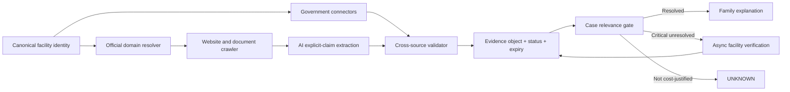

# OPTIME Data Intelligence Blueprint

Date: 2026-08-02

Canonical input: `database/optime_parameter_registry.json` (59 parameters)

Scope: data strategy and product architecture only. This blueprint does not modify the canonical registry, ranking, scoring, recommendation logic, APIs, or application code.

## Principle Impact Check

- RELEVANT EXISTING PRINCIPLES: PR-002 No Evidence, No Score; PR-003 Uncertainty Visibility; PR-005 Unknown Is Not Negative Evidence; PR-006 Verified Case-Relevant Evidence May Strengthen Proven Match; PR-007 Generic Completeness Must Not Drive Ranking; PR-008 Owner Approval Gate; PR-009 Parameter-First Facility Matching.
- DOES THIS CHANGE ALTER ANY PRINCIPLE? NO.
- OWNER APPROVAL REQUIRED? NO.
- CLASSIFICATION: B. Implementation Completion.

## Executive Decision

OPTIME should optimize **decision yield per acquisition dollar**, not raw profile fullness.

1. Run official government connectors first.
2. Extract explicit statements from official facility pages and documents with AI; do not upgrade extraction into independent truth.
3. Use proxies only for bounded statements such as "appears supported" or "no material concerns identified."
4. Trigger direct verification only for an active family case when the unresolved fact can change eligibility or the decision.
5. Use asynchronous facility self-service or structured email links. Do not create a routine calling operation.
6. Leave low-value or nonresponsive facts UNKNOWN. Remove current promotions from the canonical profile in a future separately governed registry change.
7. Never reward generic profile completeness, source volume, or facility responsiveness in ranking.

## Current-State Migration Boundary

This document is the approved acquisition-strategy blueprint, not proof of deployed acquisition behavior.

The current canonical registry still has legacy placeholders:

- All 59 records list `DIRECT_FACILITY_CONFIRMATION` as their only `source_priority`.
- 54 records use the generic freshness rule "Keep as UNKNOWN until stronger evidence or direct verification is available."
- Five dynamic records use "Direct facility confirmation required; do not infer from stale or missing data."

The existing `OPTIME_PARAMETER_ACQUISITION_MATRIX` and generated source-map/admin artifacts describe the earlier strategy and are superseded for product planning by this blueprint. They remain unchanged here because this milestone does not implement runtime or canonical data changes.

Before any acquisition pipeline consumes this blueprint, a separate implementation task must:

1. Add machine-readable strategy, proxy, refresh, status, and cost-governance fields without removing canonical IDs or changing ranking eligibility.
2. Preserve the current registry as historical input and migrate with an explicit schema version.
3. Validate exactly 59 unique mappings and reject missing, extra, or multiply owned parameters.
4. Prove that source/status changes do not alter ranking semantics, UNKNOWN handling, or generic-completeness safeguards.
5. Pilot the strategy and replace all planning estimates before statewide rollout.

## Strategy Model

Every canonical parameter has exactly one primary strategy. Other sources may corroborate it but do not change its primary ownership.

| Code | Primary strategy | Use |
| --- | --- | --- |
| A | Official Government Data | Direct structured regulator or public-program evidence |
| B | Official Facility Digital Content | Source class only; C or D is primary when AI performs acquisition |
| C | AI Document Extraction | Explicit claims from official PDFs, menus, calendars, rate sheets, or policies |
| D | AI Website Extraction | Explicit claims from the verified official facility domain |
| E | Cross-source Validation | Mandatory validation layer, not a primary owner in this 59-parameter design |
| F | Reliable Proxy | Bounded conclusion from defined substitute signals; never a direct fact claim |
| G | Direct Facility Verification | Case-triggered, asynchronous, scoped, expiring confirmation |
| H | Family Supplied | Supplemental lead/document only; no canonical facility fact is primarily family-owned |
| I | Community Feedback | Signal/conflict input only; no canonical facility fact is primarily feedback-owned |
| J | Unknown | Deliberately uncollected or not cost-justified |

Primary strategy count: A 21; C 8; D 17; F 4; G 8; J 1. Total: 59.

## Canonical Evidence Object

Every acquired value must use this envelope:

```json
{
  "value": "typed value or UNKNOWN",
  "evidence_level": "OFFICIAL_GOVERNMENT|OFFICIAL_FACILITY|INDEPENDENT_INSTITUTIONAL|COMMUNITY_OR_FAMILY|AI_DERIVATION|UNVERIFIED",
  "confidence": 0.0,
  "source": [{"uri": "...", "publisher": "...", "retrieved_at": "...", "source_date": "..."}],
  "last_updated": "ISO-8601 timestamp",
  "refresh_rule": "event, source-release, monthly, quarterly, or case-active expiry",
  "proxy_used": {"used": false, "proxy_id": null, "limitations": null},
  "verification_status": "VERIFIED|DOCUMENTED|CLAIMED|INFERRED|PROXY_SUPPORTED|NO_NEGATIVE_EVIDENCE|UNKNOWN|NEEDS_CONFIRMATION",
  "scope": {"facility": "...", "unit": null, "program": null, "service_line": null},
  "conflicts": []
}
```

Evidence levels describe source authority. They are separate from the A-J primary acquisition strategy codes.

Confidence measures confidence in the stated value at the stated scope, not facility quality. AI extraction confidence and evidence confidence must remain separate fields internally.

| Required field | Schema key |
| --- | --- |
| Value | `value` |
| Evidence Level | `evidence_level` |
| Confidence | `confidence` |
| Source | `source` |
| Last Updated | `last_updated` |
| Refresh Rule | `refresh_rule` |
| Proxy Used | `proxy_used` |
| Verification Status | `verification_status` |

## Status Rules

| Status | Permitted meaning | Family label |
| --- | --- | --- |
| VERIFIED | Current direct fact from an authoritative source with identity and scope match | Verified |
| DOCUMENTED | Explicitly stated in current official facility content | Appears Supported |
| CLAIMED | Facility or family assertion without sufficient corroboration | Currently Verifying |
| INFERRED | AI-derived classification that is not a direct source statement | Currently Verifying |
| PROXY_SUPPORTED | Defined proxy supports only the bounded proxy conclusion | Appears Supported |
| NO_NEGATIVE_EVIDENCE | Governed search found no material adverse signal in covered sources/lookback | No Material Concerns Found |
| UNKNOWN | No sufficient current evidence | Not Yet Confirmed |
| NEEDS_CONFIRMATION | Evidence exists but is stale, conflicted, ambiguous, or too broad for the case | Currently Verifying |

Technical status, source, dates, proxy logic, and limitations remain available in expandable evidence details.

## Formal No-Negative-Evidence Rule

`NO_NEGATIVE_EVIDENCE` is allowed only when all conditions are true:

1. The proxy policy names the adverse events and authoritative sources before execution.
2. All required sources were successfully searched for the defined lookback period.
3. Facility identity resolution and jurisdiction match passed.
4. No qualifying inspection finding, enforcement action, credible complaint finding, or contradictory current evidence was found.
5. Source failures, unresolved identity conflicts, and material publication gaps are absent.
6. The result carries its lookback period, checked sources, retrieval date, and expiry.

Permitted statement: "No material concerns identified from currently available evidence."

Forbidden statements: "Excellent," "safe," "clean," "high quality," or any positive capability claim derived only from absence.

The status expires on the next source release or after 90 days, whichever occurs first. A later adverse record supersedes it immediately. It may affect a concern narrative only under separately governed ranking rules; it may never prove a positive capability.

## Derived Proxy Products Outside The Canonical 59

These are non-ranking explanatory products unless separately approved as canonical parameters:

| Product | Required proxy bundle | Permitted output |
| --- | --- | --- |
| Cleanliness concern screen | Infection-control findings, sanitation deficiencies, complaint findings, enforcement, unresolved contradictions | No material cleanliness concerns identified from available evidence |
| Resident engagement signal | Current activity calendar, resident events, volunteers, family events, religious/music programming, dated official media | Active resident engagement appears supported |
| Structured dietary service signal | Dietitian evidence, current menus, diet options, food-service findings, dietary policies | Structured dietary services are documented |

Photos, reviews, social posts, and marketing adjectives cannot independently establish cleanliness, atmosphere, food quality, clinical capability, or outcomes.

## Complete 59-Parameter Review

Legend: Auto = obtainable automatically; AI = AI may safely derive the stated output; Proxy = reliable proxy can replace direct measurement; Direct = direct confirmation still required for a decision-grade value; Family = family can provide a useful current lead/document; Ask = OPTIME should ask the family when case-relevant; Later = automatic later discovery is realistic; ROI = ranking influence justifies acquisition cost. `PARTIAL` is used only for Auto. Costs are estimated incremental cost per facility per refresh after shared infrastructure, excluding initial engineering.

| Parameter | Strategy | Auto | AI | Proxy | Direct | Family | Ask | Later | ROI | Best method | Best proxy | Manual effort | Refresh | Est. cost | Expected accuracy | Eng/Ops | Priority | Wave | Disposition |
| --- | --- | --- | --- | --- | --- | --- | --- | --- | --- | --- | --- | --- | --- | --- | --- | --- | --- | --- | --- |
| skilled_nursing_capabilities | A | YES | NO | NO | NO | NO | NO | YES | YES | CMS certification/provider record at matched facility scope | None; provider title alone is insufficient outside matched certification | Exception only | Source release/monthly check | <$0.01 | 97-99% | M/L | P0 | 1 | KEEP_AUTO |
| nursing_24_7 | G | NO | NO | NO | YES | NO | NO | NO | YES | Current scoped facility attestation plus staffing policy | None; skilled-nursing category cannot prove this under PR-009 | Case only | 90 days; case-active reconfirm | $1-$5 | 90-97% after fresh response | L/M | P0 | 4 | VERIFY_CASE_ONLY |
| direct_24hr_nurse_availability | G | NO | NO | NO | YES | NO | NO | NO | YES | Named nursing response defining employed coverage and scope | Payroll/staffing signals may route verification but cannot replace it | Case only | 90 days | $1-$5 | 90-97% | L/M | P0 | 4 | VERIFY_CASE_ONLY |
| third_party_24hr_nurse_availability | G | NO | NO | NO | YES | NO | NO | NO | YES | Named response plus current contracted-coverage evidence | Vendor/job evidence may route verification only | Case only | 90 days | $1-$5 | 85-95% | L/M | P1 | 4 | VERIFY_CASE_ONLY |
| rn_hours_per_resident_day | A | YES | NO | NO | NO | NO | NO | YES | YES | CMS PBJ/Care Compare staffing file | None | None | Each CMS release | <$0.01 | 97-99% within reporting lag | M/L | P0 | 1 | KEEP_AUTO |
| total_nurse_hours_per_resident_day | A | YES | NO | NO | NO | NO | NO | YES | YES | CMS PBJ/Care Compare staffing file | None | None | Each CMS release | <$0.01 | 97-99% within reporting lag | M/L | P0 | 1 | KEEP_AUTO |
| adl_support | D | PARTIAL | YES | NO | YES | NO | NO | YES | YES | Extract explicit ADL services and scope from official care pages | License/service level may route verification but cannot prove task coverage | Case exception | Monthly; confirm for hard need | $0.03-$0.12 | 85-94% extraction; truth remains DOCUMENTED | M/L | P0 | 2 | KEEP_DOCUMENTED_CONFIRM_CRITICAL |
| medication_support | D | PARTIAL | YES | NO | YES | NO | NO | YES | YES | Extract administration/management wording from official care pages | License scope may bound possible service, not prove current delivery | Case exception | Monthly; confirm for hard need | $0.03-$0.12 | 85-94% | M/L | P0 | 2 | KEEP_DOCUMENTED_CONFIRM_CRITICAL |
| transfer_assistance | D | PARTIAL | YES | NO | YES | NO | NO | YES | YES | Extract transfer/assist language with unit scope | ADL support is not a substitute for transfer capability | Case exception | Monthly; confirm for hard need | $0.03-$0.12 | 82-92% | M/L | P0 | 2 | KEEP_DOCUMENTED_CONFIRM_CRITICAL |
| higher_acuity_capabilities | F | PARTIAL | YES | YES | YES | NO | NO | YES | YES | Cross-validate licenses, staffing, explicit services, exclusions, and enforcement | Supported capability envelope from license + staffing + service evidence | Case only | Monthly; 30-day case expiry | $0.08-$0.30 | 75-88% for bounded proxy | H/L | P0 | 3 | KEEP_PROXY_CONFIRM_CRITICAL |
| pt | D | PARTIAL | YES | NO | NO | NO | NO | YES | YES | Extract explicit physical-therapy service from official domain | Current therapy schedule is corroboration, not required for DOCUMENTED | Exception only | Monthly | $0.03-$0.12 | 88-95% | M/L | P0 | 2 | KEEP_DOCUMENTED |
| ot | D | PARTIAL | YES | NO | NO | NO | NO | YES | YES | Extract explicit occupational-therapy service from official domain | Current therapy schedule | Exception only | Monthly | $0.03-$0.12 | 88-95% | M/L | P0 | 2 | KEEP_DOCUMENTED |
| speech_therapy | D | PARTIAL | YES | NO | NO | NO | NO | YES | YES | Extract explicit speech/swallow therapy from official domain | Current therapy schedule | Exception only | Monthly | $0.03-$0.12 | 88-95% | M/L | P0 | 2 | KEEP_DOCUMENTED |
| short_term_rehab | D | PARTIAL | YES | NO | NO | NO | NO | YES | YES | Extract explicit short-term rehabilitation program | Therapy bundle alone does not prove a short-term program | Exception only | Monthly | $0.03-$0.12 | 88-95% | M/L | P1 | 2 | KEEP_DOCUMENTED |
| post_stroke_neuro_evidence | F | PARTIAL | YES | YES | YES | NO | NO | YES | YES | Cross-validate explicit program content, PT/OT/ST, staffing, outcomes, and scope | Multidisciplinary neuro-rehab evidence supports only "appears supported" | Case only | Monthly; 30-day case expiry | $0.10-$0.30 | 75-88% for bounded proxy | H/L | P0 | 3 | KEEP_PROXY_CONFIRM_CRITICAL |
| therapy_staffing | G | NO | NO | NO | YES | NO | NO | NO | YES | Current role/FTE/contract coverage response at service-line scope | Job listings and schedules route verification only | Case only | 90 days | $1-$5 | 88-96% | M/M | P1 | 4 | VERIFY_CASE_ONLY |
| memory_care | D | PARTIAL | YES | NO | YES | NO | NO | YES | YES | Extract explicit memory-care unit/program and scope | Secured unit or dementia marketing alone cannot prove full capability | Case exception | Monthly; confirm hard need | $0.03-$0.12 | 86-94% | M/L | P0 | 2 | KEEP_DOCUMENTED_CONFIRM_CRITICAL |
| dementia_alz_programs | D | PARTIAL | YES | NO | NO | NO | NO | YES | YES | Extract named dementia/Alzheimer program details | Memory-care label is corroboration, not equivalent evidence | Exception only | Monthly | $0.03-$0.12 | 84-93% | M/L | P1 | 2 | KEEP_DOCUMENTED |
| wound_care | D | PARTIAL | YES | NO | YES | NO | NO | YES | YES | Extract explicit wound-care service and clinician scope | Nursing capability cannot prove wound-care program | Case exception | Monthly; confirm active need | $0.03-$0.12 | 84-93% | M/L | P1 | 2 | KEEP_DOCUMENTED_CONFIRM_CRITICAL |
| dialysis_arrangements | D | PARTIAL | YES | NO | YES | NO | NO | YES | YES | Extract on-site/transport/partner arrangement explicitly | Nearby dialysis center is not proof of an arrangement | Case exception | Monthly; confirm active need | $0.03-$0.12 | 82-92% | M/L | P0 | 2 | KEEP_DOCUMENTED_CONFIRM_CRITICAL |
| respiratory_trach_vent | F | PARTIAL | YES | YES | YES | NO | NO | YES | YES | Cross-validate license, respiratory staffing, equipment/service statements, and exclusions | Capability envelope supports only the named modality and scope | Case only | Monthly; 30-day case expiry | $0.10-$0.30 | 72-86% for bounded proxy | H/L | P0 | 3 | KEEP_PROXY_CONFIRM_CRITICAL |
| hospice_palliative_arrangements | D | PARTIAL | YES | NO | YES | NO | NO | YES | YES | Extract explicit partner/on-site arrangement and scope | Nearby hospice provider is not proof of an arrangement | Case exception | Monthly; confirm active need | $0.03-$0.12 | 84-93% | M/L | P0 | 2 | KEEP_DOCUMENTED_CONFIRM_CRITICAL |
| specialty_licenses | A | YES | NO | NO | NO | NO | NO | YES | YES | AHCA license and specialty designation records | None | None | Source release/monthly | <$0.01 | 97-99% | M/L | P1 | 1 | KEEP_AUTO |
| extended_congregate_care | A | YES | NO | NO | NO | NO | NO | YES | YES | AHCA ECC license status | None | None | Source release/monthly | <$0.01 | 97-99% | M/L | P1 | 1 | KEEP_AUTO |
| limited_nursing_services | A | YES | NO | NO | NO | NO | NO | YES | YES | AHCA LNS license status | None | None | Source release/monthly | <$0.01 | 97-99% | M/L | P0 | 1 | KEEP_AUTO |
| limited_mental_health | A | YES | NO | NO | NO | NO | NO | YES | YES | AHCA LMH designation | None | None | Source release/monthly | <$0.01 | 97-99% | M/L | P0 | 1 | KEEP_AUTO |
| secured_units | D | PARTIAL | YES | NO | YES | NO | NO | YES | YES | Extract explicit secured-unit statement with population and scope | Memory-care marketing or photos cannot prove a secured unit | Case exception | Monthly; confirm hard need | $0.03-$0.12 | 84-93% | M/L | P0 | 2 | KEEP_DOCUMENTED_CONFIRM_CRITICAL |
| inspection_rating | A | YES | NO | NO | NO | NO | NO | YES | YES | CMS/AHCA inspection rating | None | None | Each source release | <$0.01 | 97-99% | M/L | P0 | 1 | KEEP_AUTO |
| deficiency_count | A | YES | NO | NO | NO | NO | NO | YES | YES | CMS/AHCA deficiency records | None | None | Each source release | <$0.01 | 97-99% | M/L | P0 | 1 | KEEP_AUTO |
| deficiency_severity | A | YES | NO | NO | NO | NO | NO | YES | YES | CMS/AHCA severity/scope fields | None | None | Each source release | <$0.01 | 97-99% | M/L | P0 | 1 | KEEP_AUTO |
| complaint_related_findings | A | YES | NO | NO | NO | NO | NO | YES | YES | Official complaint-survey findings | Public reviews are conflict signals, not complaint findings | None | Each source release | <$0.01 | 95-99% within official coverage | M/L | P0 | 1 | KEEP_AUTO |
| fire_safety_deficiencies | A | YES | NO | NO | NO | NO | NO | YES | YES | CMS fire-safety inspection records | None | None | Each source release | <$0.01 | 97-99% | M/L | P0 | 1 | KEEP_AUTO |
| infection_control_findings | A | YES | NO | NO | NO | NO | NO | YES | YES | CMS/AHCA infection-control findings | None | None | Each source release | <$0.01 | 97-99% | M/L | P0 | 1 | KEEP_AUTO |
| penalties_fines | A | YES | NO | NO | NO | NO | NO | YES | YES | CMS/AHCA penalties and fines | None | None | Each source release | <$0.01 | 97-99% | M/L | P0 | 1 | KEEP_AUTO |
| sanctions_final_orders | A | PARTIAL | NO | NO | NO | NO | NO | YES | YES | AHCA final orders and sanction records with entity resolution | News coverage may discover a lead but cannot replace the order | Exception only | Monthly/event | $0.01-$0.05 | 93-98% after identity match | H/L | P0 | 1 | KEEP_AUTO |
| payment_denials | A | YES | NO | NO | NO | NO | NO | YES | YES | CMS denial-of-payment records | None | None | Each source release | <$0.01 | 97-99% | M/L | P0 | 1 | KEEP_AUTO |
| quality_measures | A | YES | NO | NO | NO | NO | NO | YES | YES | CMS quality-measure releases with measure date | None | None | Each source release | <$0.01 | 97-99% within measure definition | M/L | P0 | 1 | KEEP_AUTO |
| hospital_claims_outcomes | A | PARTIAL | NO | NO | NO | NO | NO | YES | YES | Public CMS claims/outcomes measures where facility-level release is permitted | Inspection data cannot replace outcome measurement | Exception only | Each source release | $0.01-$0.05 | 95-99% when published; coverage limited | H/L | P1 | 1 | KEEP_AUTO_WHERE_PUBLISHED |
| staffing_turnover | A | YES | NO | NO | NO | NO | NO | YES | YES | CMS staffing-turnover measure | Job-post volume is only a conflict/routing signal | None | Each source release | <$0.01 | 95-99% within reporting lag | M/L | P1 | 1 | KEEP_AUTO |
| languages | F | PARTIAL | YES | YES | YES | NO | NO | YES | YES | Combine explicit language pages, staff profiles, job posts, and current program documents | Repeated current staff/program evidence supports "appears supported," never guaranteed availability | Case only | Monthly; 30-day case expiry | $0.08-$0.25 | 75-88% for bounded proxy | H/L | P1 | 3 | KEEP_PROXY_CONFIRM_CASE |
| dietary_capabilities | C | PARTIAL | YES | NO | YES | NO | NO | YES | YES | Extract explicit dietitian, diet types, menu, and policy statements | Food-service inspection history supports concern screening, not capability | Case exception | Monthly/document change | $0.02-$0.10 | 86-95% | M/L | P1 | 2 | KEEP_DOCUMENTED_CONFIRM_MEDICAL |
| gluten_free | C | PARTIAL | YES | NO | YES | NO | NO | YES | YES | Extract explicit gluten-free policy/menu and cross-contact language | Menu item alone cannot prove medical/celiac safety | Case only for medical need | Monthly/document change | $0.02-$0.10 | 84-94% | M/L | P1 | 2 | KEEP_DOCUMENTED_CONFIRM_MEDICAL |
| kosher | C | PARTIAL | YES | NO | YES | NO | NO | YES | YES | Extract certification, kitchen process, supervision, or meal-source documentation | Jewish programming or a menu label cannot prove kosher standard | Case only | Monthly/document change | $0.02-$0.10 | 82-93% | M/L | P1 | 2 | KEEP_DOCUMENTED_CONFIRM_STANDARD |
| religious_cultural_services | C | PARTIAL | YES | NO | NO | NO | NO | YES | YES | Extract current calendars, service schedules, partners, and program documents | Historical events or nearby worship sites are not current facility services | Exception only | Monthly/calendar month | $0.02-$0.10 | 84-94% | M/L | P2 | 2 | KEEP_DOCUMENTED |
| activities | C | PARTIAL | YES | NO | NO | NO | NO | YES | YES | Extract current activity calendars and recurring program evidence | Dated event/media density supports engagement only as a separate proxy product | Exception only | Monthly/calendar month | $0.02-$0.10 | 88-96% | M/L | P2 | 2 | KEEP_DOCUMENTED |
| transportation | D | PARTIAL | YES | NO | NO | NO | NO | YES | YES | Extract explicit transport service, radius, purpose, and scheduling terms | Vehicle photos do not prove service | Exception only | Monthly | $0.03-$0.12 | 85-94% | M/L | P2 | 2 | KEEP_DOCUMENTED |
| amenities | D | PARTIAL | YES | NO | NO | NO | NO | YES | YES | Extract explicit amenity list from official domain with page date | Official photos corroborate existence but not availability or quality | Exception only | Quarterly/page change | $0.03-$0.12 | 86-95% | M/L | P3 | 2 | KEEP_DOCUMENTED_LOW_PRIORITY |
| private_shared_rooms | D | PARTIAL | YES | NO | NO | YES | NO | YES | YES | Extract room types from official floor plans/pages | Photos cannot determine inventory; family document may corroborate | Exception only | Quarterly; availability separate | $0.03-$0.12 | 86-95% | M/L | P2 | 2 | KEEP_DOCUMENTED |
| accessibility | D | PARTIAL | YES | NO | YES | NO | NO | YES | YES | Extract explicit accessibility features and official floor-plan details | Photos/map geometry may route verification but cannot prove compliance | Case exception | Quarterly; confirm exact need | $0.03-$0.12 | 80-92% | M/L | P1 | 2 | KEEP_DOCUMENTED_CONFIRM_EXACT |
| payer_information | C | PARTIAL | YES | NO | YES | YES | NO | YES | YES | Extract current payer sheet/admissions policy | Facility category cannot prove payer acceptance | Case exception | Monthly/document change | $0.02-$0.10 | 87-95% | M/L | P0 | 2 | KEEP_DOCUMENTED_CONFIRM_CASE |
| medicaid_attributes | A | YES | NO | NO | NO | NO | NO | YES | YES | CMS/AHCA Medicaid participation attributes | None | None | Source release/monthly | <$0.01 | 97-99% | M/L | P0 | 1 | KEEP_AUTO |
| medicare_attributes | A | YES | NO | NO | NO | NO | NO | YES | YES | CMS Medicare certification/participation attributes | None | None | Source release/monthly | <$0.01 | 97-99% | M/L | P0 | 1 | KEEP_AUTO |
| published_rates | C | PARTIAL | YES | NO | NO | YES | NO | YES | YES | Extract dated official rate sheet and included/excluded services | Aggregator prices and bed-count heuristics are not substitutes | Exception only | Monthly/document change | $0.02-$0.10 | 88-96% for published amount/date | M/L | P1 | 2 | KEEP_DOCUMENTED |
| fees | C | PARTIAL | YES | NO | YES | YES | YES | YES | YES | Extract dated fee schedule, contract, or official quote | Family quote is supplemental and remains CLAIMED until document captured | Case exception | Monthly/document change | $0.02-$0.10 | 85-95% | M/L | P1 | 2 | KEEP_DOCUMENTED_CONFIRM_CASE |
| current_availability | G | NO | NO | NO | YES | YES | YES | NO | NO | Case-triggered self-service response at exact unit/care scope | Published vacancy or "availability" marketing is not current inventory | Case only | 7 days or stated hold expiry | $1-$4/active case | 90-97% at response time; rapidly decays | L/M | P0 utility | 4 | ON_DEMAND_NOT_PROFILE |
| earliest_admission_date | G | NO | NO | NO | YES | YES | YES | NO | NO | Case-triggered scoped admission-date response | Current availability cannot establish admission readiness/date | Case only | 7 days | $1-$4/active case | 88-96% at response time | L/M | P0 utility | 4 | ON_DEMAND_NOT_PROFILE |
| waiting_list | G | NO | NO | NO | YES | YES | YES | NO | NO | Case-triggered wait-list status and estimated timing | Historical occupancy is not a waiting-list proxy | Case only | 7 days | $1-$4/active case | 85-95% at response time | L/M | P1 utility | 4 | ON_DEMAND_NOT_PROFILE |
| current_price | G | NO | NO | NO | YES | YES | YES | NO | NO | Case-specific written quote with care level, room, fees, and effective date | Published rate is context only; never substitute an estimated price | Case only | 7 days/quote expiry | $1-$4/active case | 90-98% for quoted scope | L/M | P0 utility | 4 | ON_DEMAND_NOT_PROFILE |
| current_promotions | J | NO | NO | NO | NO | YES | NO | NO | NO | Do not routinely acquire | None | None | Never | $0 | N/A | L/L | P4 | 5 | REMOVE_CANDIDATE |

## Implementation Waves And Completeness

Two metrics are required:

- **Design-addressed completeness**: share of 59 parameters with a deployed strategy. This is not evidence and must never be shown as facility quality.
- **Expected evidence-bearing completeness**: estimated mean share of applicable parameter values likely to hold VERIFIED, DOCUMENTED, or PROXY_SUPPORTED evidence after source availability and extraction success. UNKNOWN, CLAIMED, and unanswered verification requests do not count.

| Wave | Scope | New parameters | Cumulative addressed | Expected evidence-bearing completeness | Recurring operations |
| --- | --- | ---: | ---: | ---: | --- |
| 1 | Official government automation | 21 | 35.6% | 32.8% | Exception handling only |
| 2 | AI document and official-website extraction | 25 | 78.0% | 60.3% | Crawl/parser exceptions only |
| 3 | Governed proxy products | 4 | 84.7% | 64.0% | Conflict review only |
| 4 | Case-triggered direct verification | 8 | 98.3% | 68.8% expected across active cases | Async self-service; no routine calls |
| 5 | Deliberate UNKNOWN/removal | 1 | 100% classified | 68.8% | None |

Assumptions: Wave 1 yields evidence for 92% of its applicable rows; Wave 2 65%; Wave 3 55%; Wave 4 35% because only active cases trigger it and nonresponse remains UNKNOWN. These are planning estimates, not measured results. Measure them in a pilot and replace estimates with observed precision, coverage, cost, freshness, and response rates.

Completeness is deliberately capped below 100%. A trustworthy 69% evidence-bearing profile is better than a 95% profile built from stale claims, category assumptions, or forced outreach.

## Solved, Proxy, Verification, And Removal Decisions

### Solved Automatically

- Wave 1: 21 government parameters.
- Wave 2: 25 official-document or official-website parameters become scalable DOCUMENTED evidence when the source explicitly supports the value.
- Automatic extraction never converts silence into NO and never upgrades marketing content to VERIFIED.

### Proxy-Supported

- Higher-acuity capabilities
- Post-stroke/neurological evidence
- Respiratory/tracheotomy/ventilator capabilities
- Languages

Each remains NEEDS_CONFIRMATION when it is a critical requirement for a specific family.

### Direct Verification

- Routine profile verification: none.
- Case-only clinical verification: 24/7 nursing, direct/third-party nursing coverage, therapy staffing, and critical exceptions identified in Waves 2-3.
- Case-only transaction verification: availability, admission date, waiting list, and current price.
- Channel: structured facility portal/email response with named respondent, scope, effective date, expiry, and optional supporting document. After one reminder, close as UNKNOWN. No routine calls.

### Never Routinely Collected

- Current availability, earliest admission date, waiting list, and current price: acquire only for active shortlisted cases.
- Subjective claims such as cleanliness, atmosphere, and food quality: never collect as direct facts; expose only governed proxy statements.
- Community popularity, generic review averages, marketing adjectives, and source volume: never use as canonical fact or ranking input.

### Removal Candidate

- `current_promotions`: no ranking eligibility, high volatility, commercial-bias risk, and negligible durable decision value. Leave UNKNOWN now. Removal from the canonical registry requires a separate governed owner-approved registry change.

No other canonical parameter should be removed before pilot evidence shows that its case-relevant decision yield is lower than its measured acquisition and refresh cost.

## AI-First Operating Architecture



Required controls:

- Verified canonical domain and facility identity before extraction.
- Raw immutable source snapshot or permissible source reference, content hash, retrieval time, and parser/model version.
- Schema-constrained extraction with quoted evidence span and page/document location.
- Deterministic source precedence, conflict detection, scope matching, and expiry.
- Model disagreement or low extraction confidence routes to UNKNOWN, not manual review by default.
- Manual review only for high-impact conflicts affecting an active case.
- Community/family submissions create leads or CLAIMED evidence, never automatic ranking evidence.

## Cost And Success Metrics

Track by parameter, facility type, and source:

- Evidence-bearing coverage, applicability, UNKNOWN rate, and expiry rate
- Precision from stratified audit samples; false-positive rate is the primary trust metric
- Cost per newly evidenced parameter and cost per retained fresh parameter
- Crawl success, document discovery, extraction confidence, source conflicts, and model disagreement
- Direct-verification trigger rate, response rate, median latency, and value half-life
- Decision yield: percentage of acquired values actually used in a case's eligibility, ranking explanation, or verification plan
- Removal threshold: retire or demote a strategy when decision yield stays below 1% and annualized cost per used fact exceeds the portfolio threshold for two review cycles

Pilot gate before statewide scale:

1. At least 95% precision for VERIFIED/DOCUMENTED normalization in a stratified sample.
2. Zero observed UNKNOWN-to-NO conversions.
3. Zero positive capability claims produced solely from absence of negative evidence.
4. Wave-level measured coverage and cost replace planning estimates.
5. Direct verification remains case-triggered and below the approved operations budget.

## Final Product Rule

The platform should prefer a smaller set of fresh, scoped, explainable facts over a fuller profile. Missing information lowers confidence and creates a verification action; it does not lower facility quality, create a negative score, or justify a guess.