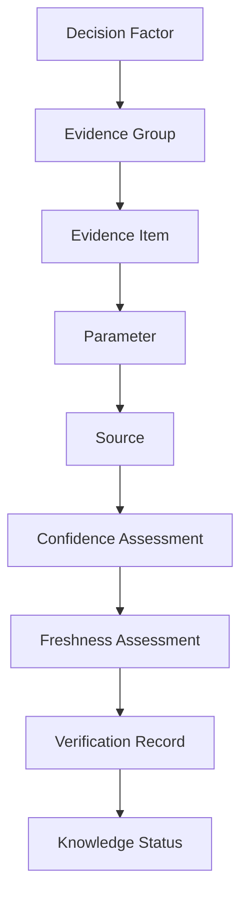
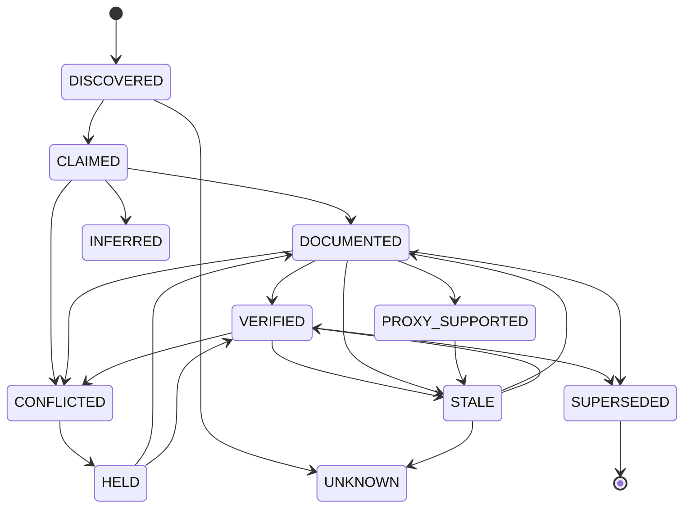
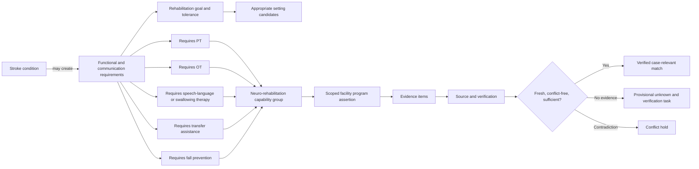
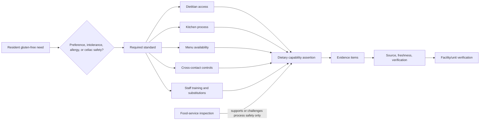
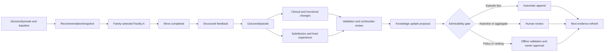

# OPTIME Decision Intelligence Architecture

Date: 2026-08-02

Status: Proposed long-term architecture. Documentation only.

Scope: This document defines how OPTIME should represent, acquire, verify, maintain, challenge, explain, and learn from decision knowledge. It does not modify the canonical parameter registry, ranking, scoring, APIs, evidence pipeline, databases, or application code.

## Principle Impact Check

- RELEVANT EXISTING PRINCIPLES: PR-001 Outcome-Only Optimization; PR-002 No Evidence, No Score; PR-003 Uncertainty Visibility; PR-004 No Commercial Bias; PR-005 Unknown Is Not Negative Evidence; PR-006 Verified Case-Relevant Evidence May Strengthen Proven Match; PR-007 Generic Completeness Must Not Drive Ranking; PR-008 Principle Consistency And Owner Approval Gate; PR-009 Parameter-First Facility Matching.
- DOES THIS CHANGE ALTER ANY PRINCIPLE? YES, at proposal level.
- OWNER APPROVAL REQUIRED? YES for semantic implementation; NO for this documentation-only architecture.
- CLASSIFICATION: C/D. Product Principle Ambiguity / Product Principle Change.
- IMPLEMENTATION GATE: STOP. No object type, relationship, confidence rule, ROI classification, learning rule, or recommendation role in this document is authorized for runtime use without explicit owner approval and separately validated implementation.

## Constitutional Purpose

OPTIME is not a parameter database. It is a decision institution whose durable asset is a governed record of:

1. what matters to a person and family,
2. what a care setting or facility can actually provide,
3. what evidence supports or challenges each claim,
4. how certain and current the claim is,
5. how the claim affected a decision, and
6. whether the resulting decision achieved the person's goals.

Every material fact must therefore be a first-class, versioned knowledge object or an immutable component linked to one. A rendered profile field, extracted string, model output, score, review, or facility assertion is not institutional knowledge until it has identity, scope, provenance, lifecycle, governance, and an audit trail.

This architecture incorporates the decision journey and 21-factor ontology defined in `reports/OPTIME_DECISION_ONTOLOGY_REVIEW.md`. The proposed 80 atomic fields remain a typed design target, not 80 independently weighted ranking parameters.

## Core Semantic Separation

The platform must never collapse these distinct concepts:

- **Need**: what the person requires or values.
- **Capability**: what a scoped facility, unit, program, or service can provide.
- **Claim**: a source's assertion about a need, capability, event, or outcome.
- **Evidence**: the preserved material supporting or challenging a claim.
- **Verification**: the governed process and result applied to evidence and claim identity.
- **Confidence**: bounded certainty that the stated value is true at the stated scope and time.
- **Freshness**: whether evidence remains temporally usable for its fact type.
- **Status**: lifecycle and recommendation-eligibility state; not confidence and not quality.
- **Match**: a case-specific relationship between a need and an evidenced capability.
- **Quality**: observed process or outcome evidence, not source volume or profile completeness.
- **Unknown**: insufficient evidence, never a negative fact.
- **Negative evidence**: verified evidence that a defined capability is absent or a defined adverse event occurred.

## Canonical Information Hierarchy

The requested hierarchy is a navigational view of a graph, not a rule that each child has only one parent:

A parameter may serve several factors; an evidence item may support or challenge several parameters; a source may publish many evidence items. Every relationship is explicit, typed, scoped, dated, versioned, and independently challengeable.

### Layer Contract

| Layer | Purpose | Ownership | Update rules | Confidence propagation | Conflict resolution | Storage model | Explainability |
| --- | --- | --- | --- | --- | --- | --- | --- |
| **Decision Factor** | Represents a clinically, practically, financially, relationally, or personally meaningful dimension of a decision | Decision Ontology Council; product owner approves semantic changes | Version only after evidence review, persona testing, and owner approval; never changed by facility data | Does not inherit a numeric confidence. Reports coverage and confidence distribution of relevant assertions | Conflicts are value tradeoffs, not truth conflicts; preserve resident priorities and actor disagreement | Versioned `decision_factor` node with definition, role, applicability, exclusions, and governing principle references | Family-facing label and why it matters; never expose internal weight |
| **Evidence Group** | Organizes the distinct proof needed to measure a factor without double counting correlated signals | Domain steward: clinical, regulatory, staffing, finance, lived experience, or transition | Add or retire groups through domain review; preserve historical membership | Aggregates only eligible parameter assertions using declared logic; weakest critical component may cap group confidence | Correlated evidence is clustered; disagreement opens a group conflict rather than averaging away contradiction | Versioned `evidence_group` node plus membership and aggregation-policy edges | Shows proof categories, gaps, and whether evidence is direct, supporting, or contextual |
| **Evidence Item** | Preserves one immutable observation, document passage, dataset row, response, event, or outcome | Ingestion owner; source steward; reviewer for promoted evidence | Append-only; correction creates a superseding item; raw payload/hash retained | Starts with extraction certainty and source applicability, not final claim confidence | Contradictory items coexist; no destructive overwrite; material conflicts create review incidents | Immutable `evidence_item` with content hash, locator, observed/published/retrieved times, extraction method, and scope | Can show citation, date, excerpt/measure, limitations, and whether it supports or challenges |
| **Parameter** | Defines a typed, atomic property that can describe a case, entity, capability, event, preference, transaction, or outcome | Parameter steward and domain owner; owner approval for canonical semantic changes | Schema-versioned; changes require migration/crosswalk; value updates occur through assertions, never by mutating the definition | Parameter definition has no confidence; each subject-value assertion has confidence derived from evidence | Competing values create parallel assertions and a conflict state; scope and time are resolved before authority | `parameter_definition` plus versioned `parameter_assertion(subject, value, scope, valid_time)` | Family sees plain-language meaning, case relevance, value, evidence state, and missingness when appropriate |
| **Source** | Identifies publisher, authority, document/system, acquisition method, and permitted use | Source Governance Council; identity resolution owner | Reassess authority on ownership, policy, methodology, retraction, or reliability change | Supplies an authority prior and applicability constraints; never confers truth by itself | Regulator controls regulatory status; source-specific claims remain bounded; independent corroboration preferred | `source` and `source_release` nodes with identity, tier by claim type, terms, jurisdiction, methodology, and reliability history | Show publisher and source class; explain that official facility content is a claim unless independently verified |
| **Confidence** | Quantifies bounded certainty in one assertion at one scope and time | Trust and Data Quality function; policy approved by owner | Recompute when evidence, conflict, scope, source reliability, or freshness changes; preserve prior assessment | Propagates from item to assertion to group using declared, monotonic rules; cannot exceed critical evidence ceiling | Unresolved material conflict caps confidence and blocks verified status; independent agreement may raise confidence within limits | Versioned `confidence_assessment` with components, formula/policy version, result, and reason codes | Family-facing bands plus reasons; numeric internals available to audit, not used as a quality score |
| **Freshness** | Determines temporal usability for a fact type and decision context | Parameter steward sets policy; ingestion owner executes refresh | Event-driven or TTL-based; expiry never converts value to NO; later source release may supersede immediately | Freshness can maintain or reduce confidence, never increase source authority | Newer does not automatically win if less authoritative or differently scoped; material changes create conflict/review | `freshness_assessment` with policy, as-of time, expiry, source-release cursor, and state | Show “verified as of,” expiry, stale/unknown label, and why re-verification is needed |
| **Verification** | Records what checks were performed, by whom/what, against which evidence and identity/scope | Verification owner; named human reviewer for escalations | Immutable attempt records; new checks append; reversal/supersession requires reason | Verification may remove uncertainty from identity, scope, and process; it cannot manufacture absent evidence | Failed identity/scope/domain checks block promotion; authoritative contradictions require human resolution | `verification_record` with method, checks, actor/model versions, result, date, and linked evidence | Show verified/documented/claimed/inferred and the verification method at an appropriate level |
| **Status** | Controls lifecycle, recommendation eligibility, and required next action | Governance policy; data-quality service applies; reviewer resolves holds | Deterministic transitions only; every transition audited; terminal records retained | Status is derived after confidence, freshness, verification, and conflict checks; it is not averaged | `CONFLICTED`, `STALE`, or `HELD` blocks silent promotion; resolution creates a new status event | Append-only `status_event` and materialized current state | Show family-safe state and next action; internal incident states remain internal unless decision-relevant |

### Supporting First-Class Objects

The hierarchy cannot safely operate without these peer objects:

| Object | Required role |
| --- | --- |
| `Entity` | Canonical identity for person, caregiver, facility, unit, program, service line, payer, source organization, or regulator |
| `ParameterAssertion` | The actual subject-property-value claim; separates a parameter definition from a facility or case fact |
| `RelationshipAssertion` | Typed graph edge with evidence, scope, direction, confidence, freshness, and status |
| `RequirementCapabilityMatch` | Case-specific assertion connecting a person requirement to a scoped capability |
| `DecisionEpisode` | Alternatives considered, actors, authority, constraints, shortlist, tradeoffs, selected option, and knowledge snapshot |
| `RecommendationSnapshot` | Immutable set of object/edge versions, policies, model/rule versions, and explanation used for one recommendation |
| `OutcomeEpisode` | Post-decision observations tied to baseline, time horizon, reporter, and confounders |
| `ConflictIncident` | Competing assertions, materiality, affected decisions, owner, disposition, and resolution evidence |
| `ReviewTask` | Human/accountable action for ambiguity, conflict, harm signal, proxy promotion, or policy change |
| `AuditEvent` | Who/what created, read, changed, challenged, verified, expired, or used an object, with reason and timestamp |

### Confidence Propagation Rules

Confidence is about the truth of a bounded assertion, not about whether a facility is “good.” The architecture should use a policy-versioned function rather than one universal formula:

$$
C(a) = \operatorname{cap}_{type}\left(A_s \times Q_e \times I_{scope} \times R_f \times V_m \times K_c\right)
$$

where:

- $A_s$ is claim-type-specific source authority,
- $Q_e$ is evidence quality and extraction certainty,
- $I_{scope}$ is identity and scope match,
- $R_f$ is freshness retention,
- $V_m$ is verification-method strength, and
- $K_c$ is the conflict/corroboration modifier.

Rules:

1. Any failed identity or scope check sets recommendation eligibility to false regardless of numeric confidence.
2. Corroboration raises confidence only for independent evidence; repeated copies of one source count once.
3. Provider self-report can establish `CLAIMED` or `DOCUMENTED`; it cannot independently establish an outcome or regulatory standing.
4. AI extraction confidence concerns transcription/classification, not truth. Keep it separate from assertion confidence.
5. A proxy has its own bounded assertion and can never inherit the confidence of the direct fact it approximates.
6. An evidence group may use minimum, conjunction, disjunction, or measure-specific synthesis. Generic averaging is forbidden.
7. Critical-path confidence is capped by the least certain required assertion, while missing noncritical preferences affect explanation/coverage only.
8. UNKNOWN contributes neither positive nor negative match evidence.

### Status State Machine

`NO_NEGATIVE_EVIDENCE` is a specialized bounded assertion status governed by the existing formal rule in `reports/OPTIME_DATA_INTELLIGENCE_BLUEPRINT.md`; it is never equivalent to `VERIFIED`, `YES`, safety, or quality.

### Storage Principles

1. **Append, do not overwrite.** Current state is a materialized view over immutable assertions, evidence, verification, confidence, freshness, and status events.
2. **Bitemporal facts.** Store valid time (when the fact was true) and transaction time (when OPTIME knew it).
3. **Scope is mandatory.** Every facility fact identifies facility, unit, program, service line, payer, room, or case scope; no silent inheritance.
4. **Content-address evidence.** Preserve a cryptographic hash and locator so evidence can be reproduced or detected as changed.
5. **Separate sensitive case data.** Resident/caregiver objects use purpose limitation, least privilege, retention limits, and de-identification for learning.
6. **Graph and analytical views are projections.** The canonical event/assertion store remains the audit source; graph indices and feature tables are rebuildable.
7. **Policy versions are data.** Confidence, freshness, source hierarchy, status, aggregation, and recommendation-eligibility policies are versioned objects.

## Current-State Reconciliation

Existing repository assets are useful but not yet the canonical hierarchy:

- `facility_evidence_matrix_schema.json` defines source levels, verification values, unknown handling, and minimum fields.
- `knowledge_object_schema.md` and `knowledge_repository_schema.md` describe reusable facts, evidence, relationships, history, and governance.
- `community_outcome_framework.json` separates resident profile, chosen community, timed outcomes, opinions, allegations, and verified issues, but most outcome values are null and it is not a placement-learning contract.
- `recommendation_traceability_matrix.json` preserves recommendation evidence counts, rules, explanations, and unknown handling, but it does not snapshot every object and relationship version proposed here.

Future implementation should reconcile and migrate these assets rather than silently replacing them. This document is the proposed semantic contract; it is not proof that the current runtime conforms to it.

## Conceptual OPTIME Knowledge Graph

### Graph Purpose

The graph connects people, goals, needs, settings, capabilities, evidence, sources, facilities, decisions, and outcomes without forcing them into one flat record. It supports four operations:

1. discover which evidence is relevant to a case,
2. test whether a facility has a decision-critical capability at the correct scope,
3. explain every match, mismatch, unknown, and tradeoff through a traversable evidence path, and
4. learn from outcomes without treating one family's experience as universal facility quality.

The graph is conceptual. It does not require a graph database; relational tables with typed edge records can be canonical if they preserve the same semantics and auditability.

### Canonical Node Types

| Node family | Central nodes | Why central |
| --- | --- | --- |
| Decision | Decision episode, goal, constraint, preference, requirement, tradeoff | Anchors relevance; no facility fact affects a decision without a case-specific path |
| Person and family | Resident, decision authority, caregiver, family system, communication need | Preserves agency, support, burden, and actor disagreement |
| Clinical and functional | Condition, symptom/risk, function, ADL, cognition, behavior, medication, diet, rehabilitation goal | Converts diagnoses into specific care requirements rather than category assumptions |
| Care delivery | Setting, capability, discipline, intervention, staffing model, workflow, equipment, transition process | Represents what care is actually delivered and at what scope |
| Organization | Facility, unit, program, service line, payer, regulator, source organization | Provides identity, jurisdiction, ownership, and exact service scope |
| Evidence and governance | Parameter, assertion, evidence item, source release, verification, confidence, freshness, status, conflict | Makes every conclusion challengeable and reproducible |
| Outcome | Placement, move completion, goal attainment, function change, utilization event, adjustment, satisfaction/regret, relocation | Connects decisions to results while preserving time and case context |

The most central node is not `Facility`; it is `DecisionEpisode`. Facility centrality would recreate a profile-centric system. Every recommendation path begins with a person goal or requirement and ends with a scoped facility assertion supported by evidence.

### Canonical Edge Types

| Edge | Meaning | Direct or inferred | Recommendation use |
| --- | --- | --- | --- |
| `HAS_REQUIREMENT` | Case/person requires a typed support | Direct from assessed case or professional recommendation | Eligibility or proven-match input when verified and case-critical |
| `HAS_PREFERENCE` | Resident assigns importance to a noncritical choice | Direct resident/proxy statement with authority context | Preference fit only |
| `HAS_CONSTRAINT` | Budget, timing, payer, geography, or legal condition limits feasibility | Direct or rule-derived from verified facts | Feasibility gate or explanation |
| `APPROPRIATE_SETTING_CANDIDATE` | A setting is clinically/plausibly supportable | Professional evidence or governed support; not autonomous diagnosis | Candidate-setting generation with uncertainty |
| `REQUIRES_CAPABILITY` | Requirement depends on a capability | Ontology rule reviewed by domain owner | Expands a need into testable capability questions |
| `PROVIDES_CAPABILITY` | Scoped facility/unit/program provides a capability | Direct evidenced assertion only | Match/mismatch/unknown computation |
| `DELIVERED_BY` | Capability is delivered by discipline/staff/service line | Direct or documented | Delivery detail and explanation |
| `DEPENDS_ON` | Capability needs staffing, equipment, workflow, or partner arrangement | Governed domain relationship | Completeness check; cannot independently prove provision |
| `MEASURED_BY` | Factor/capability/outcome is measured by a parameter or evidence group | Ontology definition | Evidence retrieval and traceability |
| `SUPPORTED_BY` / `CHALLENGED_BY` | Assertion is supported or contradicted by evidence | Direct evidence linkage | Confidence, conflict, and explanation |
| `PUBLISHED_BY` | Evidence item came from a source release | Direct provenance | Source authority and reproduction |
| `SCOPED_TO` | Assertion applies to facility, unit, program, service, room, payer, or case | Direct identity/scope fact | Prevents unsafe inheritance |
| `VALID_DURING` | Assertion applies during a valid-time interval | Direct/derived from evidence dates | Freshness and historical reconstruction |
| `SUPERSEDES` | New assertion/evidence/policy replaces prior version | Governed lifecycle event | Current-state materialization; history remains visible |
| `MATCHES` / `MISMATCHES` | Case requirement aligns or conflicts with scoped capability | Derived only from verified operands and policy version | Candidate decision and explanation |
| `UNKNOWN_FOR` | Required assertion lacks sufficient current evidence | Derived absence-of-evidence state | Verification queue; neutral to score |
| `SELECTED` | Decision episode selected an option | Direct decision event | Outcome linkage, not proof of quality |
| `RESULTED_IN` | Placement/decision preceded an observed outcome | Direct temporal association | Learning evidence; never causal by itself |
| `SIMILAR_CONTEXT_TO` | Cases share governed contextual features | Inferred and privacy-controlled | Cohort analysis after minimum sample/review; never individual proof |

### Stroke Rehabilitation Path

Safe conclusions:

- Stroke can activate questions about function, cognition, communication, swallowing, therapy, transfer, falls, nursing, caregiver support, and setting.
- Verified PT, OT, and speech availability can prove discipline availability at a scope.
- A documented multidisciplinary pathway, current dose, staff competency, and relevant outcomes may strengthen proven match.

Forbidden conclusions:

- Stroke alone does not prove a person needs every therapy.
- PT presence does not imply OT, speech therapy, neuro expertise, sufficient dose, or good outcomes.
- A facility name containing “rehabilitation” does not prove capability.
- Missing neuro-program evidence does not prove a facility lacks relevant services.

### Gluten-Free And Dietary Safety Path

Safe conclusions:

- A current official menu can document option availability.
- A dietitian, written kitchen procedure, training, and cross-contact controls can support a stronger medical-safety assertion.
- Inspection evidence may challenge sanitary/process claims or provide bounded context.

Forbidden conclusions:

- A gluten-free menu item does not prove celiac-safe preparation.
- A dietitian's presence does not prove daily implementation.
- No inspection finding does not prove the kitchen is safe or high quality.
- Jewish programming does not prove a kosher kitchen, and kosher evidence does not establish the resident's preferred standard without asking.

### High-Value Relationship Patterns

Engineering should prioritize relationships that change eligibility, prevent unsupported inference, or explain a decision:

1. `Requirement -> REQUIRES_CAPABILITY -> Scoped capability assertion`.
2. `Assertion -> SUPPORTED_BY/CHALLENGED_BY -> Evidence item -> PUBLISHED_BY -> Source release`.
3. `Assertion -> SCOPED_TO -> Unit/program/service line`.
4. `Assertion -> confidence/freshness/verification/status assessments`.
5. `Decision episode -> USED_KNOWLEDGE -> immutable object and policy versions`.
6. `Decision episode -> SELECTED -> placement -> RESULTED_IN -> timed outcome episode`.
7. `Conflict incident -> AFFECTS -> assertion/recommendation snapshot`.

Lower-value edges such as generic facility-category similarity, marketing-topic co-occurrence, or unverified “nearby service” links may support discovery but must not enter recommendation paths.

### Inference Governance

Every inferred edge must record:

- premise object and edge versions,
- inference rule and version,
- output scope and permitted wording,
- confidence ceiling,
- creation and expiry time,
- recommendation eligibility,
- counterevidence query,
- reviewer requirement, and
- explanation template.

Inferences are monotonic only within their bounded claim. Example: a verified Florida ECC license may support legal scope, but it cannot establish current staffing or resident-specific delivery. A proxy expiration immediately invalidates dependent inferred edges; it does not invalidate the underlying direct evidence.

### Decision-Critical Paths

A path is decision-critical when failure at any required edge could make the recommendation unsafe, infeasible, or materially inconsistent with the resident's stated goals.

| Path | Required terminal states | Failure behavior |
| --- | --- | --- |
| Clinical need -> capability -> scoped provider | Verified match or explicit professional exception | Verified mismatch excludes when governed; unknown remains provisional and triggers verification |
| Setting recommendation -> eligible setting -> facility | Current support and no verified legal/clinical conflict | Do not rank across inappropriate settings as though they are equivalent |
| Payer/eligibility -> case acceptance -> bed/unit | Current case-specific verification | Mark not actionable; do not convert facility participation into acceptance |
| Admission deadline -> availability -> earliest admission | Fresh transaction evidence | Expired evidence becomes unknown; never infer from marketing vacancy |
| Medical diet -> standard -> kitchen process | Sufficient standard-specific evidence | Distinguish preference accommodation from medical safety |
| Resident authority/goals -> preference tradeoff | Current authority and resident voice | Surface disagreement; do not silently replace resident preference with family preference |
| Recommendation -> knowledge snapshot -> explanation | Complete versioned trace | Block publication if a material claim cannot be reproduced |

The graph improves recommendations by retrieving more relevant evidence and preventing invalid shortcuts. It does not make unsupported conclusions acceptable: graph proximity, path count, centrality, embeddings, or model similarity are discovery signals only unless a governed relationship assertion and sufficient evidence support the conclusion.

## Knowledge Economics

### Economic Model

Knowledge economics prioritizes decision yield, not profile completeness. The current acquisition strategies and cost ranges come from `reports/OPTIME_DATA_INTELLIGENCE_BLUEPRINT.md`; the scores below are architecture-planning estimates, not measured production costs or approved ranking weights.

Scales:

- **Decision Value (DV), 1-5:** maximum plausible effect when case-relevant; 5 can change safety, eligibility, or actionability, while 1 is rarely decision-relevant.
- **Operational Cost (O), Maintenance Cost (M), Refresh Cost (R), 1-5:** relative recurring burden after shared infrastructure.
- **Automation Potential (A), 0-100%:** share of routine acquisition/normalization that can be automated without upgrading a claim beyond evidence.
- **Scalability (S), 1-5:** ability to apply consistently across a statewide/national universe.
- **Expected Confidence (EC), 0-100:** expected confidence of an acquired value at its permitted scope, not confidence that a facility is good.

Decision ROI is a normalized planning index:

$$
ROI = \operatorname{round}\left(100 \times \frac{DV}{5} \times \frac{A}{100} \times \frac{S}{5} \div \frac{O+M+R}{3}\right)
$$

ROI is intentionally low for expensive but essential case verification. A low ROI does not authorize skipping a safety-critical fact; it means engineering should reduce its cost or ask only when relevant. Quadrants use `DV >= 4` as high value and average recurring cost `<= 2` as low cost.

Strategy assumptions: `A` government automation = costs 1/1/1, automation 95%, scalability 5, confidence 98%; `C/D` official document/site extraction = 2/2/2, 80%, 5, 91%; `F` governed proxy = 3/3/2, 65%, 4, 82%; `G` direct case verification = 4/4/4, 35%, 3, 94%; `J` deliberate noncollection = 1/1/1, 0%, 5, 0%. Actual per-facility ranges remain those in the blueprint.

Investment codes: `P0` automate first; `P1` build next; `P2` optimize case-triggered verification; `P3` collect only when explicitly relevant; `P4` do not collect.

### Complete Parameter Economics Matrix

| # | Parameter | Strategy | DV | O | M | R | A% | S | EC% | ROI | Quadrant | Invest |
| ---: | --- | --- | ---: | ---: | ---: | ---: | ---: | ---: | ---: | ---: | --- | --- |
| 01 | `skilled_nursing_capabilities` | A | 5 | 1 | 1 | 1 | 95 | 5 | 98 | 95 | High Value / Low Cost | P0 |
| 02 | `nursing_24_7` | G | 5 | 4 | 4 | 4 | 35 | 3 | 94 | 5 | High Value / High Cost | P2 |
| 03 | `direct_24hr_nurse_availability` | G | 3 | 4 | 4 | 4 | 35 | 3 | 94 | 3 | Low Value / High Cost | P3 |
| 04 | `third_party_24hr_nurse_availability` | G | 2 | 4 | 4 | 4 | 35 | 3 | 94 | 2 | Low Value / High Cost | P3 |
| 05 | `rn_hours_per_resident_day` | A | 4 | 1 | 1 | 1 | 95 | 5 | 98 | 76 | High Value / Low Cost | P0 |
| 06 | `total_nurse_hours_per_resident_day` | A | 4 | 1 | 1 | 1 | 95 | 5 | 98 | 76 | High Value / Low Cost | P0 |
| 07 | `adl_support` | D | 5 | 2 | 2 | 2 | 80 | 5 | 91 | 40 | High Value / Low Cost | P1 |
| 08 | `medication_support` | D | 5 | 2 | 2 | 2 | 80 | 5 | 91 | 40 | High Value / Low Cost | P1 |
| 09 | `transfer_assistance` | D | 5 | 2 | 2 | 2 | 80 | 5 | 91 | 40 | High Value / Low Cost | P1 |
| 10 | `higher_acuity_capabilities` | F | 4 | 3 | 3 | 2 | 65 | 4 | 82 | 16 | High Value / High Cost | P2 |
| 11 | `pt` | D | 5 | 2 | 2 | 2 | 80 | 5 | 91 | 40 | High Value / Low Cost | P1 |
| 12 | `ot` | D | 5 | 2 | 2 | 2 | 80 | 5 | 91 | 40 | High Value / Low Cost | P1 |
| 13 | `speech_therapy` | D | 5 | 2 | 2 | 2 | 80 | 5 | 91 | 40 | High Value / Low Cost | P1 |
| 14 | `short_term_rehab` | D | 4 | 2 | 2 | 2 | 80 | 5 | 91 | 32 | High Value / Low Cost | P1 |
| 15 | `post_stroke_neuro_evidence` | F | 5 | 3 | 3 | 2 | 65 | 4 | 82 | 20 | High Value / High Cost | P2 |
| 16 | `therapy_staffing` | G | 5 | 4 | 4 | 4 | 35 | 3 | 94 | 5 | High Value / High Cost | P2 |
| 17 | `memory_care` | D | 5 | 2 | 2 | 2 | 80 | 5 | 91 | 40 | High Value / Low Cost | P1 |
| 18 | `dementia_alz_programs` | D | 4 | 2 | 2 | 2 | 80 | 5 | 91 | 32 | High Value / Low Cost | P1 |
| 19 | `wound_care` | D | 4 | 2 | 2 | 2 | 80 | 5 | 91 | 32 | High Value / Low Cost | P1 |
| 20 | `dialysis_arrangements` | D | 5 | 2 | 2 | 2 | 80 | 5 | 91 | 40 | High Value / Low Cost | P1 |
| 21 | `respiratory_trach_vent` | F | 5 | 3 | 3 | 2 | 65 | 4 | 82 | 20 | High Value / High Cost | P2 |
| 22 | `hospice_palliative_arrangements` | D | 4 | 2 | 2 | 2 | 80 | 5 | 91 | 32 | High Value / Low Cost | P1 |
| 23 | `specialty_licenses` | A | 4 | 1 | 1 | 1 | 95 | 5 | 98 | 76 | High Value / Low Cost | P0 |
| 24 | `extended_congregate_care` | A | 4 | 1 | 1 | 1 | 95 | 5 | 98 | 76 | High Value / Low Cost | P0 |
| 25 | `limited_nursing_services` | A | 4 | 1 | 1 | 1 | 95 | 5 | 98 | 76 | High Value / Low Cost | P0 |
| 26 | `limited_mental_health` | A | 4 | 1 | 1 | 1 | 95 | 5 | 98 | 76 | High Value / Low Cost | P0 |
| 27 | `secured_units` | D | 5 | 2 | 2 | 2 | 80 | 5 | 91 | 40 | High Value / Low Cost | P1 |
| 28 | `inspection_rating` | A | 4 | 1 | 1 | 1 | 95 | 5 | 98 | 76 | High Value / Low Cost | P0 |
| 29 | `deficiency_count` | A | 3 | 1 | 1 | 1 | 95 | 5 | 98 | 57 | Low Value / Low Cost | P3 |
| 30 | `deficiency_severity` | A | 5 | 1 | 1 | 1 | 95 | 5 | 98 | 95 | High Value / Low Cost | P0 |
| 31 | `complaint_related_findings` | A | 4 | 1 | 1 | 1 | 95 | 5 | 98 | 76 | High Value / Low Cost | P0 |
| 32 | `fire_safety_deficiencies` | A | 4 | 1 | 1 | 1 | 95 | 5 | 98 | 76 | High Value / Low Cost | P0 |
| 33 | `infection_control_findings` | A | 5 | 1 | 1 | 1 | 95 | 5 | 98 | 95 | High Value / Low Cost | P0 |
| 34 | `penalties_fines` | A | 3 | 1 | 1 | 1 | 95 | 5 | 98 | 57 | Low Value / Low Cost | P3 |
| 35 | `sanctions_final_orders` | A | 4 | 1 | 1 | 1 | 95 | 5 | 98 | 76 | High Value / Low Cost | P0 |
| 36 | `payment_denials` | A | 4 | 1 | 1 | 1 | 95 | 5 | 98 | 76 | High Value / Low Cost | P0 |
| 37 | `quality_measures` | A | 5 | 1 | 1 | 1 | 95 | 5 | 98 | 95 | High Value / Low Cost | P0 |
| 38 | `hospital_claims_outcomes` | A | 5 | 1 | 1 | 1 | 95 | 5 | 98 | 95 | High Value / Low Cost | P0 |
| 39 | `staffing_turnover` | A | 4 | 1 | 1 | 1 | 95 | 5 | 98 | 76 | High Value / Low Cost | P0 |
| 40 | `languages` | F | 4 | 3 | 3 | 2 | 65 | 4 | 82 | 16 | High Value / High Cost | P2 |
| 41 | `dietary_capabilities` | C | 4 | 2 | 2 | 2 | 80 | 5 | 91 | 32 | High Value / Low Cost | P1 |
| 42 | `gluten_free` | C | 3 | 2 | 2 | 2 | 80 | 5 | 91 | 24 | Low Value / Low Cost | P3 |
| 43 | `kosher` | C | 3 | 2 | 2 | 2 | 80 | 5 | 91 | 24 | Low Value / Low Cost | P3 |
| 44 | `religious_cultural_services` | C | 3 | 2 | 2 | 2 | 80 | 5 | 91 | 24 | Low Value / Low Cost | P3 |
| 45 | `activities` | C | 2 | 2 | 2 | 2 | 80 | 5 | 91 | 16 | Low Value / Low Cost | P3 |
| 46 | `transportation` | D | 3 | 2 | 2 | 2 | 80 | 5 | 91 | 24 | Low Value / Low Cost | P3 |
| 47 | `amenities` | D | 1 | 2 | 2 | 2 | 80 | 5 | 91 | 8 | Low Value / Low Cost | P4 |
| 48 | `private_shared_rooms` | D | 3 | 2 | 2 | 2 | 80 | 5 | 91 | 24 | Low Value / Low Cost | P3 |
| 49 | `accessibility` | D | 4 | 2 | 2 | 2 | 80 | 5 | 91 | 32 | High Value / Low Cost | P1 |
| 50 | `payer_information` | C | 5 | 2 | 2 | 2 | 80 | 5 | 91 | 40 | High Value / Low Cost | P1 |
| 51 | `medicaid_attributes` | A | 5 | 1 | 1 | 1 | 95 | 5 | 98 | 95 | High Value / Low Cost | P0 |
| 52 | `medicare_attributes` | A | 5 | 1 | 1 | 1 | 95 | 5 | 98 | 95 | High Value / Low Cost | P0 |
| 53 | `published_rates` | C | 4 | 2 | 2 | 2 | 80 | 5 | 91 | 32 | High Value / Low Cost | P1 |
| 54 | `fees` | C | 4 | 2 | 2 | 2 | 80 | 5 | 91 | 32 | High Value / Low Cost | P1 |
| 55 | `current_availability` | G | 5 | 4 | 4 | 4 | 35 | 3 | 94 | 5 | High Value / High Cost | P2 |
| 56 | `earliest_admission_date` | G | 5 | 4 | 4 | 4 | 35 | 3 | 94 | 5 | High Value / High Cost | P2 |
| 57 | `waiting_list` | G | 4 | 4 | 4 | 4 | 35 | 3 | 94 | 4 | High Value / High Cost | P2 |
| 58 | `current_price` | G | 5 | 4 | 4 | 4 | 35 | 3 | 94 | 5 | High Value / High Cost | P2 |
| 59 | `current_promotions` | J | 1 | 1 | 1 | 1 | 0 | 5 | 0 | 0 | Low Value / Low Cost | P4 |

### Engineering Investment Order

1. **P0 official truth infrastructure:** identity resolution, source releases, licenses, staffing, regulatory events, quality measures, claims outcomes, Medicaid/Medicare participation, and bitemporal refresh. These fields combine high decision value, high scalability, high expected confidence, and low marginal cost.
2. **P1 typed extraction:** task-level ADLs, medication, transfers, PT/OT/speech, dementia, specialty services, diet, accessibility, payer documents, rates, and fees. Engineering must extract scope and limitations, not only YES/NO.
3. **P2 case-verification workflow:** 24/7 coverage, therapy staffing, respiratory/high-acuity details, language availability, exact bed/date/price. Invest in a single structured asynchronous request bundle with expiry rather than routine calls.
4. **P3 relevance-triggered facts:** direct/contract employment detail, raw counts/fines, gluten-free/kosher/culture, activities, transport, room type. Acquire only when the case or explanation requires the distinction.
5. **P4 noncollection/removal:** generic amenities and promotions should not receive broad acquisition investment. Named accessibility or resident-requested environmental features belong in typed case-relevant fields instead.

### Information Not Worth Collecting

Do not collect or maintain these as canonical organic decision inputs:

- promotions, discounts, referral economics, sponsorship, advertising spend, lead value, or partner status;
- generic amenity counts, marketing adjectives, stock imagery, or social-post volume;
- undifferentiated review sentiment or popularity for its own sake;
- duplicated copies of the same source presented as corroboration;
- precise dynamic price or availability outside an active decision window;
- broad “high acuity,” “luxury,” “best,” “specialized,” or “home-like” labels without atomic evidence;
- sensitive person data without a defined decision, safety, legal, equity-audit, or consented learning purpose;
- outcome fields that cannot be tied to baseline, time horizon, reporter, and relevant context.

Low collection cost does not justify low-value data. Every proposed object must pass a documented decision contribution, governance, privacy, and maintenance test before ingestion.

## Explainability Architecture

### Exposure Rules

Explainability is a projection of the same versioned evidence used by the decision engine, not separately authored marketing copy. Every recommendation snapshot must preserve the material factors, assertions, sources, verification states, confidence bands, freshness states, conflicts, unknowns, rules, and model/policy versions that produced it.

Four exposure roles are distinct:

- **Family-visible:** show directly when the fact is relevant to a stated need, constraint, comparison, or active transaction.
- **Ranking support:** may affect eligibility, proven match, potential match, quality support, or uncertainty only under an approved rule. It is never a generic completeness bonus.
- **Explanation-visible:** disclose whenever the input materially changes ordering, gating, confidence, or the difference between proven and potential match. Raw technical detail may be behind “why” or evidence views.
- **Internal-only:** limited to workflow routing, extraction diagnostics, protected audit metadata, abuse controls, and calculation internals. Internal-only data may not become an unexplained organic ranking input.

Permitted family wording must describe bounded evidence: “the current source documents…,” “verified on…,” “the facility reports…,” “not yet confirmed,” or “sources conflict.” It must not turn evidence into an absolute promise. Absence of evidence is worded as unknown, never as lack of capability.

### Complete Explainability Matrix

`Gate` means case eligibility or safety; `Match` means need-capability fit; `Support` means governed quality or confidence support; `None` means no organic ranking effect. “Rank-only?” is deliberately `No` for all canonical inputs: material effects must be explainable.

| # | Parameter | Family sees | Ranking role | Rank-only? | Explanation | Internal only? |
| ---: | --- | --- | --- | --- | --- | --- |
| 01 | `skilled_nursing_capabilities` | When relevant | Gate / Match | No | Direct capability and scope | No |
| 02 | `nursing_24_7` | When relevant | Gate / Match | No | Coverage model, scope, and verification | No |
| 03 | `direct_24hr_nurse_availability` | On request | Match | No | Employment distinction when material | No |
| 04 | `third_party_24hr_nurse_availability` | On request | Match | No | Contracted coverage distinction when material | No |
| 05 | `rn_hours_per_resident_day` | On request | Support | No | Staffing evidence when material | No |
| 06 | `total_nurse_hours_per_resident_day` | On request | Support | No | Staffing evidence when material | No |
| 07 | `adl_support` | When relevant | Gate / Match | No | Supported tasks, limits, and unknowns | No |
| 08 | `medication_support` | When relevant | Gate / Match | No | Supported tasks, limits, and unknowns | No |
| 09 | `transfer_assistance` | When relevant | Gate / Match | No | Assistance level and verification | No |
| 10 | `higher_acuity_capabilities` | When relevant | Gate / Match | No | Atomic capability evidence; never broad label alone | No |
| 11 | `pt` | When relevant | Gate / Match | No | Modality, delivery, frequency evidence | No |
| 12 | `ot` | When relevant | Gate / Match | No | Modality, delivery, frequency evidence | No |
| 13 | `speech_therapy` | When relevant | Gate / Match | No | Modality, delivery, frequency evidence | No |
| 14 | `short_term_rehab` | When relevant | Match | No | Program scope and supporting evidence | No |
| 15 | `post_stroke_neuro_evidence` | When relevant | Match / Support | No | Evidence strength and limitations | No |
| 16 | `therapy_staffing` | When relevant | Match / Support | No | Current discipline, coverage, and date | No |
| 17 | `memory_care` | When relevant | Gate / Match | No | Program scope and setting | No |
| 18 | `dementia_alz_programs` | When relevant | Match | No | Program components and verification | No |
| 19 | `wound_care` | When relevant | Gate / Match | No | Wound types, limits, and delivery model | No |
| 20 | `dialysis_arrangements` | When relevant | Gate / Match | No | On-site/transport/partner arrangement | No |
| 21 | `respiratory_trach_vent` | When relevant | Gate / Match | No | Atomic respiratory capabilities and limits | No |
| 22 | `hospice_palliative_arrangements` | When relevant | Match | No | Arrangement type and current scope | No |
| 23 | `specialty_licenses` | When relevant | Gate / Match | No | License, jurisdiction, status, and date | No |
| 24 | `extended_congregate_care` | When relevant | Gate / Match | No | License status and permitted scope | No |
| 25 | `limited_nursing_services` | When relevant | Gate / Match | No | License status and permitted scope | No |
| 26 | `limited_mental_health` | When relevant | Gate / Match | No | License status and permitted scope | No |
| 27 | `secured_units` | When relevant | Gate / Match | No | Unit type, population, and verification | No |
| 28 | `inspection_rating` | Comparison / why | Support | No | Rating period, authority, and limitations | No |
| 29 | `deficiency_count` | Evidence view | Support | No | Period and denominator; never count alone | No |
| 30 | `deficiency_severity` | Comparison / why | Support | No | Severity, recency, correction, and scope | No |
| 31 | `complaint_related_findings` | Comparison / why | Support | No | Final findings separated from allegations | No |
| 32 | `fire_safety_deficiencies` | Comparison / why | Gate / Support | No | Severity, correction status, and date | No |
| 33 | `infection_control_findings` | Comparison / why | Gate / Support | No | Severity, recurrence, correction, and date | No |
| 34 | `penalties_fines` | Evidence view | Support | No | Final action, reason, amount, and period | No |
| 35 | `sanctions_final_orders` | Comparison / why | Gate / Support | No | Current legal status and scope | No |
| 36 | `payment_denials` | Comparison / why | Support | No | Basis, duration, and current status | No |
| 37 | `quality_measures` | Comparison / why | Support | No | Measure, period, denominator, and benchmark | No |
| 38 | `hospital_claims_outcomes` | Comparison / why | Support | No | Risk adjustment, period, and limitations | No |
| 39 | `staffing_turnover` | Comparison / why | Support | No | Role, period, denominator, and benchmark | No |
| 40 | `languages` | When relevant | Gate / Match | No | Language, role, shift, and interpretation model | No |
| 41 | `dietary_capabilities` | When relevant | Gate / Match | No | Diet, cross-contact controls, and verification | No |
| 42 | `gluten_free` | When relevant | Gate / Match | No | Preparation controls; never menu label alone | No |
| 43 | `kosher` | When relevant | Gate / Match | No | Standard, supervision, and preparation controls | No |
| 44 | `religious_cultural_services` | When relevant | Match | No | Specific service and delivery pattern | No |
| 45 | `activities` | When relevant | Match | No | Specific resident-requested activity only | No |
| 46 | `transportation` | When relevant | Gate / Match | No | Destinations, schedule, cost, and accessibility | No |
| 47 | `amenities` | On request | None | No | Named requested feature; no generic bonus | No |
| 48 | `private_shared_rooms` | When relevant | Match | No | Room configuration and current availability | No |
| 49 | `accessibility` | When relevant | Gate / Match | No | Named access need and verified feature | No |
| 50 | `payer_information` | When relevant | Gate / Match | No | Accepted payer, constraints, and verification | No |
| 51 | `medicaid_attributes` | When relevant | Gate / Match | No | Participation type, status, and limits | No |
| 52 | `medicare_attributes` | When relevant | Gate / Match | No | Certification/coverage status and limits | No |
| 53 | `published_rates` | When relevant | Match | No | Rate date, unit, inclusions, and exclusions | No |
| 54 | `fees` | When relevant | Match | No | Fee trigger, amount/range, and date | No |
| 55 | `current_availability` | Active transaction | Gate / Match | No | Unit/bed scope, as-of time, and expiry | No |
| 56 | `earliest_admission_date` | Active transaction | Gate / Match | No | Earliest date, assumptions, and expiry | No |
| 57 | `waiting_list` | Active transaction | Gate / Match | No | Queue status, estimate, and expiry | No |
| 58 | `current_price` | Active transaction | Gate / Match | No | Quoted amount, scope, terms, and expiry | No |
| 59 | `current_promotions` | Clearly labeled commercial surface only | None | No | Never in organic recommendation rationale | No |

### Explanation Contract

Each family-facing recommendation must answer:

1. **Why this facility is present:** the case requirements it meets and any hard gates applied.
2. **What is proven:** verified, scoped capabilities and supporting quality evidence.
3. **What is only potential:** claims or proxy-supported possibilities that require confirmation.
4. **What is unknown or conflicted:** decision-critical gaps, source disagreement, and the next verification action.
5. **Why alternatives differ:** material factor-level differences, not an opaque composite score.
6. **When the explanation was true:** source dates, effective interval, retrieval time, and snapshot version.

Families may inspect source lineage and challenge any material assertion. A challenge creates a review task and preserves the original recommendation snapshot; it does not silently rewrite history.

## Continuous-Learning Architecture

### Learning Unit And Flow

The learning unit is a consented, versioned `DecisionEpisode` joined to a later `OutcomeEpisode`; it is not a facility review and not a row added directly to a ranking model. The system must preserve the baseline case, facilities considered, recommendation snapshot, family decision, transition, observation horizon, reporter, evidence, and relevant confounders.

Required episode fields include:

- pseudonymous episode/person identity and explicit consent/permission basis;
- baseline needs, risks, preferences, payer/financial constraints, urgency, and stated priorities;
- complete recommendation snapshot and the evidence/rule/model versions used;
- selected facility, stated selection reasons, alternatives considered, and whether OPTIME influenced the choice;
- move attempted/completed/cancelled, transition dates, and reasons;
- outcome domain, baseline measure, follow-up measure, horizon, reporter, collection method, and missingness;
- clinical or functional change, hospitalization/transfer, satisfaction, lived-fit signals, and reported problems;
- treatment exposure, service availability, adherence, major intervening events, and known confounders;
- provenance, verification, confidence, review state, privacy class, retention, and permitted learning uses.

### What An Outcome Means

Selection is evidence of a family decision, not proof of facility quality, recommendation correctness, or causal benefit. Move completion is an operational outcome, not a clinical success. Satisfaction is a bounded reporter observation, not proof of safety. One favorable or unfavorable episode is never a facility-wide conclusion.

Outcomes are interpreted only at their measured scope. A facility assertion may be updated from an outcome when the outcome directly verifies or challenges that bounded assertion, such as “the promised gluten-free process was unavailable during this stay.” Indirect clinical improvement or decline may create an analytical signal or review task, but cannot silently become a capability or quality fact.

### Admissibility Matrix

| Learning input or action | Automatic | Human review | Never directly influences recommendations |
| --- | --- | --- | --- |
| Consent, contact preference, and retention changes | Apply permission state immediately | Review ambiguity or legal hold | Raw permission history as quality/match |
| Recommendation, selection, move, and follow-up events | Append immutable event | Review contradictory event reports | Selection popularity as quality |
| Structured family feedback | Append as attributed observation | Required before facility assertion | Unverified sentiment as organic boost/penalty |
| Clinical/functional measurement | Append at episode scope after schema validation | Required for interpretation and aggregate eligibility | Unadjusted single outcome as facility quality |
| Satisfaction measurement | Append at episode/reporter scope | Review suspicious, duplicate, or disputed records | Popularity or response volume as quality |
| Direct contradiction of a promised capability | Create conflict/review task and provisional hold where safety-critical | Resolve assertion scope and evidence | Automatic facility-wide NO |
| Direct confirmation of delivered capability | Append episode evidence | Required before upgrading reusable facility fact | Automatic organic boost from one episode |
| Government source release | Ingest and supersede at source scope | Review identity/conflict exceptions | Authority outside the claim type it governs |
| Facility response to verification request | Append as facility claim | Required for independently verified status | Self-report alone as organic improvement |
| Aggregate outcome estimate | Recompute after cohort/privacy/quality gates | Approve interpretation and publication | Small, biased, unadjusted, or identifiable cohort |
| Candidate feature or relationship | Register in research environment | Validate leakage, fairness, stability, and semantics | Production recommendation before approval |
| Threshold, weight, rule, ontology, or policy change | Never | Owner approval after offline validation | Silent online learning or self-modifying ranking |
| Promotions, referral revenue, sponsorship, lead value | May be recorded in isolated commercial ledger | Audit separation | Organic eligibility, order, confidence, or explanation |
| Protected traits or sensitive data | Only permission/security operations | Approved safety, access, legal, or equity use | Unapproved targeting, quality inference, or ranking advantage |

### Learning Lanes

1. **Operational learning:** improves reminders, source routing, extraction, entity resolution, review queues, and follow-up timing. It may deploy through normal engineering controls if it does not alter decision semantics.
2. **Knowledge learning:** proposes new or revised assertions, relationships, source rules, confidence calibration, and expiry behavior. Reusable knowledge requires evidence review and versioned governance.
3. **Decision learning:** proposes changes to factor definitions, eligibility, ranking, weights, thresholds, explanation policy, or outcome use. It requires a preregistered hypothesis, historical replay, benchmark evaluation, subgroup analysis, owner approval, versioning, and rollback.

No lane may bypass the others by renaming a semantic change as model retraining, calibration, data cleanup, or operations optimization.

### Cohort, Causality, And Privacy Safeguards

- Define the outcome, baseline, horizon, eligible cohort, exclusions, confounders, and analysis before evaluating a decision-engine change.
- Separate association, prediction, and causal claims. Do not label an association as facility-caused improvement.
- Adjust comparisons for baseline acuity, setting, payer, transition source, observation opportunity, and other approved confounders; publish residual limitations.
- Require minimum cohort and privacy thresholds before facility-level aggregation. Suppress or broaden slices that risk identification.
- Treat missing follow-up and response selection as possible bias, not neutral random loss.
- Preserve positive, negative, neutral, conflicted, and unknown results; do not train only on completed moves or satisfied respondents.
- Test calibration, utility, false exclusion, subgroup performance, temporal drift, source drift, and geographic generalization.
- Keep a frozen holdout and benchmark cases outside routine optimization. Compare against the last approved policy, not only the newest experiment.
- Provide opt-out/deletion behavior consistent with the permission basis while retaining only legally necessary non-identifying audit facts.

### Promotion And Rollback

A candidate decision-engine improvement advances through `PROPOSED -> DATA_QUALIFIED -> OFFLINE_VALIDATED -> GOVERNANCE_REVIEWED -> OWNER_APPROVED -> SHADOW -> LIMITED_RELEASE -> ACTIVE`. Failure at any gate returns it to research or rejects it. Production monitoring can move an active version to `HELD` or `ROLLED_BACK`; prior recommendation snapshots remain reproducible.

The approval package must contain the hypothesis, affected principles and populations, data lineage, cohort definition, missingness, leakage analysis, benchmark results, subgroup effects, explainability impact, privacy review, expected benefit, failure thresholds, monitoring plan, and rollback target. Online experiments may compare approved variants but may not discover or activate new product principles autonomously.

## Product Governance

### Governance Authority

| Role | Authority | Cannot do |
| --- | --- | --- |
| Product owner | Approve principles, canonical semantics, recommendation roles, and architectural deviations | Rewrite historical evidence or waive commercial separation |
| Decision Ontology Council | Propose factor/parameter definitions, crosswalks, and applicability rules | Activate semantic changes without owner approval |
| Domain steward | Define evidence requirements, source applicability, freshness, and verification for a claim type | Grant a source authority outside the stewarded domain |
| Source Governance Council | Register source identity, releases, methodology, terms, reliability, and claim-specific authority | Treat publisher prestige or source volume as truth |
| Verification owner | Operate checks and assign review; ensure methods are versioned | Upgrade a claim without required evidence |
| Human reviewer | Resolve identity, scope, extraction, and evidence interpretation with documented rationale | Override principles, fabricate evidence, or erase contradictions |
| Trust and Data Quality | Calibrate confidence, monitor drift/conflicts, and place safety holds | Turn confidence into facility quality or generic ranking points |
| Privacy and Security | Control permissions, purpose limitation, access, retention, and incident response | Authorize recommendation use merely because data is available |
| Commercial operations | Maintain isolated commercial records and clearly labeled surfaces | Access or influence organic candidate, ranking, confidence, or explanation logic |
| Audit function | Inspect lineage, access, overrides, reproducibility, and policy conformance | Modify the audited record |

Governance records are append-only and effective-dated. Approval applies only to the named policy/object versions, scope, and environment. Silence, broad execution language, code merge, or model deployment is not principle approval.

### Source Authority By Claim Type

There is no universal source ranking. Authority is a matrix of claim type, jurisdiction, scope, effective time, methodology, and purpose.

| Claim type | Primary authority | Supporting sources | Facility self-report role | Conflict rule |
| --- | --- | --- | --- | --- |
| License, certification, sanction, final order | Governing regulator or official registry | Official order/document | May identify correction or appeal for review | Regulator controls legal status at its jurisdiction/time; preserve pending appeal separately |
| Medicare/Medicaid participation | CMS/state program record | Official plan/contract document | May trigger refresh | Official participation record controls status; transaction eligibility still requires case confirmation |
| Staffing hours/turnover | Official measured dataset for its period/method | Audited payroll or governed verification | Claim only unless audited/verified | Compare like periods and definitions; do not mix self-reported current staffing with historical official measures |
| Inspection, deficiency, complaint finding | Issuing authority and final inspection record | Correction plan and follow-up inspection | May provide response/context | Allegation, finding, correction, appeal, and final status remain distinct |
| Clinical/service capability | Current scoped license plus direct program evidence where license is insufficient | Contracts, rosters, policies, schedules, observed delivery, outcome evidence | Useful claim and verification lead | No category/license proxy proves delivery beyond its legal scope; verify facility/unit/program/service line |
| Therapy or specialty staffing | Current roster/schedule/contract and governed verification | Official filings and program documents | Useful claim | Time-bound and scope-bound; employment model is separate from availability |
| Dietary/cultural/language capability | Current process, qualified staff/vendor, controls, and direct verification | Policy/menu/service schedule | Useful claim | Marketing label alone is insufficient; verify requested standard and delivery context |
| Quality/process measure | Methodologically governed dataset | Independent audit/research | Context only | Preserve measure definition, denominator, risk adjustment, period, and limitations |
| Outcome estimate | Governed, adequately sized, adjusted outcome dataset | Independent validated study | May submit evidence for review | Cohort, bias, privacy, and methodology gates apply; no anecdote becomes facility quality |
| Price, fees, availability, admission date | Current scoped quote/transaction confirmation | Published rate sheet | Primary current claim, expiring rapidly | Most recent valid scoped quote controls transaction display, not organic quality |
| Preference/lived experience | Person or authorized reporter for their own observation | Structured follow-up and corroborating event evidence | Not applicable | Preserve reporter and scope; opinion is not objective facility fact |
| Commercial offer/promotion | Facility/commercial system | None needed for organic engine | Commercial claim only | Isolate from organic recommendation data and label clearly |

Independent sources corroborate only when they are genuinely independent and address the same identity, scope, value, definition, and time. Copies, syndication, citations to a common upstream source, and repeated facility claims count as one lineage, not many votes.

### Conflict Resolution

When assertions disagree, the system follows this order:

1. **Normalize the question:** confirm parameter definition, units, polarity, identity, subject level, jurisdiction, valid time, and observation time.
2. **Split false conflicts:** retain both assertions if they describe different units, programs, populations, periods, or claim types.
3. **Assess authority and method:** apply the claim-specific source matrix, methodology, directness, independence, and verification results.
4. **Assess temporal relationship:** a newer assertion supersedes only when it measures the same fact and has adequate authority; recency alone does not win.
5. **Preserve contradiction:** create `ConflictIncident`, link all assertions/evidence, cap confidence, and set the governed hold/status.
6. **Apply safety behavior:** unresolved decision-critical conflict cannot produce proven match. It may produce potential match plus explicit verification, or exclusion only when verified negative/legal evidence justifies it.
7. **Resolve by supersession:** append the resolution, rationale, reviewer, policy version, and effective time; never delete the losing evidence.

Conflicting positive and negative evidence must never be averaged into a comfortable middle. `UNKNOWN`, `CONFLICTED`, verified `NO`, and source failure remain separate states.

### Freshness, Expiration, And Source Failure

Each parameter type has a versioned freshness policy with event triggers, expected cadence, soft-stale threshold, hard expiry, safety criticality, and required action.

- `CURRENT` is usable under its policy; `REFRESH_DUE` remains usable with disclosed age where allowed.
- `STALE` reduces or blocks assertion eligibility according to the claim type; it never changes the value to NO.
- `EXPIRED` is not current evidence. A prior value remains historical and a new verification task is created when case-relevant.
- Source outage, parser failure, access denial, delayed release, and “no row found” are acquisition states, not facility facts.
- A retracted/corrected release immediately creates review and supersession work for dependent assertions and snapshots; historical recommendations retain the release they used.
- Dynamic transaction facts use short, explicit expiries. Static licenses use event-driven monitoring plus scheduled reconciliation. Clinical capabilities use scope-sensitive refresh and case verification where risk warrants.

Proxy assertions carry the proxy definition, target claim, validation population, known limitations, confidence ceiling, and separate expiry. A proxy cannot outlive its supporting dataset, survive material domain drift without revalidation, or silently become direct evidence. Expiration returns the target to unknown/potential status unless independent evidence exists.

### Facility Self-Report

Facility-supplied information is valuable for discovery, correction, and rapid transaction confirmation, but provenance remains `FACILITY_CLAIM` until the required independent or governed verification occurs.

- Self-report may populate a clearly labeled claim, open a review task, identify evidence, or confirm an expiring transaction fact.
- It may improve family understanding when labeled and scoped.
- It may not independently improve organic ranking, proven match, quality, or confidence merely because the profile is more complete.
- Repeated claims, polished documents, paid participation, response speed, or data volume do not raise authority.
- Verified case-relevant evidence supplied by a facility may strengthen proven match under the same rules applied to equivalent evidence from any facility.
- Failure to respond remains unknown unless a governing rule and evidence establish a separate negative fact.

### Overrides And Holds

An override is a new, typed governance record, never a mutation. It requires target assertion/status, prior value, proposed value, reason code, evidence links, actor, authority scope, creation/effective/expiry times, second approval when required, and rollback reference.

**Regulator action:** an authoritative regulator record may supersede regulatory status within its jurisdiction and effective period. It does not automatically prove or disprove unrelated service delivery, lived fit, price, or quality.

**Human reviewer action:** a reviewer may correct entity linkage, extraction, scope, units, source applicability, or conflict interpretation. A reviewer may place a temporary safety hold. They may not override constitutional principles, convert missing evidence to NO, promote facility claims without evidence, or manually order facilities.

**Automated action:** deterministic policy may expire, hold, or route assertions and can ingest an authoritative source release. It cannot waive evidence requirements or create a novel semantic rule.

Emergency holds default to the narrowest affected assertion/capability and expire unless renewed with evidence. Broad facility holds require documented legal or safety scope. Every override and hold is visible to audit, included in reproducibility, and challengeable through the review process.

### Auditability And Reproducibility

For any recommendation shown at time $t$, OPTIME must be able to reconstruct:

- the consented case snapshot, priorities, constraints, and actor inputs;
- the candidate universe and every inclusion/exclusion reason;
- parameter, assertion, relationship, evidence, source-release, verification, confidence, freshness, conflict, and status versions;
- unknowns and negative evidence exactly as represented then;
- ontology, source policy, confidence policy, eligibility/ranking rule, explanation template, model, feature, and code versions;
- overrides, holds, reviewer actions, commercial-access boundary checks, and experiment assignment;
- ordered results, proven/potential distinctions, explanation output, timestamps, and content hashes.

Audit events record who/what/when/why, correlation/episode ID, before/after references, policy authority, environment, and integrity hash. Access to sensitive or commercial data is also audited. Derived projections are rebuildable from append-only records; they are not the audit source.

Reproducibility tests must include historical replay, deterministic policy checks, source-release pinning, model artifact pinning, explanation parity, unknown neutrality, commercial isolation, no completeness bonus, claim-scope enforcement, and diff output when exact replay is impossible because of a retired dependency.

### Challenge And Redress

Families, facilities, source owners, reviewers, and internal monitors may challenge a material assertion or recommendation. The challenge records the contested object, claimed error, evidence, requested remedy, identity/authority of the challenger, privacy permissions, and urgency.

Safety-critical challenges may trigger a narrow provisional hold; ordinary challenges do not erase evidence or automatically change ranking. A reviewer returns a reasoned resolution, evidence considered, scope, effective date, and appeal path. Corrections supersede the affected assertion and initiate dependency analysis for active profiles and decision episodes. Historical recommendation snapshots remain unchanged but link to the later correction.

### Governance Conformance Gates

No architecture component is production-eligible until tests demonstrate:

- UNKNOWN contributes neither positive nor negative evidence;
- verified negative evidence is explicit, scoped, and not inferred from absence;
- generic completeness, source count, and evidence volume do not improve ranking;
- case-relevant verified evidence affects only its approved match/quality role;
- category labels cannot proxy for unverified capabilities;
- facility claims cannot independently improve organic ranking;
- commercial data is inaccessible to organic recommendation execution;
- expired/proxy evidence cannot masquerade as current/direct evidence;
- conflicts and manual overrides produce holds, lineage, and explanations as governed;
- every material result can be replayed and explained from pinned versions.

## Executive Architecture Synthesis

### The Ten Questions This Architecture Answers

| Required question | Architectural answer |
| --- | --- |
| 1. How do families decide? | Through a time-bound `DecisionEpisode` spanning safety, care fit, feasibility, quality evidence, lived fit, transition readiness, tradeoffs, and family priorities rather than a facility-category lookup. |
| 2. What changes decisions? | Verified case-relevant capabilities, constraints, quality/outcome evidence, transaction facts, uncertainty, and explicit priority tradeoffs. Generic completeness, popularity, and commercial incentives do not. |
| 3. How is every factor measured? | Decision Factors decompose into Evidence Groups, atomic Parameters, scoped Assertions, Evidence Items, and governed aggregation rules. The prior 21-factor/80-field proposal is the design target; the current 59 parameters remain unchanged pending approval. |
| 4. How do facts enter? | Through registered source releases, immutable evidence items, extraction/identity checks, facility claims, direct verification, outcome observations, and challenges, each with provenance and permitted use. |
| 5. How are facts verified? | Claim-specific methods test identity, scope, value, authority, independence, and time. Verification is recorded separately from extraction confidence, source authority, freshness, and truth confidence. |
| 6. How are facts maintained? | Append-only bitemporal assertions, event/TTL refresh, source-release monitoring, explicit stale/expired states, conflict incidents, supersession, and rebuildable projections preserve current and historical truth. |
| 7. How are facts explained? | Recommendation snapshots expose material factors, proven/potential match, sources, verification, confidence, freshness, unknowns, conflicts, alternatives, and as-of time through one family-facing voice. |
| 8. How are facts challenged? | A challenge links evidence to the exact assertion or recommendation, can create a narrow hold, receives reasoned review and appeal, and corrects by supersession without rewriting history. |
| 9. How does the system learn? | Consented decision/outcome episodes feed separate operational, knowledge, and decision-learning lanes. Reusable facts require review; policy/ranking changes require offline validation, owner approval, monitored release, and rollback. |
| 10. What should never be collected or used? | Commercial influence, generic marketing/profile volume, duplicated evidence, unscoped labels, unnecessary sensitive data, and uninterpretable outcomes are excluded from organic decision intelligence; transaction facts expire outside an active need. |

### Architectural Commitments

If approved, the durable foundation is:

1. `DecisionEpisode` is the center of relevance; facilities are entities evaluated for a particular decision.
2. Knowledge is a graph of typed, scoped, versioned assertions, even if initially stored relationally.
3. Assertion truth, confidence, freshness, verification, status, match, and quality are separate.
4. Evidence is immutable; corrections and overrides supersede rather than erase.
5. UNKNOWN is neutral; verified negative evidence must be explicit.
6. Proven match may strengthen only from verified, case-relevant evidence under approved rules.
7. Completeness, source count, facility category, and evidence volume cannot stand in for quality or capability.
8. Explanations and audit replay use the same pinned recommendation snapshot as ranking.
9. Learning proposes evidence and policy changes; it does not silently self-authorize them.
10. Commercial systems remain technically and institutionally isolated from organic recommendations.

## Owner-Approval Packet

### Current Principle

PR-001 through PR-009 require outcome-only, evidence-based, uncertainty-visible, commercially neutral, parameter-first recommendations. UNKNOWN is not negative evidence; verified case-relevant evidence may strengthen proven match; generic completeness may not drive ranking; semantic ambiguity/change and architectural deviation require explicit owner approval.

### Current Behavior

The canonical model is a facility-oriented 59-parameter registry supported by partially overlapping evidence matrix, knowledge object, source integrity, outcome, and traceability assets. Those assets already preserve important provenance and uncertainty concepts, but they do not yet implement this document's unified first-class ontology, decision-centered graph, assertion lifecycle, knowledge economics, exposure matrix, outcome-learning lanes, or complete governance contract.

### Problem Discovered

The current registry mixes direct decision measures, supporting evidence, transparency fields, and dynamic transaction facts. Several existing assets also combine claim, evidence, verification, confidence, freshness, status, and recommendation eligibility. That makes it difficult to represent person/family context, scope capability to a unit/program/service line, reproduce changes over time, prevent invalid inference, or learn safely from outcomes.

### Proposed Change

Adopt the architecture in this document as a versioned target: a decision-centered, graph-compatible knowledge fabric with the nine-layer ontology, peer assertion/episode objects, bitemporal evidence, claim-specific governance, explicit explainability roles, knowledge economics, and separated learning lanes. Reconcile rather than replace useful existing assets, and migrate in approved increments.

### Why It May Be Needed

The foundation must answer the actual family decision, not only describe facilities. It must preserve the difference between fact and claim, distinguish proven from potential match, handle unknown/conflict/expiry without unfair penalties, show why a recommendation changed, and convert outcomes into governed institutional learning without creating causal overclaims.

### User Impact

Families should receive more relevant questions, fewer generic profile fields, clearer proven-versus-potential distinctions, visible uncertainty, comparable evidence, active verification of critical gaps, and a reproducible explanation. Risks include temporary complexity, fewer apparently certain answers, and poor experiences if internal states are exposed without careful family-language design.

### Ranking, Scoring, And Data Impact

Implementation would change canonical object boundaries, source policies, confidence propagation, recommendation eligibility, dynamic-fact handling, explanation contracts, and potentially the future factor/parameter set. It must not change runtime scoring or ordering until every affected role is explicitly approved, crosswalked, benchmarked, and regression tested. The economics and explainability matrices are planning classifications, not weights.

### Risks

- false precision in confidence, economics, outcomes, or graph inference;
- ontology growth that recreates an unmaintainable checklist;
- migration divergence between historical and new assertions;
- data-coverage bias, source bias, and facility participation bias;
- privacy and causal risk in longitudinal outcome learning;
- reviewer inconsistency or override misuse;
- user overload if transparency is not progressively disclosed;
- accidental semantic activation through a data, model, or operations change.

### Alternatives

1. Keep the 59-field registry and improve acquisition only. This is lowest cost but leaves the decision boundary and semantic conflation unresolved.
2. Add family/context fields beside the current registry without a graph/assertion model. This improves intake but preserves fragmented provenance and lifecycle handling.
3. Build a graph database first. This changes infrastructure but does not itself solve semantics, governance, or decision quality.
4. Adopt the semantic architecture first with relational typed edges and projections, then choose storage based on measured query/scale needs.

### Recommendation

Approve the architecture as a **target for staged validation**, not as immediate runtime doctrine. Begin with immutable assertion/source/evidence contracts and recommendation replay because they improve trust infrastructure without requiring a new ranking philosophy. Require separate owner decisions for the proposed factor/field model, confidence policy, parameter recommendation roles, outcome use, and any ranking/eligibility change.

## Proposed Implementation Sequence After Approval

| Stage | Deliverable | Semantic gate | Exit evidence |
| --- | --- | --- | --- |
| 0. Decision record | Approve/reject each architecture commitment and assign owners | Owner approval required | Versioned architecture decision and principle registry updates where needed |
| 1. Contracts and crosswalk | Schemas for entity, assertion, evidence, source release, verification, freshness, conflict, status, audit; crosswalk existing assets | No runtime ranking change | Schema fixtures, migration/replay design, privacy/security review |
| 2. Append-only truth layer | Ingest one claim type end to end with bitemporal history and rebuildable projection | Shadow/read-only | Identity, lineage, supersession, expiry, conflict, and source-failure tests |
| 3. Recommendation snapshot | Pin current case, candidates, evidence/rules/models, output, and explanation | Preserve current semantics | Historical replay and explanation parity on golden cases |
| 4. Official-source automation | P0 government truth infrastructure and claim-specific source releases | Existing approved roles only | Coverage, freshness, extraction, identity, and rollback metrics |
| 5. Typed capability evidence | P1 extraction and P2 case-verification workflows | New roles require separate approval | Domain accuracy, scoped unknown/NO tests, reviewer agreement |
| 6. Family explainability | Proven/potential/unknown/conflict/source/freshness views and challenge workflow | Explanation approval | Family comprehension, overload, accessibility, and parity tests |
| 7. Decision-centered ontology | Pilot approved factors/fields and graph paths in shadow mode | Explicit ontology and ranking-role approval | Persona benchmarks, false exclusion, subgroup, and causal audits |
| 8. Outcome learning | Consented episode/outcome capture and research aggregates | No production learning initially | Cohort, privacy, missingness, bias, calibration, and holdout validation |
| 9. Governed decision improvement | Shadow/limited release of separately approved policy changes | Owner approval per version | Benchmark gain, no principle regression, monitoring, and tested rollback |

The first production implementation should be the smallest reversible slice that improves lineage and replay while holding recommendation semantics constant. Infrastructure choice follows measured access patterns; a graph database is optional, while typed relationships and governed semantics are not.

## Success Measures

Architecture success is not the number of nodes, fields, sources, or documents. Measure:

- percentage of material recommendations reproducible from pinned versions;
- percentage of decision-critical assertions with valid scope, provenance, and freshness;
- unknown-to-verified resolution without false NO conversion;
- conflict detection/resolution time and reviewer agreement;
- explanation parity and family comprehension of proven/potential/unknown;
- source failure detected without facility penalty;
- verification burden per case and family time saved;
- false eligibility/exclusion and subgroup performance;
- facility claims promoted only with required evidence;
- zero commercial influence on organic recommendation execution;
- outcome follow-up quality, representativeness, privacy compliance, and calibrated improvement over the last approved policy.

## Final Implementation Boundary

This document is the proposed **OPTIME Decision Intelligence Architecture**. It is complete as an architectural recommendation and intentionally inactive as product semantics. No table, formula, object, source hierarchy, inference, exposure role, learning rule, or sequence above modifies the current 59-parameter registry or runtime recommendation behavior. Semantic work remains stopped until the owner approves the relevant decisions explicitly and the affected implementation passes the required evidence, replay, fairness, explainability, privacy, and principle-regression gates.