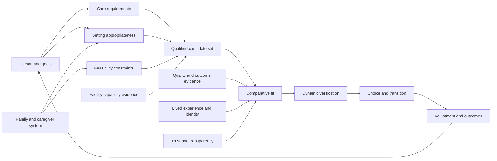

# OPTIME Decision Ontology Review

Date: 2026-08-03

Status: Architecture and decision-science review. Proposed doctrine only.

Scope: This report tests whether the current 59 canonical facility parameters represent the decision families actually face. It does not modify the canonical registry, ranking, scoring, recommendations, APIs, evidence pipeline, or application code.

## Principle Impact Check

- RELEVANT EXISTING PRINCIPLES: PR-001 Outcome-Only Optimization; PR-002 No Evidence, No Score; PR-003 Uncertainty Visibility; PR-005 Unknown Is Not Negative Evidence; PR-006 Verified Case-Relevant Evidence May Strengthen Proven Match; PR-007 Generic Completeness Must Not Drive Ranking; PR-008 Principle Consistency And Owner Approval Gate; PR-009 Parameter-First Facility Matching.
- DOES THIS CHANGE ALTER ANY PRINCIPLE? YES, at proposal level only.
- OWNER APPROVAL REQUIRED? YES for semantic implementation; NO for this documentation-only review.
- CLASSIFICATION: C/D. Product Principle Ambiguity / Product Principle Change.
- IMPLEMENTATION GATE: STOP. No proposal in this report is authorized for production until the owner explicitly approves it and a separate versioned implementation, migration, and validation plan is accepted.

## Executive Finding

The current 59-parameter model is not a complete ontology of the elder-care decision. It is primarily a registry of facility facts and regulatory signals. That is useful, but it starts too late in the decision and mixes five different kinds of objects:

1. person and family needs,
2. setting and admission constraints,
3. facility capabilities,
4. evidence about care quality and lived experience, and
5. dynamic transaction facts.

The real decision is staged. A family must first establish decision authority, goals, appropriate care setting, clinical and functional requirements, caregiver capacity, financial feasibility, and timing. Only then can it compare feasible facilities. A facility can be excellent in general and still be wrong for this person; a nearby or attractive facility can be unacceptable if it cannot safely execute the care plan; and missing information cannot prove either mismatch or quality.

The next-generation model should therefore be a typed decision graph, not a longer flat list. This review proposes 21 decision factors organized into six layers. Later sections map all 59 current parameters into that independent frame and identify which should remain direct decision parameters, become evidence indicators, merge, split, move to transparency, or be retired.

## Research Method And Limits

This is a structured evidence synthesis, not a formal systematic review or clinical guideline. It uses peer-reviewed qualitative studies, systematic reviews, observational studies, rehabilitation literature, AHRQ shared-decision guidance, and official CMS/Medicare data documentation. The evidence base is heterogeneous: study settings, countries, care systems, populations, and dates differ. Several studies are small or qualitative; they establish recurring constructs and mechanisms, not universal effect sizes. CMS measures describe reportable dimensions and observed performance, not a complete person-specific definition of quality.

The review applies four evidence rules:

- A published association or reported preference justifies considering a construct; it does not justify a ranking weight.
- A facility claim is not proof of capability or outcome.
- Absence of a reported problem is not proof of safety or excellence.
- No numeric quality-improvement estimate is presented as observed OPTIME performance without a prospective validation study.

## Evidence Base

| Source | Design / scope | Decision-science contribution | Limitation |
| --- | --- | --- | --- |
| [Gadbois, Tyler, Mor 2017, PMID 28682444](https://pubmed.ncbi.nlm.nih.gov/28682444/) | Interviews with 98 newly admitted residents/families across 14 SNFs in five US cities | Families commonly received only names and addresses, felt rushed and unprepared, and chose by proximity or prior experience; many would travel farther for a recommendation | Postacute SNF sample; qualitative recall after admission |
| [Tyler et al. 2017, PMID 28784730](https://pubmed.ncbi.nlm.nih.gov/28784730/) | Multiple-case study; 138 staff and 98 patients | Quality data were rarely shared or used; hospital staff misinterpreted choice rules | Does not estimate the causal effect of better decision support |
| [Sorkin et al. 2016, PMID 26772624](https://pubmed.ncbi.nlm.nih.gov/26772624/) | Personalized SNF decision-aid trial protocol | Medical needs and preferences must be combined; report cards are complex and poorly available during hospital discharge | Protocol rationale, not outcome results |
| [Serrano-Gemes et al. 2020, PMID 32205378](https://pubmed.ncbi.nlm.nih.gov/32205378/) | Systematic review of 46 qualitative studies | Elders, families, professionals, and others act jointly, separately, or sequentially with variable influence | Qualitative heterogeneity; does not establish one ideal allocation of authority |
| [Pel-Littel et al. 2021, PMID 33549059](https://pubmed.ncbi.nlm.nih.gov/33549059/) | Systematic review of 28 studies on older adults with multimorbidity | Values, priorities, quality of life, function, explicit invitation, caregiver support, communication, and care coordination enable shared decisions | Broader treatment context, not facility selection alone |
| [Adekpedjou et al. 2018, PMID 30161238](https://pubmed.ncbi.nlm.nih.gov/30161238/) | Cross-sectional housing-decision study | Preferred and actual housing often diverged; health, safety, caregiver burden, sadness, guilt, conflict, and regret matter | Small Canadian sample |
| [Nguyen et al. 2018, PMID 29514552](https://pubmed.ncbi.nlm.nih.gov/29514552/) | Qualitative secondary analysis plus literature review | Placement follows insufficient informal care; families need early guidance, financial/housing information, mediation, coordination, and post-placement support | German-language review and service context |
| [Koplow et al. 2015, PMID 25691220](https://pubmed.ncbi.nlm.nih.gov/25691220/) | Longitudinal qualitative study of 10 caregivers | Identity preservation, familial responsibility, and changing family relationships persist through placement | Small regional sample |
| [Caldwell et al. 2014, PMID 24267583](https://pubmed.ncbi.nlm.nih.gov/24267583/) | Interviews with 27 dementia caregivers | Readiness differs from contingency planning to crisis; emotion, expectations, duty, cultural specificity, and family disagreement shape acceptance | Small, culturally specific Australian sample |
| [Ducharme et al. 2012, PMID 22974081](https://pubmed.ncbi.nlm.nih.gov/22974081/) | Repeated interviews with 18 dementia caregivers over about 20 months | Placement is a longitudinal process influenced by formal and informal networks | Small Canadian sample |
| [Magdon-Ismail et al. 2016, PMID 27100410](https://pubmed.ncbi.nlm.nih.gov/27100410/) | Survey of 77 stroke discharge planners | Patients/families, insurance, perceived quality, and discharge pressure materially affect setting and facility selection | 16% response rate; one US region; perceptions rather than audited decisions |
| [Stein et al. 2020, PMID 32272107](https://pubmed.ncbi.nlm.nih.gov/32272107/) | Prospective study of 427 stroke discharges | PT/discharge-planner agreement was high; family preference and insurance explained some deviations | Regional sample; no randomized setting assignment |
| [Unsworth 1996, PMID 8822244](https://pubmed.ncbi.nlm.nih.gov/8822244/) | Study of 62 stroke survivors, teams, and functional measures | Residents viewed housing as their decision and preferred home despite deficits; function and family support must be discussed without erasing autonomy | Older evidence and non-US setting |
| [Brownie et al. 2014, PMID 24813582](https://pubmed.ncbi.nlm.nih.gov/24813582/) | Systematic review of 19 high-quality observational/descriptive studies | Control over relocation, autonomy, meaningful relationships, new staff/resident relationships, and preadmission knowledge support adjustment | Primarily adjustment after choosing, not comparative facility effects |
| [Spilsbury et al. 2024, PMID 38634535](https://pubmed.ncbi.nlm.nih.gov/38634535/) | Mixed-methods program with evidence syntheses and routine data | Quality depends on sufficient, stable, consistent, competent, supported staff who know residents; headcount alone is insufficient | UK context; some self-report and single-operator data |
| [Hovenga et al. 2022, PMID 35732193](https://pubmed.ncbi.nlm.nih.gov/35732193/) | Interpretative literature synthesis | Family-staff trust, competence, goodwill, communication, psychosocial vulnerability, and organizational conditions shape involvement | Interpretative synthesis, not comparative effectiveness |
| [CMS nursing-home provider data](https://data.cms.gov/provider-data/topics/nursing-homes) | Official US provider, inspection, staffing, MDS, ownership, and quality datasets | Establishes observable regulatory, staffing, and outcome evidence domains | Measures are lagged, scoped, risk-adjusted in differing ways, and incomplete for lived fit |
| [AHRQ SHARE Approach](https://www.ahrq.gov/health-literacy/professional-training/shared-decision/index.html) | Federal shared-decision implementation framework | Requires options, benefits/harms/risks, values, communication support, teach-back, numeracy, and cultural competence | General framework, not elder-care placement validation |

## The Actual Decision Journey

The decision is a loop with different tempos, not a one-time ranking event.

| Stage | Core question | Primary actors | Typical tempo | Required output |
| --- | --- | --- | --- | --- |
| 1. Trigger and readiness | What changed, and must a decision happen now? | Resident, family, clinician, social worker | Planned months ahead or crisis hours/days | Trigger, urgency, avoidable-crisis options, readiness/conflict |
| 2. Agency and goals | Who has capacity and authority, and what outcome matters most? | Resident first; proxy/family when legally or practically required | Before tradeoffs are framed | Decision role, capacity/authority, goals, unacceptable outcomes, resident voice |
| 3. Setting appropriateness | Is home, home health, assisted living, memory care, SNF, inpatient rehab, or another setting appropriate? | Resident/family plus clinician, PT/OT, nursing, social work, payer | Often hours/days after hospitalization; longer in planned moves | Clinically supportable setting set, not a facility list |
| 4. Person requirements | What clinical, functional, cognitive, behavioral, rehabilitation, communication, and nutritional support is required? | Interdisciplinary team and caregivers | Current, with trajectory forecast | Structured need profile; critical versus preferred needs |
| 5. Feasibility constraints | What can the family sustain and what will coverage, geography, timing, and admission rules permit? | Resident/family, payer, facility admissions, discharge planner | Dynamic; may change daily | Feasible budget/coverage, radius, timing, documentation and admission constraints |
| 6. Candidate generation | Which facilities are plausibly capable at the correct unit/program scope? | Decision system with human verification | Minutes initially, then refreshed | Broad qualified/provisional set with unknowns visible |
| 7. Comparative evaluation | Which feasible option best supports safety, outcomes, continuity, dignity, identity, relationships, and family access? | Resident/family with professionals as needed | Hours/days; visits when possible | Case-relevant comparison, tradeoffs, evidence confidence, missing facts |
| 8. Dynamic verification | Is the relevant bed, price, payer acceptance, staffing/program, equipment, and admission date real now? | Facility admissions and payer; decision system records evidence | Same day or short expiry | Verified transaction facts and unresolved blockers |
| 9. Choice and transition | How will information, medications, equipment, goals, relationships, and responsibilities transfer? | Sending/receiving teams, resident, family | Hours/days | Accountable transition plan, handoff, orientation, family role |
| 10. Reassessment | Is the placement producing the intended outcome and preserving fit? | Resident, family, facility team, clinicians | Days, 30/60/90 days, change events | Adjustment, function/outcome, concerns, revised plan or move prevention |

### Decision Authority Is Contextual

The resident's preferences and participation should be sought and supported whenever possible. Authority cannot be inferred from age, diagnosis, family presence, or urgency. Capacity may be decision-specific and fluctuate. A proxy's legal authority, the resident's expressed wishes, clinical recommendations, caregiver limits, and payer constraints are different facts and must not be collapsed into one preference field.

Professionals contribute setting appropriateness, safety, prognosis, and transition knowledge. Families contribute history, identity, practical support, and often proxy decision-making. Payers and admissions teams constrain feasibility but do not define the resident's goals. OPTIME should expose disagreements and constraints instead of silently converting the most powerful actor's position into the user's preference.

## Independent Decision Ontology

The ontology has six typed layers. A field can inform more than one factor, but its type and permitted inference must remain explicit.

### Layer 1: Person, Agency, And Goals

| ID | Factor | Why it changes the decision | Persona sensitivity |
| --- | --- | --- | --- |
| F01 | Decision agency, capacity, and authority | Determines whose values govern, who consents, and how disagreements are handled | Highest in dementia, delirium, stroke with communication/cognitive effects, and family conflict |
| F02 | Resident goals, preferences, and unacceptable outcomes | Defines outcome optimization: recovery, home return, safety, independence, comfort, community, or stability | Recovery dominates short-term rehab; autonomy/lifestyle often rises for independent seniors; comfort may dominate advanced illness |
| F03 | Urgency, readiness, and decision support needs | Changes available time, information burden, visit feasibility, and risk of defaulting to proximity or first availability | Highest in hospital discharge, caregiver collapse, eviction, acute behavioral change, and expiring coverage |

### Layer 2: Setting And Person Requirements

| ID | Factor | Why it changes the decision | Persona sensitivity |
| --- | --- | --- | --- |
| F04 | Appropriate care setting and future-care trajectory | Prevents comparing facilities before establishing whether institutional care and its intensity are appropriate; anticipates avoidable moves | Central for every persona; especially independent seniors and postacute cases |
| F05 | Clinical complexity and safety requirements | Establishes condition-specific nursing, monitoring, medication, wound, respiratory, dialysis, palliative, and other critical needs | Highest in medically complex nursing and postacute personas |
| F06 | Function, mobility, ADLs, transfers, and fall risk | Determines assistance, equipment, environment, staffing, and realistic return-home plan | High in stroke, frailty, orthopedic rehab, and long-term nursing |
| F07 | Cognition, behavior, mental health, and supervision | Determines environmental security, staff competency, behavior support, routine, and least-restrictive safe care | Highest in advanced dementia and behavioral/psychiatric need |
| F08 | Rehabilitation fit, intensity, disciplines, and recovery potential | A therapy label does not establish dose, integration, condition expertise, scheduling, or outcomes | Highest in stroke and short-term rehabilitation |
| F09 | Communication, sensory, language, and health-literacy access | Affects consent, symptom reporting, therapy participation, safety, relationships, and family understanding | High with aphasia, hearing/vision loss, limited English, and cognitive impairment |
| F10 | Nutrition, swallowing, dining, and dietary requirements | Combines clinical nutrition/safety with a major daily quality-of-life experience | High in dysphagia, diabetes, renal disease, allergies, kosher practice, and frailty |

### Layer 3: Family And Feasibility

| ID | Factor | Why it changes the decision | Persona sensitivity |
| --- | --- | --- | --- |
| F11 | Caregiver capacity, burden, role, and family system | Caregiver availability and limits affect setting viability, discharge success, visits, conflict, guilt, and continuity | Highest in dementia, home-return plans, low-resource households, and distant families |
| F12 | Financial feasibility, payer fit, eligibility, and price trajectory | Coverage, eligibility, total cost, spend-down, add-on fees, and future price determine whether a plan can be sustained | Highest for Medicaid, low budget, long stays, and postacute insurance constraints |
| F13 | Geography, family access, transportation, and community continuity | Proximity enables visits and support but should be a governed tradeoff, not an accidental proxy for quality | High when family provides frequent care, spouse is nearby, transport is limited, or cultural community is local |
| F14 | Admission feasibility, timing, and dynamic availability | A theoretically good match is not actionable without a suitable bed/unit, accepted payer, required documents, and viable admission date | Highest in urgent discharge, Medicaid beds, specialty units, and short-term rehab |

### Layer 4: Facility Capability And Care Delivery

| ID | Factor | Why it changes the decision | Persona sensitivity |
| --- | --- | --- | --- |
| F15 | Case-specific capability at facility/unit/program scope | Establishes whether the actual care team and service line can meet critical needs; labels alone are insufficient | Central for all care-needing personas |
| F16 | Staffing sufficiency, skill mix, stability, leadership, and relational continuity | Hours alone miss turnover, consistency, competence, supervision, agency dependence, and whether staff know residents | Highest in dementia, high acuity, long-term nursing, and communication vulnerability |
| F17 | Care coordination, medical integration, and transition execution | Handoffs, physician access, pharmacy/equipment, family communication, discharge planning, and escalation pathways affect outcomes | Highest in postacute rehab, complex medication regimens, dialysis, and repeated hospitalization risk |
| F18 | Safety, outcomes, regulatory performance, and improvement trajectory | Distinguishes capability claims from observed care; requires measure-specific interpretation, recency, scope, and risk context | High for all, with condition-specific outcomes prioritized over generic ratings |

### Layer 5: Lived Fit And Identity

| ID | Factor | Why it changes the decision | Persona sensitivity |
| --- | --- | --- | --- |
| F19 | Autonomy, dignity, privacy, identity, and least-restrictive living | Control and identity affect acceptance, adjustment, trust, and quality of life; these are outcomes, not decoration | Highest for independent seniors, long-stay residents, dementia, and shared-room decisions |
| F20 | Relationships, belonging, culture, religion, activities, and daily life | Social connection and culturally meaningful routines shape adjustment and sustained fit | High for long stays, Jewish/cultural personas, isolated residents, and cognitive impairment |

### Layer 6: Trust, Evidence, And Learning

| ID | Factor | Why it changes the decision | Persona sensitivity |
| --- | --- | --- | --- |
| F21 | Trust, transparency, responsiveness, and evidence confidence | Families must know what is proven, claimed, stale, conflicting, or unknown; communication behavior can inform transition risk but must not reward marketing volume | Universal; especially high under urgency, proxy decision-making, and prior negative care experiences |

## Factor Roles In A Decision Engine

Not every factor belongs in one weighted score.

| Role | Meaning | Candidate factors |
| --- | --- | --- |
| Governance prerequisite | Must be resolved or explicitly represented before personalization | F01-F03 |
| Setting gate | Determines the appropriate setting set, not relative facility quality | F04 |
| Critical eligibility | Verified mismatch may exclude; UNKNOWN remains provisional and triggers verification | F05-F10, selected F14-F17 requirements |
| Feasibility gate | Determines whether an option is actionable and sustainable | F12, F14; selected F11/F13 constraints |
| Comparative proven match | Verified case-relevant evidence may differentiate qualified options | F08, F15-F18 and case-relevant parts of F09-F10 |
| Preference fit | Resident-weighted tradeoff among otherwise feasible options | F02, F13, F19-F20 |
| Confidence / transparency | Changes certainty, questions, and explanation; not facility quality by itself | F03, F21 and unknown/conflicted evidence across all factors |
| Post-choice learning | Evaluates whether the decision worked and updates future evidence | F17-F21 outcomes after admission |

This role separation preserves PR-002, PR-005, PR-006, and PR-007. For example, unknown kosher capability is not evidence that kosher service is absent; high source count is not quality; a verified lack of a required respiratory capability can be a mismatch; and a current verified stroke program with case-relevant outcomes may establish stronger proven match than a generic therapy claim.

## Preliminary Structural Diagnosis

The independent ontology predicts four weaknesses that the current-registry mapping must test:

1. **Missing upstream state:** agency, goals, setting appropriateness, urgency, caregiver capacity, and future trajectory are likely absent because they describe the case and decision process rather than the facility.
2. **Capability decomposition without delivery context:** service labels may be numerous while intensity, integration, competency, scope, continuity, and condition-specific outcomes remain thin.
3. **Evidence indicators treated as decision parameters:** deficiencies, sanctions, hours, and ratings are evidence about broader constructs, not separate family goals.
4. **Lived experience compressed into amenities:** autonomy, identity, privacy, trust, relationships, adjustment, communication, and family inclusion are not equivalent to activity lists or amenities.

The following registry review will accept or reject these predictions parameter by parameter.

## Current 59-Parameter Mapping

This section evaluates the current registry against the independently derived ontology. It does not change current eligibility or acquisition rules.

Role codes: `D` direct decision measure; `S` supporting evidence; `T` transparency/explanation; `X` transaction fact. Impact is the potential decision consequence when case-relevant, not a proposed weight. Value/effort is qualitative expected decision yield relative to recurring acquisition and interpretation cost.

Disposition meanings:

- **KEEP**: preserve the concept, with stronger typing or scope where noted.
- **MERGE**: preserve the evidence but combine overlapping rows into a governed construct.
- **SPLIT**: replace an overly broad field with decision-grade subfields.
- **INFER/PROXY**: derive only a bounded statement; never silently promote it to a direct fact.
- **TRANSPARENCY**: retain for explanation or risk context, not as an independent family preference.
- **REMOVE**: no durable place in organic decision architecture.

| # | Current parameter | Factor / role | Contribution and overlap | Proposed disposition | Operating mode / refresh | Impact; value/effort |
| ---: | --- | --- | --- | --- | --- | --- |
| 01 | `skilled_nursing_capabilities` | F04/F15, D | Useful certification/capability anchor, but facility title cannot prove every service | KEEP as scoped certification/capability evidence; never blanket proxy | A government; source release/monthly | H; H |
| 02 | `nursing_24_7` | F15/F16, D | Meaningful coverage fact; overlaps direct and contracted coverage rows | MERGE into `nursing_coverage_model`, with role, on-site/on-call, scope, and time coverage | G case verification; 90 days and active-case reconfirm | H; H when critical |
| 03 | `direct_24hr_nurse_availability` | F16, S | Employment model may affect continuity but is not independently the outcome | MERGE into coverage/stability model; preserve direct-employment evidence | G case verification; 90 days | M/H in high acuity; M |
| 04 | `third_party_24hr_nurse_availability` | F16, S/T | Contract coverage can fill a need but does not prove consistency or competence | MERGE into coverage model; expose employment/contract source as transparency | G case verification; 90 days | M; M |
| 05 | `rn_hours_per_resident_day` | F16, S | Strong standardized staffing input, not a direct measure of relational or case-specific sufficiency | KEEP as supporting evidence with reporting period, case mix, and comparator | A CMS; each release | H for nursing cases; H |
| 06 | `total_nurse_hours_per_resident_day` | F16, S | Complements RN hours; overlaps staffing construct but not redundant by skill mix | KEEP within staffing evidence bundle, not as a stand-alone preference | A CMS; each release | H; H |
| 07 | `adl_support` | F06/F15, D | Too broad to establish bathing, dressing, toileting, feeding, cueing, or assistance level | SPLIT into task and assistance-level capability matched to person requirements | D extraction; monthly, confirm critical need | H; H |
| 08 | `medication_support` | F05/F15/F17, D | Broad label hides reminders, administration, complex regimens, injections, pharmacy and monitoring | SPLIT into medication assistance/administration/complexity/coordination | D extraction; monthly, confirm critical need | H; H |
| 09 | `transfer_assistance` | F06/F15, D | Directly material but binary value hides one/two-person assist, lift, weight, and equipment | SPLIT by assist level, lift/equipment, bariatric limits, and unit scope | D extraction; monthly, confirm critical need | H; H |
| 10 | `higher_acuity_capabilities` | F05/F15, D/S | Vague umbrella overlaps skilled nursing and named specialty services | REMOVE umbrella as direct field; INFER bounded capability envelope from atomic verified needs | F governed proxy; monthly, 30-day case expiry | H if precise; M due interpretation |
| 11 | `pt` | F08/F15, D | Presence matters but does not establish frequency, intensity, specialization, or outcomes | KEEP as discipline availability inside rehabilitation service object | D extraction; monthly | H when required; H |
| 12 | `ot` | F06/F08/F15, D | Essential for ADLs, cognition/environment and home transition; currently only presence | KEEP and SPLIT availability from dose, evaluation, specialty, and transition role | D extraction; monthly | H in stroke/ADL cases; H |
| 13 | `speech_therapy` | F08-F10/F15, D | Broad label combines speech, language, cognition, communication, and swallowing | SPLIT into communication/cognitive and dysphagia competencies plus availability | D extraction; monthly | H in stroke/dysphagia; H |
| 14 | `short_term_rehab` | F04/F08, D/T | Program label supports setting fit but overlaps therapy availability | KEEP as program/setting descriptor; do not treat as proof of dose or quality | D extraction; monthly | H in postacute; H |
| 15 | `post_stroke_neuro_evidence` | F08/F15/F18, D/S | Correctly case-specific but bundles program, staff, integration, and outcomes | SPLIT into neuro competency, interdisciplinary pathway, dose, and condition-relevant outcomes | F proxy plus critical confirmation; monthly/30 days | H; H despite higher effort |
| 16 | `therapy_staffing` | F08/F16, D/S | Binary value is not interpretable; overlaps PT/OT/ST presence | SPLIT by discipline, FTE/contract model, days, minutes, caseload, weekend access, turnover | G case verification; 90 days | H in rehab; M/H |
| 17 | `memory_care` | F04/F07/F15, D | Program/unit label is useful but overlaps dementia programs and secured units | KEEP as setting/program object; require scope and component evidence | D extraction; monthly, confirm hard need | H; H |
| 18 | `dementia_alz_programs` | F07/F15/F20, D/S | Overlaps memory care; named activities do not prove behavior/supervision competency | MERGE into dementia capability object with behavior support, routines, staff training, family inclusion | D extraction; monthly | H; H |
| 19 | `wound_care` | F05/F15/F17, D | Direct case capability; binary hides wound types, clinician access and supplies | KEEP and SPLIT scope/complexity/oversight | D extraction; monthly, confirm active need | H when required; H |
| 20 | `dialysis_arrangements` | F05/F13/F15/F17, D | Direct need; must distinguish on-site, partner, transport, schedule and emergency plan | KEEP as structured arrangement object | D extraction; monthly, confirm active need | H when required; H |
| 21 | `respiratory_trach_vent` | F05/F15-F17, D | Combines materially different acuity levels, equipment and staffing requirements | SPLIT oxygen/respiratory therapy/trach/ventilator and escalation capability | F proxy plus critical confirmation; monthly/30 days | H; H despite effort |
| 22 | `hospice_palliative_arrangements` | F02/F05/F15/F17, D | Important goals/care integration field; partner name alone is insufficient | KEEP and SPLIT hospice access, palliative competency, goals process, symptom/escalation support | D extraction; monthly, confirm active need | H when relevant; H |
| 23 | `specialty_licenses` | F04/F15, S/T | Legal scope matters but generic boolean hides designation and does not prove delivery | SPLIT into typed license/designation records; use as boundary/supporting evidence | A government; source release/monthly | H for legal constraints; H |
| 24 | `extended_congregate_care` | F04/F15, S/D | Florida-specific licensed scope; meaningful only in applicable setting/case | KEEP as typed regulatory capability, not generic quality | A government; source release/monthly | H in applicable ALF cases; H |
| 25 | `limited_nursing_services` | F04/F15, S/D | Florida-specific boundary; does not prove current staff delivery | KEEP as typed legal scope and corroborate delivery | A government; source release/monthly | H in applicable cases; H |
| 26 | `limited_mental_health` | F04/F07/F15, S/D | Designation is relevant but too broad for diagnosis, behavior or treatment fit | KEEP as legal/program evidence; add atomic mental-health capability fields | A government; source release/monthly | H when required; H |
| 27 | `secured_units` | F07/F15/F19, D | Security may be required, but binary value risks equating restriction with dementia quality | KEEP as exact environmental/supervision feature; pair with least-restrictive practice | D extraction; monthly, confirm hard need | H for elopement risk; H |
| 28 | `inspection_rating` | F18, S/T | Useful summary but overlaps underlying findings and can conceal domain/recency differences | KEEP for transparency; compare through measure-specific risk synthesis | A government; each release | H; H |
| 29 | `deficiency_count` | F18, S | Raw count overlaps severity and inspection opportunity; count alone is weak | MERGE into regulatory event series with severity, scope, domain, date, correction, recurrence | A government; each release | M/H; H |
| 30 | `deficiency_severity` | F18, S | More decision-relevant than count but inseparable from domain, scope, date and recurrence | MERGE into regulatory event series | A government; each release | H; H |
| 31 | `complaint_related_findings` | F18/F21, S/T | Substantiated official findings matter; complaints/reviews cannot be conflated | MERGE into event series with complaint-survey provenance; explain separately | A government; each release | H; H |
| 32 | `fire_safety_deficiencies` | F18, S | Distinct safety domain but still an event, not a family preference | MERGE into regulatory event series while preserving fire domain | A government; each release | H; H |
| 33 | `infection_control_findings` | F18, S | Clinically meaningful domain; absence cannot prove cleanliness or safety | MERGE into event series; permit only bounded no-concern statement under existing rule | A government; each release | H; H |
| 34 | `penalties_fines` | F18, S/T | Enforcement consequence overlaps deficiencies/sanctions; dollar amount is not severity by itself | MERGE into enforcement event series | A government; each release | M/H; H |
| 35 | `sanctions_final_orders` | F18, S/T | High-salience enforcement evidence; requires identity and legal-status resolution | MERGE into enforcement series, preserve order text/status | A government; monthly/event | H; H |
| 36 | `payment_denials` | F18, S/T | Serious program signal but not a separate resident goal | MERGE into enforcement series with period and reason | A government; each release | H; H |
| 37 | `quality_measures` | F18, S | Integer/bundle is semantically invalid: measures differ in direction, denominator, population and date | SPLIT into typed measure records; select case-relevant measures only | A government; each release | H if typed; H |
| 38 | `hospital_claims_outcomes` | F17/F18, S | Valuable observed outcome domain but text bundle hides readmission, ED use, discharge, mortality and risk adjustment | SPLIT into typed outcomes with cohort, period, denominator and uncertainty | A government where published; each release | H; H/M due coverage |
| 39 | `staffing_turnover` | F16/F18, S | Important continuity signal; complements rather than replaces hours and staff experience | KEEP within staffing stability bundle with role and period | A government; each release | H; H |
| 40 | `languages` | F09/F20, D | Binary facility-level field cannot establish staff role, shift, proficiency, interpreter access or unit availability | SPLIT spoken-language access, interpreter mode, role/shift, proficiency and scope | F proxy plus case confirmation; monthly/30 days | H when needed; H/M |
| 41 | `dietary_capabilities` | F10/F15, D | Broad field hides clinical diets, texture modification, dietitian access, allergies and dining adaptation | SPLIT into clinical diet and dining support capabilities | C document extraction; monthly/change, confirm medical need | H; H |
| 42 | `gluten_free` | F10, D | May be preference or medical safety requirement; menu option does not prove cross-contact control | KEEP as diet subtype with standard/medical-safety level | C extraction; monthly/change, confirm medical need | H for celiac; H |
| 43 | `kosher` | F10/F20, D | Standard varies; overlaps cultural services but food practice is independently material | KEEP as typed standard, supervision/certification, kitchen/meal-source and scope | C extraction; monthly/change, confirm standard | H when required; H |
| 44 | `religious_cultural_services` | F20, D | Broad binary compresses tradition, frequency, language, observance support and community connection | SPLIT into resident-selected cultural/religious practice requirements and evidenced offerings | C extraction; monthly calendar | M/H by preference; H/M |
| 45 | `activities` | F20, D/S | Existence is low information; relevance, choice, adaptation, participation and schedule matter | SPLIT into current program evidence and person-specific participation fit; infer bounded engagement only | C extraction; monthly calendar | M/H long stay; M |
| 46 | `transportation` | F13/F17, D | Useful but purpose, escort, accessibility, radius, frequency and cost determine fit | KEEP and SPLIT service terms | D extraction; monthly | M/H; H/M |
| 47 | `amenities` | F19/F20, T/D | Generic completeness risks dominating; only specifically requested features matter | REMOVE generic boolean; represent named features as preference-scoped transparency | D extraction only when requested; quarterly/change | L generally; L |
| 48 | `private_shared_rooms` | F12/F14/F19, D/X | Room type affects privacy, cost and availability; boolean conflates offered with available | SPLIT room inventory type from case-current availability and price | D extraction quarterly; G case verification 7 days | H when preferred/required; H |
| 49 | `accessibility` | F06/F09/F19, D | Generic binary cannot establish wheelchair, bathroom, lift, sensory or route compatibility | SPLIT by exact functional/environmental requirement and unit | D extraction; quarterly, confirm exact need | H; H |
| 50 | `payer_information` | F12/F14, D/X | Broad boolean overlaps Medicaid/Medicare and does not establish case acceptance/network/authorization | SPLIT payer participation, plan/network, benefit, authorization and case acceptance | C extraction monthly/change; confirm case | H; H |
| 51 | `medicaid_attributes` | F12/F14, D/S | Participation is necessary but not proof of an available Medicaid bed or eligibility | KEEP as official participation; separate case eligibility and bed acceptance | A government; source release/monthly | H; H |
| 52 | `medicare_attributes` | F12/F14, D/S | Certification/participation is not a coverage guarantee for this stay | KEEP as official participation; separate benefit/qualifying-stay/case acceptance | A government; source release/monthly | H in postacute; H |
| 53 | `published_rates` | F12, D/T | Useful baseline but may omit care tiers, room, services and effective date | MERGE into structured cost model as dated baseline, inclusions and exclusions | C extraction; monthly/change | H for private pay; H |
| 54 | `fees` | F12, D/T | Material to total cost; cannot be interpreted outside service and recurrence | MERGE into total-cost model with trigger, frequency and scope | C extraction; monthly/change, confirm case | H; H |
| 55 | `current_availability` | F14, X | Essential actionability fact but not durable facility quality | KEEP case-scoped and on-demand, outside persistent profile/ranking quality | G direct; 7 days or hold expiry | H under urgency; H per active case |
| 56 | `earliest_admission_date` | F03/F14, X | Essential timing fact; availability alone does not prove readiness | KEEP case-scoped with prerequisites and confidence | G direct; 7 days | H; H |
| 57 | `waiting_list` | F03/F14, X | Useful timing constraint but binary hides position, cohort, estimate and policy | SPLIT status, estimated timing, priority rules and date | G direct; 7 days | H in constrained supply; H/M |
| 58 | `current_price` | F12/F14, X | Essential case fact; must include room, care level, fees, payer and effective period | KEEP as written case-scoped total-price quote | G direct; 7 days/quote expiry | H; H |
| 59 | `current_promotions` | F12, T/X | Volatile commercial fact with bias risk and negligible durable matching value | REMOVE from canonical/organic model; optionally disclose after ranking as transaction information | J do not acquire; no refresh | L; L |

### Mapping Result

All 59 current parameters map to at least one valid decision factor, but mapping is not the same as adequacy:

- **No current parameter directly represents F01-F04 or F11.** Agency, goals, urgency/readiness, setting appropriateness/future trajectory, and caregiver capacity are absent from the facility registry and must exist in linked case/decision entities.
- **F16-F18 are overrepresented by raw evidence rows but underrepresented as coherent constructs.** Staffing hours, turnover, deficiencies, enforcement, quality measures, and claims outcomes need typed bundles and case-relevant interpretation.
- **F19-F21 are materially underrepresented.** Room type, activities, and amenities are weak substitutes for autonomy, dignity, identity, relationships, family inclusion, trust, responsiveness, and transition support.
- **Twenty-six current fields are broad booleans whose YES value cannot establish decision-grade fit without scope or subtype.** They should be typed, split, or merged before any future weighting discussion.
- **At least 16 rows are primarily supporting evidence or transparency, not independent preference dimensions.** Treating each as a separately weighted goal would double-count correlated evidence.
- **Five dynamic rows correctly belong outside durable facility quality.** Four are high-value case transactions; `current_promotions` is a removal candidate.

The acquisition blueprint remains directionally sound for the facts it covers. The ontology review changes what those facts mean and where they belong, not the evidence standards by which they may be acquired.

## Proposed Next-Generation Decision Model

### Recommendation: 80 Typed Atomic Fields, Not 80 Weighted Parameters

The recommended model contains 80 atomic fields across seven linked entities. The count is a design estimate, not a constitutional target. Atomic fields exist so the system can represent the decision without ambiguous booleans; only case-relevant, governed subsets may affect eligibility, proven match, preference fit, confidence, or explanation.

| Entity | Count | Proposed atomic fields |
| --- | ---: | --- |
| Decision context | 9 | 1 trigger; 2 urgency/deadline; 3 readiness stage; 4 resident participation preference; 5 decision-specific capacity status; 6 legal decision authority; 7 primary goals; 8 unacceptable outcomes; 9 preferred setting/home-return intent |
| Person requirements | 17 | 10 current setting; 11 clinically supportable setting set; 12 active conditions/risks; 13 monitoring/nursing complexity; 14 medication complexity; 15 ADL task/assist profile; 16 mobility/transfer/fall/equipment profile; 17 cognition; 18 behavior; 19 mental-health needs; 20 supervision/elopement need; 21 rehabilitation goals/potential/tolerance; 22 required therapy disciplines; 23 communication/sensory/language access; 24 swallowing/nutrition; 25 clinical and religious diets; 26 palliative/comfort goals |
| Family and feasibility | 12 | 27 caregiver identity/role; 28 caregiver availability; 29 caregiver capability/training; 30 burden/sustainability; 31 family agreement/conflict; 32 geographic/family-access constraint; 33 transport constraint; 34 total sustainable budget; 35 payer/benefit source; 36 eligibility/level-of-care status; 37 plan/network/authorization; 38 admission deadline/documents |
| Facility capability and delivery | 18 | 39 setting/license scope; 40 unit/program population scope; 41 nursing coverage model; 42 staffing hours/skill mix; 43 staffing stability/continuity; 44 staff competency/training; 45 task-level ADL support; 46 medication service complexity; 47 transfer/equipment capacity; 48 specialty clinical capabilities; 49 dementia/behavior capability; 50 rehabilitation disciplines; 51 therapy dose/schedule/caseload; 52 physician/advanced-practice access; 53 pharmacy/equipment/external-service integration; 54 transition/handoff/discharge capability; 55 escalation/hospital integration; 56 communication/language access |
| Quality and outcome evidence | 8 | 57 typed regulatory event history; 58 enforcement history; 59 staffing measures; 60 MDS/clinical quality measures; 61 claims/utilization outcomes; 62 case-relevant rehabilitation outcomes; 63 leadership/ownership stability; 64 improvement/recurrence trajectory |
| Lived fit and relationships | 10 | 65 autonomy/choice practices; 66 dignity/privacy/room fit; 67 least-restrictive environment; 68 identity/personalization support; 69 family inclusion/communication; 70 staff-resident relationship continuity; 71 social connection/belonging; 72 cultural/religious practice fit; 73 meaningful activity/daily routine; 74 dining/environment/accessibility fit |
| Case transaction | 6 | 75 case/payer acceptance; 76 exact unit/room availability; 77 earliest feasible admission; 78 wait-list timing/rules; 79 case-specific written total price; 80 hold/quote/verification expiry |

### Entity Relationships

- A **case** owns person, decision, caregiver, payer, timing, and preference data.
- A **facility** owns identity and durable organization-level facts.
- A **unit/program/service line** owns scoped capabilities; facility-level inheritance is forbidden unless the evidence explicitly supports it.
- An **evidence record** owns value, provenance, date, scope, method, uncertainty, conflicts, and expiry.
- A **requirement-to-capability assertion** connects one case requirement to one scoped facility capability and states `VERIFIED_MATCH`, `VERIFIED_MISMATCH`, `PROVISIONAL_UNKNOWN`, or `NOT_APPLICABLE`.
- A **decision episode** owns actors, authority, alternatives, tradeoffs, shortlist, dynamic verification, choice, and explanations.
- An **outcome episode** records adjustment, function, transfer/readmission, goal attainment, satisfaction/regret, and whether another move occurred.

This model makes PR-009 more precise without changing it: matching remains parameter-first, but parameters become typed assertions across the person, setting, facility scope, and evidence rather than a flat facility checklist.

## Parameter-Change Recommendations

### Add

Add the currently missing constructs as linked case or decision fields, not facility marketing fields:

- agency, capacity, authority, resident voice, goals, unacceptable outcomes, urgency, and readiness;
- clinically supportable settings and future trajectory;
- caregiver availability, capability, burden, sustainability, and family conflict;
- exact payer eligibility, authorization, network, case acceptance, and spend-down/coverage transition;
- therapy dose, schedule, caseload, condition competency, recovery goals, and case-relevant outcomes;
- staffing skill, competency, stability, consistency, leadership, and relational continuity;
- transition/handoff, medical integration, escalation, discharge/home-return, and family communication;
- autonomy, least-restrictive practice, dignity, identity, family inclusion, belonging, trust, and adjustment;
- post-placement goal attainment, adjustment, decision regret, avoidable transfer, and move-prevention outcomes.

### Merge

- Merge the three 24-hour nursing rows into one structured coverage model.
- Merge memory-care, dementia-program, secured-environment, supervision, staff-training, behavior-support, and family-inclusion evidence into a dementia capability object while preserving atomic facts.
- Merge deficiency, complaint finding, fire/infection finding, fine, sanction, final order, and payment-denial rows into typed event histories. Preserve every source event; remove independent double counting.
- Merge published rates, fees, current quote, payer, room, care level, inclusions, exclusions, and effective dates into a total-cost object.

### Split

- Split broad booleans for ADLs, medication, transfers, respiratory care, therapy, language, diet, accessibility, activities, and payer information.
- Split `quality_measures` and `hospital_claims_outcomes` into measure records with direction, cohort, period, denominator, risk adjustment, uncertainty, and applicability.
- Split program labels from service delivery and outcomes. A program name may support discovery; it cannot independently establish dose, competency, or effectiveness.

### Infer Or Proxy

Inference is appropriate only when the output is narrower than the evidence:

- license + staffing + explicit services may support a bounded capability envelope;
- current program documents may support “active program appears documented,” not resident participation or benefit;
- repeated language evidence may support “language access appears available,” not guaranteed shift-level fluency;
- adverse-event source coverage may support “no material concerns identified in the covered period,” not safety or excellence;
- a resident's combined function, cognition, caregiver support, home environment, and clinician recommendations may support a setting discussion, but OPTIME should not autonomously issue a medical level-of-care determination.

### Explanation-Only Or Transparency-Only

- Facility category, ownership, license, employment/contract model, inspection star, and raw evidence provenance should often explain a conclusion rather than become separate preference weights.
- Individual regulatory events remain visible even when rolled into a risk construct.
- Amenities and named features appear only when requested or useful for understanding daily life.
- Responsiveness may change evidence freshness and verification confidence; it must not reward a facility for marketing effort or act as organic quality.
- Promotions may be disclosed after an organic ordering is fixed, with business-logic separation, but should not be canonical matching input.

## Persona Stress Test

The same ontology applies across personas, but factor roles and evidence thresholds change. “Highest factors” below means decision salience, not a preapproved numeric weight.

| Persona | Highest factors and gates | Current-model coverage | Material gaps / redesign effect |
| --- | --- | --- | --- |
| Stroke rehabilitation | F04-F06, F08-F09, F11-F18; setting intensity, PT/OT/ST, neuro competency, therapy dose, function, insurance, family support, discharge timing and outcomes | Moderate: disciplines and post-stroke label exist | Major gaps in rehabilitation potential/tolerance, dose, interdisciplinary integration, aphasia/cognition, caregiver/home plan and condition-specific outcomes; redesign materially improves qualification and comparison |
| Advanced dementia | F01-F07, F09, F11, F14-F21; proxy authority, behavior, supervision, least restriction, staff consistency, identity, family inclusion and transition | Moderate: memory/program/secured rows exist | Labels can overstate delivery; missing behavior profile, competency, continuity, autonomy, identity, trust, caregiver burden and adjustment make present coverage uneven |
| Independent senior | F01-F04, F11-F14, F19-F21; autonomy, goals, social connection, location, cost, future trajectory and avoidance of premature institutional intensity | Low: personal-fit and price rows provide fragments | Current model starts with care capabilities and can medicalize a housing/life decision; redesign adds setting alternatives, future-care tradeoff, control, identity and community continuity |
| Short-term rehabilitation | F03-F06, F08, F12-F18; admission speed, payer, treatment dose, function, home-return plan and outcomes | Moderate | Current labels identify services but not intensity, weekend access, caseload, transition execution or goal attainment |
| Long-term nursing | F02, F05-F07, F10-F21; sustainable staffing, safety, relationships, dignity, family access, payer transition and future stability | Moderate | Regulatory and nursing facts are stronger than lived-life, continuity, trust, autonomy and move-prevention evidence; redesign balances care and home-like outcomes |
| Low budget | F04, F11-F14 plus critical capabilities; sustainable total cost, benefits, transport and family burden dominate feasibility | Low/moderate | Published price and payer booleans do not model total cost, eligibility, future spend-down, add-ons or forced-transfer risk; redesign prevents attractive but unsustainable shortlists |
| High budget | F02, F13, F15-F21 after safety; privacy, customization and experience can differentiate but cannot purchase a clinical exception | Moderate | Amenities may currently overcount generic completeness; redesign makes premium features preference-scoped and keeps verified clinical fit first |
| Jewish resident | F09-F10, F13, F19-F21; resident-defined observance, kosher standard, language/community, holidays, worship, dignity and family proximity | Moderate but shallow | `kosher` and cultural-service booleans do not capture standard, supervision, kitchen process, frequency, denomination or resident's actual practice; redesign avoids stereotyping and verifies the requested standard |
| Veteran | F04-F05, F12-F15, F17-F20; VA eligibility/pathway, setting, service-connected coverage, proximity, veteran community and clinical fit | Low | Current payer fields omit VA Community Living Centers, State Veterans Homes and VA-contracted Community Nursing Homes. Official VA sources confirm these are distinct pathways with different ownership/management and service context; redesign adds pathway and eligibility objects |
| Medicaid | F04-F05, F12, F14-F18; state level-of-care eligibility, Medicaid-certified facility, covered services, case acceptance, bed timing and continuity after payer transition | Moderate at participation level | Official Medicaid guidance distinguishes eligibility, certified setting, covered services and individualized plan of care; participation does not prove case acceptance or availability. Redesign models these separately and flags transfer risk |
| Private pay | F02, F12-F14, F19-F21; total price trajectory, contract, fee triggers, room, refund/hold terms, lifestyle and future-care continuity | Moderate | Rates/fees/current price are fragmented; redesign creates a dated total-cost and contract object without allowing price or promotions to imply quality |

### Coverage Bias Conclusion

The current model is strongest for a Medicare-certified nursing-facility comparison where government regulatory data and named clinical services are relevant. It is weaker for independent living, assisted-living future planning, culturally specific fit, caregiver-driven dementia placement, VA pathways, and any decision requiring transition quality or lived-experience evidence. It also gives a false impression of stroke specificity: PT/OT/ST and a neuro-program flag are present, while dose, tolerance, integration, communication deficits, home environment, caregiver capacity, and functional outcomes are not.

## Quality, Savings, And Improvement Estimates

### Measurement Warning

No redesigned model has been implemented or prospectively tested. The estimates below are explicit planning hypotheses based on ontology coverage and the acquisition blueprint, not measured recommendation accuracy, clinical effectiveness, cost savings, or causal effect. They must not be presented externally as achieved performance.

### Architecture Quality Estimate

Six dimensions are scored from 0 to 100 by structured expert judgment: direct representation of decision constructs, not data completeness. Equal weighting is used only to make the assumptions auditable.

| Dimension | Current 59 architecture | Proposed typed architecture | Basis |
| --- | ---: | ---: | --- |
| Person/agency/goals | 15 | 90 | Current registry is facility-only; proposal explicitly represents authority, goals and resident voice |
| Setting/clinical/functional fit | 62 | 90 | Current clinical capabilities are substantial but broad; proposal adds setting, task level, trajectory and dose |
| Family/financial/logistical feasibility | 45 | 88 | Payer, price and availability exist; caregiver system, eligibility detail and sustainability are missing |
| Quality/staffing/outcome interpretation | 65 | 85 | Many source measures exist but are flat, correlated and weakly typed; proposal groups and contextualizes them |
| Lived experience/identity/relationships | 25 | 82 | Current amenities/activities/culture fragments do not represent autonomy, trust, continuity or adjustment |
| Transition/reassessment/learning | 12 | 78 | Current model largely ends at admission; proposal represents handoff, adjustment and outcomes |
| **Equal-weight architecture score** | **37/100** | **86/100 target** | Arithmetic mean, rounded; architecture coverage only |

Sensitivity: assigning twice the weight to clinical/functional fit yields approximately 41/100 current and 87/100 proposed. The conclusion is therefore not driven by equal weighting, but the exact scores remain judgmental and require multidisciplinary review.

### Recommendation Improvement Hypotheses

For a prospective shadow evaluation, the redesign should be considered successful only if it meets predeclared targets without worsening unknown neutrality or subgroup equity:

| Metric | Planning target versus current model | Validation needed |
| --- | --- | --- |
| Expert-rated top-5 decision completeness | +25 to +40 percentage points | Blinded geriatric/social-work/rehab/family panel on representative cases |
| Critical requirement omission rate | 30-50% relative reduction | Case chart abstraction and error taxonomy |
| Inappropriate-setting candidates shown | 25-45% relative reduction | Independent setting-level review before facility scoring |
| Actionable unknowns per active shortlist | 20-35% reduction | Compare broad profile gaps with case-triggered questions |
| Family-rated explanation usefulness | +15 to +25 percentage points | Prospective decision-aid study |
| Decision conflict/regret or placement failure | No numeric claim yet | Longitudinal study; architecture evidence is insufficient for an effect estimate |

These are acceptance thresholds, not forecasts. Failure to meet them should falsify or revise the redesign.

### Acquisition And Operations Estimate

Using the existing blueprint's per-facility estimates:

- 21 government fields cost less than $0.01 each per source cycle: less than $0.21 per facility-cycle.
- 25 document/website fields cost roughly $0.02-$0.12 each: $0.50-$3.00 per facility-cycle.
- four proxy fields cost roughly $0.08-$0.30 each: $0.32-$1.20 per facility-cycle.
- the digital acquisition planning range is therefore approximately **$0.82-$4.41 per facility-cycle**, excluding shared engineering and case-triggered verification.
- at 10,000 facilities, that is **$8,200-$44,100 per comparable cycle**. Different source schedules mean this is a scenario, not an annual budget.

The redesign should not stop ingesting cheap official events merely because rows merge; the savings come from interpretation, redundant verification, and low-value extraction:

| Change | Planning effect |
| --- | --- |
| Merge regulatory rows into event ingestion | Little raw-download savings; 15-30% lower downstream transformation/review effort is plausible |
| Remove promotions and generic amenities acquisition | Small digital savings; larger reduction in noise and commercial-bias risk |
| Bundle current nursing, therapy, payer, availability and price verification by case | Current eight direct strategies imply $8-$40 if separately handled at $1-$5 each; a scoped bundle is estimated at $4-$20, before complexity adjustments |
| Ask only case-relevant unknowns | 20-40% lower direct-verification operations is a reasonable pilot target; complex cases may require more, not fewer, clinically important questions |
| Add transition, staffing-continuity and lived-fit evidence | Increases one-time engineering and some recurring acquisition; no net savings should be claimed until pilot volumes are known |

Net planning expectation: **10-20% lower recurring digital acquisition/interpretation cost** and **20-40% lower routine direct-verification effort per active case**, after the new architecture is built. At the 10,000-facility scenario, digital savings are roughly **$820-$8,820 per comparable cycle**. These ranges exclude one-time ontology, migration, extraction, and validation work and should not be used as a business case without measured volumes.

## Risks And Safeguards

| Risk | Required safeguard |
| --- | --- |
| More fields create false precision | Fields remain UNKNOWN without evidence; no imputation; show uncertainty and applicability |
| Case data are mistaken for facility quality | Separate entities and access boundaries; never aggregate resident vulnerability into a facility score |
| Correlated quality signals are double counted | Typed evidence bundles and causal/overlap audit before weighting |
| Setting logic becomes an unlicensed clinical determination | Use professional recommendations and transparent support; escalate rather than autonomously diagnose level of care |
| Culture, religion or veteran identity become stereotypes | Ask resident-defined needs; identity opens questions/pathways but never assigns preferences |
| Caregiver limits override resident voice | Represent authority, capacity, preferences, conflict and constraints separately |
| Premium price or responsiveness becomes quality | Preserve PR-001, PR-004 and business-logic separation; responsiveness affects verification status only |
| Lived-fit claims become marketing completeness | Require behavior/process/outcome evidence and case relevance; generic completeness never ranks |
| Expanded model worsens inequity through missing data | UNKNOWN remains neutral; audit coverage and recommendation effects by payer, race/ethnicity, language, geography and disability |
| Historical outcomes encode selection bias | Show cohort, risk adjustment and limitations; validate case relevance; do not claim causality |

## Alternatives

1. **Keep the 59 and add descriptions.** Lowest engineering cost, but does not fix absent case/decision entities, broad booleans, or double counting.
2. **Expand the flat registry to about 80 rows.** Captures more facts but preserves type confusion and invites one-score weighting.
3. **Use only a small core of about 45 parameters.** Easier to maintain, but likely loses specialty, cultural, transaction, and evidence detail needed for diverse personas.
4. **Adopt the proposed typed graph with about 80 atomic fields.** Higher one-time complexity, but separates gates, proven match, preferences, evidence and transactions and supports staged decisions.

## Recommendation And Owner Decision

Adopt Alternative 4 as the proposed target architecture for a shadow-design phase, not production. Do not approve a numeric weighting scheme at the same time. First approve the ontology boundary and entity types; then build a versioned, non-ranking shadow representation; then evaluate representative cases and subgroup coverage; only after those results should the owner decide whether any field changes eligibility, ranking, confidence, or explanation.

### Owner-Approval Packet

- CURRENT PRINCIPLE: PR-009 evaluates facilities by verified case-relevant parameters and capabilities at the most specific evidenced scope; PR-002/005/006/007 govern evidence, unknowns, proven match, and completeness.
- CURRENT BEHAVIOR: The canonical architecture exposes 59 facility-centric rows, most as broad booleans or evidence indicators, plus five dynamic transaction facts.
- PROBLEM DISCOVERED: The model omits major upstream, caregiver, transition, relational and lived-fit constructs and conflates decision factors with evidence and transactions.
- PROPOSED CHANGE: Replace the flat conceptual model with seven linked entities and approximately 80 atomic fields; preserve evidence records and current IDs through a versioned crosswalk during any future migration.
- WHY IT MAY BE NEEDED: Families decide setting, feasibility, care delivery and life fit under urgency; facility facts alone cannot represent that decision.
- USER IMPACT: More appropriate setting/candidate generation, fewer irrelevant unknowns, clearer tradeoffs and stronger resident/family voice; potentially more questions when a high-risk case genuinely requires them.
- RANKING/SCORING/DATA IMPACT: Potentially substantial, but intentionally undefined here. No field, gate, weight or ordering changes without later explicit approval and regression evidence.
- RISKS: Complexity, false precision, privacy, inequity, clinical overreach, correlated evidence, acquisition cost and migration error.
- ALTERNATIVES: Keep 59, expand flat, reduce to a small core, or adopt typed graph.
- RECOMMENDATION: Approve a documentation and shadow-schema phase only; withhold ranking authorization.

## Validation Plan Before Any Semantic Change

1. Convene geriatric medicine, nursing, PT, OT, speech-language pathology, social work/discharge planning, dementia care, payer/benefits, and resident/family reviewers.
2. Independently code at least 100 heterogeneous decision cases, including every persona in this report, before finalizing fields.
3. Measure inter-rater agreement on setting, critical requirements, preferences, and evidence applicability.
4. Build a versioned current-to-proposed crosswalk with no destruction of historical evidence.
5. Run the proposed model in shadow mode against the current engine; do not alter production candidate generation or ranking.
6. Predeclare error and equity metrics, including unknown rates and recommendation changes by payer, language, geography, disability, cultural needs and urgency.
7. Conduct blinded expert top-5 review and family usability/decision-conflict testing.
8. Reject or revise any field that lacks decision contribution, reliable acquisition, acceptable subgroup coverage, or a clear explanation role.
9. Return to the owner with measured results and a separate proposal for gates, ranking, confidence and migration.

## Final Conclusion

The 59 canonical parameters are not “wrong” as a collection of facility facts. They are wrong as the assumed boundary of the decision. Their strongest elements should survive as scoped capabilities, official evidence, and dynamic transaction facts. Their weakest elements should be merged, split, demoted to explanation, or removed. The missing architecture is the connective tissue among resident agency and goals, appropriate setting, person requirements, caregiver reality, sustainable feasibility, actual care delivery, lived identity, transition execution, and observed outcomes.

Until the owner approves a principle-level change, this conclusion remains a review finding and a testable proposal, not OPTIME doctrine.