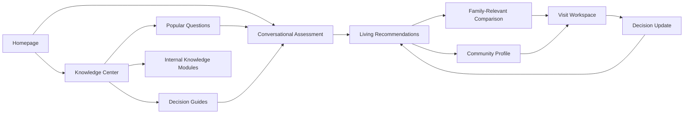
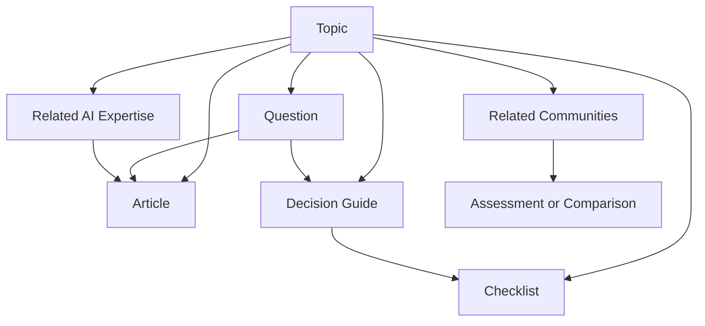
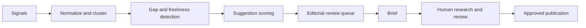
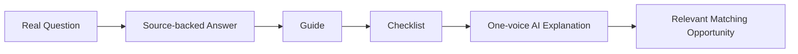

# OPTIME Platform Evolution: Canonical Post-MVP Roadmap

Version: v0.8 baseline -> Post-MVP planning
Mode: Architecture First
Status: AWAITING OWNER APPROVAL - NO IMPLEMENTATION AUTHORIZED
Date: 2026-08-03

This document supersedes prior OPTIME expansion roadmaps and consolidates them into one vision, one architecture, and one implementation sequence. Earlier strategy reports remain research inputs, not parallel plans.

## 0. Governance and Safety Gate

### Principle Impact Check

- RELEVANT EXISTING PRINCIPLES: Law 00; PR-001 through PR-009; Command DP-001 through DP-018; Command EXP-001 through EXP-015
- DOES THIS BLUEPRINT ALTER ANY PRINCIPLE? NO
- OWNER APPROVAL REQUIRED? YES before any implementation wave begins; separate approval remains required for comparison replacement, visit-driven recommendation recalculation, or any new semantic use of content/evidence
- CLASSIFICATION: B for planning, doctrine consolidation, and additive public information architecture; C/E review required before semantic expert coordination, recommendation recalculation, or canonical architecture changes

This document does not authorize changes to ranking, scoring, recommendation order, evidence semantics, unknown handling, APIs, backend, facility data, snapshots, or the canonical 59 parameters.

### Stable Baseline

The following remain constitutional implementation constraints:

- The conversational assessment and accumulated living document remain intact at `/assessment`.
- Recommendations continue inside the living document; they are not replaced by a generic results dashboard.
- UNKNOWN is not NO, absence is not negative evidence, and unsupported claims remain unknown.
- Recommendation ordering remains resident-outcome-only and commercially neutral.
- Every recommendation remains explainable with visible evidence, confidence, and missing information.
- The 59-parameter registry remains canonical. Public pages may organize it, never redefine it.
- Families experience one OPTIME advisor voice. Internal expertise is coordinated behind that voice.
- Generic editorial media never becomes facility evidence. Facility media requires rights and identity verification.
- Existing APIs, backend services, registries, snapshots, tests, and compatibility routes remain unchanged during this planning sprint.
- No architectural rewrite, backend rewrite, ranking rewrite, assessment rewrite, or database redesign is authorized. All approved work must extend existing ownership boundaries incrementally.

## 1. Mission and Canonical Architecture

### Mission

> Become the most trusted AI platform that accompanies families through the entire senior-care decision journey.

The decision engine is no longer the product. It is one preserved component inside a larger platform. OPTIME should not become a larger directory, a content farm, or a collection of disconnected AI tools.

### Four equal pillars

1. **Decision Engine**: the existing governed assessment and recommendation system. Preserve it and improve it only through better evidence.
2. **Knowledge Platform**: a structured system of topics, real questions, guides, checklists, communities, and decision tools. This becomes the largest long-term traffic and discovery source.
3. **AI Expertise**: specialized internal knowledge modules coordinated behind one trusted OPTIME voice.
4. **Community Experience**: editorial community pages, family-relevant comparison, and before/during/after visit support.

Trust, photography, design, search-demand intelligence, content governance, and SEO are shared capabilities serving all four pillars; they are not separate products.

### Family journey

1. **Understand**: source-backed knowledge answers the family’s real question.
2. **Assess**: the stable conversational assessment discovers only decision-relevant needs.
3. **Decide**: governed recommendations and family-specific comparison explain the best-supported options.
4. **Verify**: visits, questions, notes, and unresolved evidence help the family reach a defensible final decision.

### North-star promise

> Understand the decision. Compare what matters. Verify before you choose.

### Primary product architecture

Knowledge informs the decision but does not silently become personalized evidence. Visit observations remain family-entered observations until verification policy says otherwise.

### Mandatory feature gate

Every proposed feature must answer YES to all five questions before it enters a wave:

1. Does this genuinely help families make a better decision?
2. Does it increase trust?
3. Does it reduce uncertainty?
4. Does it strengthen the platform ecosystem, including a useful path back to the decision engine?
5. Does it integrate with the existing architecture?

Any NO answer stops the feature. Delivery metrics, traffic potential, visual appeal, or competitive parity cannot override this gate.

### Permanent Objectivity Charter

#### Mission

Families trust OPTIME because every recommendation is made in the family's best interest.

Objectivity is not a feature. It is the operating principle of the platform.

This charter consolidates the family-facing meaning of Law 00 and PR-001 through PR-009. It does not replace the canonical principles registry, add ranking inputs, change weights, redefine UNKNOWN, or authorize implementation.

#### Principle 1 - The Family Comes First

Every recommendation exists to improve the family's decision. Commercial relationships never override the family's needs.

#### Principle 2 - Explain Every Decision

Every recommendation must answer:

- Why was this recommended?
- What evidence supports it?
- Which family priorities influenced it?
- What information is still missing?
- Could new information change the result?

#### Principle 3 - UNKNOWN Is Honest

Missing information must never be replaced with assumptions. UNKNOWN remains UNKNOWN until sufficient evidence establishes another governed state. OPTIME prefers visible uncertainty over inaccurate certainty.

#### Principle 4 - Show the Source

Every important factual claim should have provenance. Whenever practical, families can inspect:

- source
- verification status
- last verification date
- confidence

Source volume is not quality, and provenance alone does not make a claim current, relevant, or verified.

#### Principle 5 - Disclose Limitations

OPTIME openly distinguishes:

- what it knows
- what it does not know
- what it inferred or derived
- what still requires verification

#### Principle 6 - No Hidden Ranking Factors

Every operative recommendation factor must be governed, case-relevant, auditable, and explainable through one of these family-facing groups:

- Clinical fit
- Daily support
- Lifestyle
- Location
- Financial fit
- Family priorities
- Verified evidence supporting the case-relevant match

These are explanation groups, not new scores, weights, or substitutes for the canonical 59-parameter registry. Every operative factor must trace to an approved canonical parameter, family input, verified constraint, or separately governed outcome signal. Verified evidence may strengthen only the proven case-relevant match; evidence volume or generic completeness cannot improve ranking. Commercial, referral, advertising, sponsorship, partner, lead-value, popularity, or inventory weighting is prohibited.

#### Principle 7 - New Evidence May Change Results

Recommendations are evidence-driven. When material evidence or family priorities change, recommendations may change through the governed decision engine. OPTIME explains what changed, why it mattered, and whether confidence changed. A traceable evidence-driven update is a strength, not a weakness.

#### Principle 8 - Objectivity Before Completeness

Fewer current, relevant, verified facts are preferable to many uncertain, stale, or weakly sourced facts. Generic completeness must never imply that a community is better.

#### Principle 9 - Respectful AI

OPTIME never exaggerates confidence or claims certainty without evidence. It explains its reasoning in language families can understand, preserves uncertainty, avoids diagnosis and labeling, and identifies the next useful verification step.

#### Principle 10 - One Trusted Voice

Families interact with one advisor: OPTIME. Specialized knowledge modules remain internal. All expertise, conflict resolution, evidence, and uncertainty resolve into one coherent and consistent experience.

#### Public commitment - How OPTIME Makes Recommendations

Create one permanent public page at `/how-optime-makes-recommendations`. It is a plain-language product explanation, not marketing copy, legal boilerplate, or disclosure theater.

It explains:

1. How information is collected.
2. How identity, scope, freshness, and evidence are verified.
3. How family needs and governed evidence create recommendations.
4. What UNKNOWN means and why it is not negative evidence.
5. Why new information may change a recommendation.
6. How confidence and limitations are communicated.
7. How families can report an inaccuracy and see correction status.
8. Why commercial relationships cannot influence organic recommendations.

The page must use visible examples of VERIFIED, DOCUMENTED, INFERRED, NEEDS_CONFIRMATION, and UNKNOWN states without exposing private data, proprietary orchestration, or formulas that could compromise system integrity. It links to methodology, sources, corrections, privacy, the assessment, and the current decision record when applicable.

#### Charter governance

Every future proposal must include an Objectivity Charter impact statement. A proposal is rejected if it weakens family-first outcomes, provenance, uncertainty disclosure, commercial neutrality, explainability, correction rights, or one-voice coherence. Any ambiguity or conflict with the charter triggers PR-008 review before semantic implementation.

#### Success criterion

Families should leave OPTIME able to say:

> I understand why this recommendation was made.

This remains success even when the family ultimately chooses a different community. Measure it through explanation-usefulness feedback and audited family comprehension, never by asking only whether the recommendation was accepted.

## 2. Consolidated Delivery Inventory

Effort uses product-engineering estimates for an incremental implementation by a small cross-functional team. `S` is up to 2 engineer-weeks, `M` is 3-6, `L` is 7-12, and `XL` is more than 12. Estimates exclude content production volume and external legal/clinical review time.

| Capability | Pillar | Current state | What exists now | Missing outcome | Effort | Primary dependencies | Wave |
| --- | --- | --- | --- | --- | --- | --- | --- |
| Decision engine | Decision Engine | EXISTS / PRESERVE | Adaptive assessment, canonical parameters, backend-authoritative recommendations, living document, explainability | Better governed evidence only; no redesign | Ongoing | Evidence acquisition and existing governance | Preserved across all waves |
| Homepage | Shared foundation | PARTIAL | Assessment-first `/` route and stable `/assessment` | Platform mission, trust proof, pillar entry points, direct assessment handoff | M | Owner-approved IA/copy, photography rights, analytics | 1 |
| Trust system | Shared foundation | PARTIAL | Unknown-neutral language, evidence states, methodology in repository | Public methodology, provenance standard, correction/freshness UI, commercial neutrality | M | Legal/editorial review and evidence vocabulary | 1 |
| Objectivity Charter commitment | Shared foundation | PLANNED / DOCTRINE APPROVED | Existing principles, explainability, evidence states, one trusted voice | Permanent public recommendation-method page and charter impact review | M | Approved plain-language examples, methodology, correction flow, accessibility | 1 |
| Photography system | Shared foundation | PARTIAL | Direction A assessment photography and governed media policy | One premium warm editorial language, rights ledger, responsive art direction, facility/editorial separation | M | Licensed assets, media records, accessibility review | 1 |
| Design system | Shared foundation | PARTIAL | Existing frontend tokens and strong assessment visual language | Consolidated public tokens, typography, layouts, states, accessibility and performance budgets | L | Homepage direction and component audit | 1 |
| Knowledge Center | Knowledge Platform | PARTIAL | Extensive internal knowledge/research assets and draft taxonomies | Public typed content graph, topic templates, review lifecycle, navigation | XL | Content governance, source model, design system | 2 |
| Popular Questions | Knowledge Platform | MISSING AS PRODUCT | Research contains family questions; no canonical public library | Demand-derived question registry, short answers, guides, relations, search | L | Search-demand evidence and clinical/editorial review | 2 |
| Search Demand Intelligence | Knowledge Platform | MISSING | SEO/GEO strategy and available analytics concepts | Suggestion-only demand ingestion, clustering, gap detection, editorial queue | L | Analytics/search data access, privacy policy, content IDs | 2 |
| AI knowledge modules | AI Expertise | PARTIAL | Expert coordination canon and domain knowledge assets | Versioned modules, source boundaries, orchestration and traceability behind one voice | XL | Approved content graph, expert review, retrieval evaluation | 4 |
| Community pages | Community Experience | PARTIAL | Evidence-rich profiles, editorial fallback, official media states | Canonical route and editorial sequence with visit preparation | L | Design system, media governance, route decision | 3 |
| Family-relevant comparison | Community Experience | PARTIAL | Governed comparison data and evidence details | Human explanation first, relevant factors only, explicit why-it-matters | L | Existing comparison contract, relevance rules, owner approval | 3 |
| Visit experience | Community Experience | MISSING | Recommendation verification concepts and question prompts | Before/during/after workflow, notes, visit comparison and governed recalculation lanes | XL | Privacy model, identity/persistence, comparison, evidence separation | 3 |
| Content Intelligence | Shared capability | MISSING | Manual reports and freshness concepts | Editorial suggestions for stale content, links, clusters and coverage; no auto-publishing | L | Knowledge usage data and Search Demand Intelligence | 4 |
| SEO automation | Shared capability | PARTIAL | SEO/GEO programs, route metadata foundations and content strategy | Quality-gated internal links, schema, sitemaps, freshness/index controls | L | Published knowledge graph, review states, canonical routes | 4 |
| Data acquisition operations | Long-term shared capability | PARTIAL | Canonical registry, evidence sources, runtime discovery, acquisition strategy and validation artifacts | Parameter-level production migration, refresh operations and dashboards | XL / ongoing | Existing evidence pipeline, source licenses, identity quality, owner approval | Post-launch operating horizon |
| Community expansion operations | Long-term shared capability | PARTIAL | Florida canonical universe and regional inventories | Repeatable market readiness gate and state-specific source operations | XL / ongoing | Data readiness, content coverage, verification capacity | Post-launch operating horizon |
| AI learning system | Long-term shared capability | MISSING | Existing tests, simulations and outcome event concepts | Privacy-safe product learning, proposal workflow and evaluation | XL | Consent/privacy model, event contracts, sufficient cohorts | Post-launch operating horizon |
| Trust and north-star scorecards | Long-term shared capability | PARTIAL | Evidence/confidence states and scattered operational reports | Canonical metric contracts, dashboards, owners and anti-gaming controls | L | Analytics governance and source-of-truth definitions | Begin Wave 1; mature post-launch |

### Inventory conclusion

- **Already exists**: the decision engine and its governing semantics.
- **Partially complete**: homepage entry, trust language, photography, design foundations, knowledge assets, expert doctrine, community profiles, comparison, and SEO planning.
- **Missing as coherent products**: public Knowledge Center, Popular Questions, Search Demand Intelligence, visit workspace, operational knowledge modules, Content Intelligence, and governed SEO automation.
- **Largest dependencies**: owner-approved route ownership, content/source governance, photography rights, one-voice expert orchestration, privacy-safe visit data, and strict separation between editorial content and recommendation evidence.

## 3. Complete Product and UX Audit

### Current strengths to preserve

- `/` and `/assessment` currently provide immediate access to the adaptive advisor.
- The assessment retains chronological answers, supports editing, prunes dependent answers, and auto-saves locally.
- Recommendations append to the same document with non-technical family language.
- Facility profiles distinguish verified, still verifying, and unknown information.
- Existing comparison and facility surfaces already expose evidence-oriented concepts.
- Desktop and mobile assessment behavior is covered by Playwright; core schema and conversation logic are covered by Vitest.
- Current facility media handling separates official media from labeled regional atmosphere.

### Critical priorities

| Surface | Finding | Why critical | Required response |
| --- | --- | --- | --- |
| Platform architecture | No canonical public content graph connects knowledge, questions, guides, experts, communities, and decisions | Separate page systems would create duplication and contradictory claims | Define one typed content graph and one provenance envelope before UI implementation |
| Route ownership | `/`, `/results`, `/compare`, `/facility/[id]`, and `/facilities/[id]` reflect multiple generations of the journey | Future work could accidentally replace the living document or create competing profile truth | Publish a route ownership matrix and preserve compatibility redirects |
| Medical/legal/financial content | No enforced public review lifecycle exists for high-risk articles | Trust and safety cannot rely on prose conventions | Require reviewer role, source hierarchy, reviewed date, expiry, correction state, and disclaimer |
| Expertise concept | Visible specialist personas conflict with one trusted voice and collective expert ownership | Families could receive fragmented or contradictory advice | Use internal knowledge modules only; the user always experiences OPTIME |
| Visit recalculation | “Recalculate recommendation” has no governed distinction between family notes and verified evidence | Subjective impressions could accidentally influence ranking as facts | Design separate observation, preference, verification-request, and verified-evidence lanes |

### High priorities

| Surface | Finding | Impact | Recommendation |
| --- | --- | --- | --- |
| Homepage | Current `/` starts the assessment and does not establish institutional trust first | Families cannot inspect methodology, evidence boundaries, or expertise before engaging | Create a public homepage at `/`; preserve the exact assessment at `/assessment` |
| Navigation | Current header is optimized for the assessment, not a platform | Knowledge, questions, communities, saved work, and methodology are not discoverable | Introduce task-based global navigation outside the assessment shell |
| Footer | No complete professional footer architecture | Weak trust, legal, methodology, and discovery support | Add grouped Knowledge, Decisions, Communities, Trust, Company, and Legal links |
| Comparison | Existing surfaces risk generic breadth and legacy 59-row thinking | Families need case relevance, not parameter exhaust | Lead with AI narrative and include only case-relevant rows with evidence context |
| Community profiles | Two active profile variants and dense section inventories create ownership ambiguity | Inconsistent hero, evidence, and action behavior | Select `/facilities/[id]` as public canonical or formally redirect it to one owner route |
| Content discovery | Existing knowledge assets live in docs/data, not a public IA | High-value research cannot build trust or organic discovery | Launch topic and question templates backed by structured records |
| Accessibility | Good semantic patterns exist but there is no dedicated automated a11y suite | Expansion increases regression risk | Add axe-based route checks, keyboard flows, contrast checks, and reduced-motion tests |

### Medium priorities

- The legacy `/intake` surface duplicates assessment concepts and should be frozen, mapped, or retired only after contract review.
- Loading, empty, stale, conflicting, corrected, and source-failure states need a shared presentation standard.
- Public pages need breadcrumbs, canonical metadata, structured data, and server-readable answer sections.
- Saved communities, comparisons, and visit work need a single family workspace concept.
- Design tokens should be consolidated without flattening the established editorial assessment or evidence-heavy facility language.
- Testimonials are requested but no testimonial governance exists; placeholders must remain visibly non-production.
- Tablet needs explicit test coverage rather than inference from responsive classes.

### Low priorities

- Normalize internal admin visual tokens after public platform architecture stabilizes.
- Reduce duplicated API mapping only when touched by approved implementation.
- Add optional print/PDF formatting for guides, checklists, comparisons, and visit plans.
- Introduce motion choreography only after accessibility and performance budgets are enforced.

### Screen-by-screen audit

#### Homepage

Current state: the assessment begins immediately. This is efficient but cannot carry the requested institutional story.

Decision: make `/` a trust-first public product homepage and keep `/assessment` as the unchanged task surface. The homepage must reveal a hint of the next section and provide a direct primary CTA into the assessment.

#### Assessment

Current state: strongest baseline surface. Preserve composition, accumulated conversation, progressive imagery, AI status sentence, editability, UNKNOWN semantics, local draft behavior, and inline recommendations.

Allowed additions later: a quiet exit to Knowledge, privacy/methodology links, and resume affordance outside the living document. No marketing modules inside the assessment.

#### Recommendations

Current state: family-facing narrative is strong; media/evidence states are explicit. Preserve inline continuation.

Gap: saved-state continuity, visit preparation, and comparison entry points need a coherent hierarchy. Avoid reviving a dense result-card dashboard as the primary endpoint.

#### Community Profile

Current state: rich evidence surface with a labeled editorial fallback and many anchored sections.

Gap: content order does not consistently lead with family-specific relevance; two route/component variants create ambiguity. Future redesign must be additive around evidence, not a decorative replacement.

#### Comparison

Current state: legacy and newer governed comparison concepts coexist.

Gap: family relevance, “why this matters,” evidence status, and questions to ask are not yet one canonical experience.

#### Navigation, Header, Footer

Assessment header should remain quiet. Public header should expose Knowledge, Questions, Communities, How OPTIME Works, and Start Assessment. Footer should expose methodology and commercial-neutrality policy, not merely SEO link volume.

#### Mobile, Tablet, Desktop

- Mobile: one task per viewport, 48 px controls, no horizontal comparison table, sticky bottom action only when it does not cover content.
- Tablet: two-pane layouts only when each pane remains at least 360 px; otherwise use single-column document flow.
- Desktop: constrain reading width; use side rails for local navigation, evidence summaries, or saved decision context, never decorative cards.

## 4. Homepage, Trust, and Design Foundation

### Goal

Earn enough trust that a family understands why OPTIME is different before sharing personal details, while keeping assessment entry one action away.

### First viewport

- Full-bleed, rights-cleared community-life or architectural photograph with real subject visibility.
- H1: **Find the senior living community that fits your family.**
- Supporting copy: OPTIME compares verified, case-relevant information, keeps unknowns visible, and explains every recommendation.
- Primary CTA: **Start my assessment** -> `/assessment`.
- Secondary CTA: **Explore senior living decisions** -> `/knowledge`.
- Compact trust line: “No paid ranking. Missing information stays unknown.”
- Next section visible at the fold on desktop and mobile.

### Homepage sequence

1. **Hero**: literal offer, two actions, governed media.
2. **Why OPTIME exists**: families are choosing under pressure with fragmented and uneven information.
3. **How it works**: Understand needs -> compare verified fit -> verify unknowns -> prepare the visit.
4. **Why trust us**: no commercial ranking influence, visible sources, visible uncertainty, explainable recommendations.
5. **Evidence transparency**: interactive example of Verified / Still verifying / Unknown, using demonstrative—not live facility—content.
6. **AI decision process**: explain one advisor voice coordinating specialized knowledge without exposing model orchestration.
7. **Decision tools**: assessment, question library, guides, community profiles, comparison, visit preparation.
8. **Testimonials placeholder**: clearly marked content slot until consent, provenance, date, relationship, and moderation policy exist.
9. **FAQ**: how ranking works, data sources, unknowns, cost, privacy, facility participation, and human/AI boundaries.
10. **Final CTA**: Start assessment; secondary browse Knowledge.
11. **Professional footer**: Knowledge, Decisions, Communities, Trust, Company, Legal.

### Homepage approval packet

- Why: the current homepage cannot establish platform-level trust before assessment.
- Benefits: stronger informed starts, broader discovery, clearer differentiation, better SEO entry surface.
- Risks: adds one step for high-intent users and could dilute the successful assessment.
- Dependencies: approved copy, image rights, methodology page, analytics events, accessibility review.
- Expected impact: improved assessment-start quality and increased non-assessment discovery.
- Approval required: YES before replacing `/`.

## 5. Knowledge Platform Architecture

### Positioning

The Knowledge Center is a decision system, not a blog feed. Content is organized around questions and decisions, with taxonomy as navigation rather than isolated silos.

### Primary domains

- Medical Conditions
- Care Types
- Family Journey
- Hospital Discharge
- Financial Planning
- Nutrition
- Rehabilitation
- Safety
- Caregiver Support
- Legal
- Technology

These public domains map to existing internal knowledge centers; they do not replace them.

### Canonical content graph

### Required topic page

Every topic contains:

- Overview: plain-language orientation and boundaries.
- Popular Questions: ranked by demonstrated family demand, not editorial preference alone.
- Related Articles: source-backed depth.
- Decision Guides: action-oriented sequences.
- Checklists: printable and saveable.
- Related AI Expertise: one OPTIME answer surface drawing from relevant internal knowledge modules.
- Related Communities: only when relation can be explained; never generic “best” lists.

### Content object

Each record requires:

- immutable content ID, slug, type, title, summary, body blocks
- primary domain plus secondary taxonomy tags
- audience and decision stage
- claims with source IDs and provenance
- medical/legal/financial risk class
- author, expert reviewer, review date, next review date
- status: DRAFT / REVIEW / APPROVED / STALE / CORRECTED / RETIRED
- related questions, guides, checklists, knowledge modules, and community-query intent
- assessment handoff and privacy-safe context fields
- canonical URL, indexability, structured-data eligibility

### Route model

- `/knowledge`
- `/knowledge/medical-conditions`
- `/knowledge/medical-conditions/stroke`
- `/questions/[question-slug]`
- `/guides/[guide-slug]`
- `/checklists/[checklist-slug]`

Internal knowledge modules do not require separate public chatbot routes.

## 6. Popular Questions Platform

### Product model

The question library captures how families actually ask, then maps each phrasing to a canonical question. Questions must originate in observable demand such as onsite search, Search Console, advisor/support transcripts collected with permission, public query research, or governed family research. Editorial teams may normalize wording but may not invent demand. The library is searchable by condition, care type, decision stage, urgency, and audience.

Initial condition clusters:

- Stroke
- Parkinson’s disease
- Dementia and Alzheimer’s disease
- Falls and mobility loss
- Heart failure
- COPD
- Diabetes
- Post-hospital rehabilitation
- Medication support
- Caregiver burnout

### Question answer anatomy

1. **Short answer**: 40-80 words, direct and qualified.
2. **What changes the answer**: explicit variables and uncertainty.
3. **Long article**: source-backed explanation.
4. **Related questions**.
5. **Related decision guides**.
6. **Related communities**: query-based and evidence-qualified, never editorially bought.
7. **Related AI expertise** delivered through OPTIME's one advisor voice.
8. **Decision tools**: assessment, checklist, comparison, visit questions.
9. **Sources and reviewed date**.

### Search behavior

- Typo-tolerant keyword and synonym search.
- Canonical question matching, not generated free-form pages.
- Filters remain optional; search results show answer snippets and content type.
- Zero-result events feed Content Intelligence as suggestions.
- Personalized context may reorder questions locally but cannot expose private query state in public URLs.

### Safety boundaries

- No diagnosis, treatment instruction, emergency triage replacement, or legal/financial advice.
- Crisis or red-flag language routes to appropriate urgent professional guidance.
- Generative answers must retrieve only APPROVED content and cite visible sources.
- If approved knowledge is insufficient, say so and suggest the appropriate professional.

## 7. Search Demand and Content Intelligence Architecture

### Shared purpose

Recommend editorial work without publishing it.

### Wave 2: Search Demand Intelligence

Search Demand Intelligence answers what families are trying to learn. It ingests privacy-safe demand signals, clusters real question variants, identifies missing questions and topic clusters, and sends suggestions to an editorial queue.

### Wave 4: Content Intelligence

Content Intelligence operates after the Knowledge Platform has sufficient published content and usage history. It adds freshness, coverage, duplication, source-conflict, and internal-link recommendations. It does not replace editorial judgment.

### Inputs

- anonymized onsite search demand and zero-result queries
- public search query data and landing-page performance
- question-library engagement and guide completion
- assessment topic frequency only in aggregated, privacy-safe form
- source freshness and content review expiry
- new authoritative research and regulatory updates
- community-profile unknown patterns
- expert coverage gaps

### Pipeline

### Suggestion types

- missing topic
- stale article
- FAQ addition
- new or revised guide
- checklist opportunity
- expert-lens coverage gap
- internal-link repair
- consolidation/duplication candidate
- source conflict requiring review

### Suggestion scoring

Priority combines family demand, decision impact, risk, freshness, coverage gap, and production effort. It must not infer medical importance from traffic alone.

### Hard controls

- No automatic drafting into APPROVED state.
- No automatic publication, medical review, or source acceptance.
- No private family text in content briefs.
- Every suggestion shows why it exists and which signals contributed.
- Editors may dismiss, defer, merge, commission, or escalate.

## 8. Internal AI Knowledge Module Architecture

### Recommendation

Implement specialized expertise as **governed internal knowledge modules coordinated by OPTIME**, not independent advisors or chatbot personalities. The user always experiences one advisor.

Initial modules:

- Stroke Recovery
- Dementia
- Parkinson’s
- Medicare
- Rehabilitation
- Nutrition
- Family Caregiver
- Senior Living

### Knowledge module contract

Each module record defines:

- mission and domain boundaries
- questions it may answer
- questions it must refuse or escalate
- source hierarchy and freshness requirements
- required co-experts by case signal
- approved content collections
- traceable version and reviewer
- links to articles, guides, decision engine handoffs, and facility matching
- conflict and uncertainty behavior

### Source hierarchy

1. Government and regulatory primary sources.
2. Clinical guidelines and systematic reviews.
3. Peer-reviewed primary research where needed.
4. Recognized professional organizations.
5. OPTIME governed analyses with visible methodology.
6. Facility-supplied claims only when clearly labeled and never as independent truth.

### User experience

The family asks OPTIME one question. OPTIME may state: “I’m answering this using our stroke knowledge.” The response remains one voice, includes boundaries and sources, and offers the relevant next action. Modules are not independently selectable chatbots.

### Prohibited behavior

- An expert cannot select other experts; orchestration belongs to OPTIME.
- No expert can alter ranking or override collective evidence.
- No diagnosis, prescription, or hidden certainty.
- No expert can present a facility claim as verified without governed evidence.
- Expert conflict must be visible internally and resolved through evidence before a final answer.

## 9. Community Experience Evolution

### Page hierarchy

1. Large editorial hero with rights/evidence label.
2. Community identity and location.
3. Why OPTIME recommends it for this family, or generic methodology when no family context exists.
4. Verified information.
5. Information being verified and conflicting/stale information.
6. Rehabilitation.
7. Lifestyle.
8. Dining.
9. Activities.
10. Pricing and what the price does or does not include.
11. Map and practical access.
12. Official gallery.
13. Availability state and verification date.
14. Visit planning.
15. Sources, corrections, and technical evidence.

### Personalization rule

Public profile content is generic and indexable. Family-specific “why it fits” is rendered only with private session context and is not indexable or embedded in structured data.

### Media states

- Official community photography
- Owner-authorized media
- Licensed provider embed
- Regional architectural atmosphere, explicitly not the community
- Media unavailable / being verified

Visual appeal never becomes a quality or fit signal.

### Community approval packet

- Why: current profiles are evidence-rich but not consistently decision-sequenced.
- Benefits: faster family comprehension and stronger visit preparation.
- Risks: decorative content could bury unknowns or imply unsupported quality.
- Dependencies: canonical route decision, media records, map licensing, pricing/availability contracts.
- Expected impact: higher profile-to-compare and profile-to-visit progression.
- Approval required: YES before replacing current profile composition.

## 10. Family-Relevant AI Comparison

### Principle

Never render all 59 parameters simply because they exist. Select only parameters relevant to this family and explain the selection. The canonical registry remains unchanged.

### Comparison sequence

1. AI narrative: where options meaningfully differ for this family.
2. Critical unknowns and verified gaps.
3. Grouped comparison rows.
4. Trade-offs and practical constraints.
5. Questions to ask during visits.
6. Evidence and methodology disclosure.

### Groups

- Clinical Care
- Daily Support
- Lifestyle
- Safety
- Financial
- Unknowns

### Every row shows

- parameter and family-specific “why it matters”
- each community’s status/value
- confidence label
- evidence level and source freshness
- missing or conflicting information
- verification question or next action

### Relevance selection

Include a parameter only when it is:

- a stated family need, preference, constraint, priority, or deal-breaker
- a verified differentiator among compared communities
- an unresolved critical unknown
- necessary to explain recommendation order or eligibility
- a practical decision factor needed for the planned visit

The system must explain why a row is present. Generic completeness cannot create preference.

### Mobile behavior

Use one parameter at a time with community columns stacked beneath the shared “why it matters.” Do not horizontally compress a desktop table.

### Comparison approval packet

- Why: generic tables obscure case relevance.
- Benefits: lower cognitive load and stronger explainability.
- Risks: omission could hide a factor the family expects.
- Dependencies: governed relevance endpoint/context, canonical row IDs, evidence records, print/export design.
- Expected impact: improved comparison completion and visit-question use.
- Approval required: YES before replacing existing comparison.

## 11. Visit Workflow Architecture - No Implementation

### Workflow

1. Prepare visit.
2. Build personalized checklist.
3. Add staff, rehabilitation, admissions, lifestyle, safety, and finance questions.
4. Schedule or export calendar event.
5. Capture notes by question and observation type.
6. Record post-visit impressions separately from facts.
7. Compare visits.
8. Submit verification requests.
9. Recalculate only through governed lanes.

### Visit object model

- Visit plan: family/session ID, community ID, date, attendees, accessibility needs.
- Checklist item: source, category, why it matters, required/optional, completion.
- Question: target role, parameter link, evidence gap link.
- Observation: family-entered subjective note; never facility evidence by default.
- Facility response: attributed statement awaiting verification.
- Document: uploaded evidence with rights/privacy state.
- Impression: preference signal owned by the family.
- Verification request: canonical parameter and requested proof.
- Decision update: explicit record of what changed and why.

### Recalculation lanes

- Family preference change may update personalization through an approved contract.
- Verified facility evidence may update matching only through the existing governed evidence pipeline.
- Subjective visit impressions may help the family compare but cannot masquerade as facility truth.
- Facility verbal claims remain “facility stated / being verified.”

### Calendar architecture

Use provider-neutral event objects with `.ics` export first. OAuth calendar write integrations are later, opt-in, least-privilege, revocable, and never required to use visit planning.

## 12. Photography and Visual Language

### Direction

One visual language governs the public platform: premium, warm, editorial, and real. Photography must communicate trust, dignity, hope, and professionalism.

- No illustrations.
- No dated iconography.
- No decorative imagery without decision or orientation value.
- No staged image may imply a verified fact about a specific community.
- Icons remain permissible only as restrained functional controls where accessibility and comprehension require them.

### Media classes

1. Official facility media.
2. Facility-supplied licensed media.
3. Licensed editorial stock for generic education/discovery.
4. Regional imagery labeled as atmosphere only.
5. Neutral/text fallback.

### Policy

- Facility identity and display rights are separate required checks.
- Store source, rights basis, checksum, acquisition date, review date, expiry, identity evidence, alt text, focal points, and takedown state.
- No review-platform, social, real-estate, directory, or news photos without documented rights.
- Generic imagery never enters official galleries or recommendation evidence.
- Verification badges describe media provenance, not facility quality.
- Regional fallback copy must state that it does not depict the community.

### Accessibility and performance

- Meaningful alt text describes what is shown and provenance where relevant.
- Decorative images use empty alt text.
- Responsive image sizes, modern formats, explicit dimensions, lazy loading below the fold, and preloaded LCP hero.
- Mobile and desktop focal-point approval is mandatory.
- Reduced-data mode should prefer smaller sources and omit nonessential galleries.
- No text baked into images.

## 13. Definitive-Destination and SEO Architecture

### Objective

The objective is not rankings in isolation. It is to make OPTIME the definitive, source-backed destination for senior-care decisions. Search visibility is a consequence of useful, connected, governed knowledge.

### Hub architecture

- Condition hubs
- Care-type hubs
- City/county hubs
- Community hubs
- FAQ/question hubs
- Comparison pages
- Decision guides
- Methodology and original research

### Quality gates

A page is indexable only when it has unique decision value, visible provenance, review/freshness state, adequate source-backed content, and useful internal links. Thin location-condition permutations are `noindex` or not generated.

### Internal linking graph

- Condition -> questions -> guides -> assessment.
- City/care hub -> communities -> comparison.
- Community -> relevant guides -> visit workflow.
- Questions -> related AI expertise -> decision tool.
- Guides -> checklist -> saved workspace.

Every article must naturally connect to relevant Questions, Guides, Decision Tools, Communities, the Assessment, and the recommendation journey. Links must be contextually useful; template completeness alone does not justify them.

### Structured data

Use only when visible content supports it:

- Organization and WebSite
- BreadcrumbList
- Article / MedicalWebPage when review requirements are met
- FAQPage only for visible eligible FAQs
- Dataset / Report for original research
- LocalBusiness or MedicalBusiness only for verified fields and appropriate facility types

Do not expose personalized recommendations, private assessment state, or unverified claims in schema.

### Medical review workflow

1. Research brief and source capture.
2. Writer draft.
3. Domain expert review.
4. Editorial and claims review.
5. Legal/compliance review where required.
6. Approval with next-review date.
7. Freshness monitoring.
8. Correction, stale warning, retirement, or re-review.

### Measurement

Track qualified organic entrances, answer engagement, guide/checklist completion, assessment starts, completed assessments, profile-to-compare, visit-plan creation, citation accuracy, correction rate, and freshness compliance. Traffic alone is not success.

## 14. Competitive Context

Snapshot basis: public competitor pages reviewed 2026-08-03. Features may change and should be revalidated before implementation decisions.

| Competitor | What they do better today | What OPTIME already does better | What OPTIME should never copy |
| --- | --- | --- | --- |
| A Place for Mom | National awareness, advisor distribution, directory reach, conversion operations | Visible unknowns, governed case relevance, explainability, commercial-neutral ranking doctrine | Consent-heavy lead capture as the prerequisite for useful guidance; referral economics influencing discovery |
| Seniorly | Polished homepage, extensive community directory, tools, city pages, editorial breadth, testimonials, local advisors | Parameter-first matching, evidence-state separation, one living decision document, no generic completeness bias | Opaque single-number “community score,” generic “best” lists, or visual polish treated as quality evidence |
| Caring.com | Large review corpus, broad care education, expert/advisor trust signals, local SEO scale | Family-specific evidence reasoning, unknown neutrality, recommendation causality | Review popularity as a substitute for case fit; broad cost claims without local/source qualification |
| AgingCare | Deep caregiver question language, active forum, legal/caregiving topic breadth, authentic long-tail demand | Structured decision support, facility evidence, comparison, recommendation traceability | Unmoderated community answers as authoritative clinical/legal guidance; referral consent patterns copied into core advice |

### Highest ROI competitive improvements

1. Trust-first homepage with explicit neutrality and evidence boundaries.
2. Searchable real-question library connected directly to decisions.
3. Family-relevant comparison with visit questions.
4. Knowledge-to-assessment and community-to-visit continuity.
5. Source-backed community pages with superior unknown/conflict handling.
6. Printable/saveable decision guides and visit checklists.

### OPTIME differentiation to defend

- No paid organic ranking.
- Unknown is visible and neutral.
- Recommendations explain case relevance, not generic quality.
- Specialized knowledge resolves into one accountable voice.
- Content, comparison, and visits connect to the same decision record.

## 15. Long-Term Platform Evolution

This section governs how OPTIME grows after launch. It adds no implementation authorization and does not change the four-wave launch roadmap.

### 15.1 Data Acquisition Strategy

#### Objective

Optimize decision yield per acquisition dollar, not profile fullness. Acquisition must reduce a case-relevant unknown or improve evidence freshness without rewarding generic completeness.

#### Current acquisition methods

- Structured government and regulator data, including CMS, AHCA, inspection, staffing, certification, and enforcement sources.
- Canonical identity resolution using facility, CMS, NPPES, address, license, and source crosswalks.
- Runtime and scheduled discovery of official source updates.
- Official facility website/document evidence where a claim is explicit and identity-matched.
- Case-triggered verification requests for unresolved critical facts.
- Family documents and facility statements as attributed leads or claims, not automatic verified facts.

#### Future acquisition methods

1. Government connectors run first and retain immutable source/version metadata.
2. Verified official domains and documents are discovered and parsed with schema-constrained AI extraction.
3. Cross-source validators check identity, scope, date, contradiction, and source authority.
4. Bounded proxies are permitted only under a versioned proxy policy and never become direct fact claims.
5. Active-case unknowns that can change eligibility or a decision trigger asynchronous direct verification.
6. Low-yield or nonresponsive values remain UNKNOWN; routine call-center verification is not a strategy.

#### Verification hierarchy

1. Current authoritative government or regulator evidence with identity and scope match.
2. Current official facility document or page containing an explicit scoped statement.
3. Named, dated, scoped direct facility response with supporting documentation when applicable.
4. Independent institutional evidence under a parameter-specific policy.
5. Governed bounded proxy or AI derivation, clearly labeled and never upgraded to direct truth.
6. Facility/family claim or community feedback as a lead or conflict signal.
7. UNKNOWN when no sufficient current evidence survives the hierarchy.

Higher authority does not automatically override a more recent source when the sources describe different scopes or time periods. Scope and effective date are resolved before precedence.

#### Refresh policy

- Source-release: government staffing, quality, inspection, certification, and enforcement datasets.
- Event/monthly: sanctions, official website services, policies, rates, payer details, and source identity.
- Monthly/document change: menus, calendars, fee sheets, and other volatile documents.
- Quarterly/page change: lower-volatility amenities, room types, accessibility descriptions, and floor plans.
- 90-day case-active expiry: direct clinical/service verification.
- 30-day case-active expiry: critical bounded proxies.
- 7-day or stated expiry: availability, admission date, waiting list, and case-specific price.
- Immediate invalidation: superseding adverse event, identity failure, source retraction, material conflict, or facility correction.

#### Conflict resolution

1. Preserve every conflicting evidence record; never silently overwrite it.
2. Resolve facility identity, parameter scope, source date, effective date, and authority independently.
3. Prefer the strongest current source at the exact required scope.
4. If no deterministic winner exists, set `NEEDS_CONFIRMATION` or `UNKNOWN` and expose the conflict.
5. Manual review is reserved for high-impact conflicts affecting an active case.
6. A facility response cannot erase a regulator record; it may explain, update, or dispute it with attribution.

#### Confidence scoring

Confidence is confidence in the value at the stated scope, never a facility-quality score. It must combine:

- source authority
- identity certainty
- scope match
- recency relative to the parameter refresh rule
- extraction certainty
- cross-source agreement
- direct-verification completeness

Hard caps apply: unverified claims cannot reach verified confidence; stale or conflicted evidence cannot be high confidence; proxy confidence applies only to the bounded proxy statement. Missing information remains UNKNOWN and does not lower match score as negative evidence.

#### Canonical 59-parameter acquisition ledger

Legend: `YES` means production-feasible in principle; `PARTIAL` means source coverage varies; `BOUNDED` means AI may produce only an explicitly limited documented/proxy statement; `CASE` means direct verification is triggered only for an active relevant case. This ledger consolidates the prior data-intelligence strategy into this governing blueprint; it does not change the registry or runtime.

| Canonical parameter | Automatic | May infer/extract | Direct verification | Cannot currently obtain | Expected future path | Expected verification source | Refresh |
| --- | --- | --- | --- | --- | --- | --- | --- |
| skilled_nursing_capabilities | YES | NO | NO | NO | Government connector | CMS certification/provider record | Source release/monthly |
| nursing_24_7 | NO | NO | CASE | NO | Async scoped verification | Facility staffing policy + named response | 90 days/case-active |
| direct_24hr_nurse_availability | NO | NO | CASE | NO | Async scoped verification | Named nursing response + staffing evidence | 90 days |
| third_party_24hr_nurse_availability | NO | NO | CASE | NO | Async scoped verification | Named response + current contract evidence | 90 days |
| rn_hours_per_resident_day | YES | NO | NO | NO | Government connector | CMS PBJ/Care Compare | Each release |
| total_nurse_hours_per_resident_day | YES | NO | NO | NO | Government connector | CMS PBJ/Care Compare | Each release |
| adl_support | PARTIAL | BOUNDED | CASE if critical | NO | Official-domain extraction | Explicit official care page; scoped confirmation | Monthly |
| medication_support | PARTIAL | BOUNDED | CASE if critical | NO | Official-domain extraction | Official care page; scoped confirmation | Monthly |
| transfer_assistance | PARTIAL | BOUNDED | CASE if critical | NO | Official-domain extraction | Explicit official service page | Monthly |
| higher_acuity_capabilities | PARTIAL | BOUNDED proxy | CASE | NO | Cross-source capability envelope | Licenses + staffing + services + exclusions | Monthly/30-day case expiry |
| pt | PARTIAL | BOUNDED | Exception | NO | Official-domain extraction | Explicit official PT service statement | Monthly |
| ot | PARTIAL | BOUNDED | Exception | NO | Official-domain extraction | Explicit official OT service statement | Monthly |
| speech_therapy | PARTIAL | BOUNDED | Exception | NO | Official-domain extraction | Explicit speech/swallow service statement | Monthly |
| short_term_rehab | PARTIAL | BOUNDED | Exception | NO | Official-domain extraction | Named official rehabilitation program | Monthly |
| post_stroke_neuro_evidence | PARTIAL | BOUNDED proxy | CASE | NO | Cross-source program envelope | Program + PT/OT/ST + staffing + outcomes | Monthly/30-day case expiry |
| therapy_staffing | NO | NO | CASE | NO | Async service-line verification | Current role/FTE/contract response | 90 days |
| memory_care | PARTIAL | BOUNDED | CASE if critical | NO | Official-domain extraction | Explicit unit/program and scope | Monthly |
| dementia_alz_programs | PARTIAL | BOUNDED | Exception | NO | Official-domain extraction | Named official program details | Monthly |
| wound_care | PARTIAL | BOUNDED | CASE if active need | NO | Official-domain extraction | Explicit service and clinician scope | Monthly |
| dialysis_arrangements | PARTIAL | BOUNDED | CASE if active need | NO | Official-domain extraction | Explicit on-site/transport/partner arrangement | Monthly |
| respiratory_trach_vent | PARTIAL | BOUNDED proxy | CASE | NO | Cross-source capability envelope | License + respiratory staffing + modality evidence | Monthly/30-day case expiry |
| hospice_palliative_arrangements | PARTIAL | BOUNDED | CASE if active need | NO | Official-domain extraction | Explicit partner/on-site arrangement | Monthly |
| specialty_licenses | YES | NO | NO | NO | Government connector | AHCA license/designation | Source release/monthly |
| extended_congregate_care | YES | NO | NO | NO | Government connector | AHCA ECC status | Source release/monthly |
| limited_nursing_services | YES | NO | NO | NO | Government connector | AHCA LNS status | Source release/monthly |
| limited_mental_health | YES | NO | NO | NO | Government connector | AHCA LMH designation | Source release/monthly |
| secured_units | PARTIAL | BOUNDED | CASE if critical | NO | Official-domain extraction | Explicit secured-unit statement and scope | Monthly |
| inspection_rating | YES | NO | NO | NO | Government connector | CMS/AHCA inspection record | Each release |
| deficiency_count | YES | NO | NO | NO | Government connector | CMS/AHCA deficiency record | Each release |
| deficiency_severity | YES | NO | NO | NO | Government connector | CMS/AHCA scope/severity fields | Each release |
| complaint_related_findings | YES | NO | NO | NO | Government connector | Official complaint-survey findings | Each release |
| fire_safety_deficiencies | YES | NO | NO | NO | Government connector | CMS fire-safety inspection | Each release |
| infection_control_findings | YES | NO | NO | NO | Government connector | CMS/AHCA findings | Each release |
| penalties_fines | YES | NO | NO | NO | Government connector | CMS/AHCA penalties | Each release |
| sanctions_final_orders | PARTIAL | NO | Exception | NO | State order connector + identity resolution | AHCA final orders | Monthly/event |
| payment_denials | YES | NO | NO | NO | Government connector | CMS payment-denial record | Each release |
| quality_measures | YES | NO | NO | NO | Government connector | CMS quality releases | Each release |
| hospital_claims_outcomes | PARTIAL | NO | Exception | NO | Public outcome connector where permitted | CMS claims/outcomes release | Each release |
| staffing_turnover | YES | NO | NO | NO | Government connector | CMS turnover measure | Each release |
| languages | PARTIAL | BOUNDED proxy | CASE | NO | Cross-source language envelope | Current official staff/program evidence | Monthly/30-day case expiry |
| dietary_capabilities | PARTIAL | BOUNDED | CASE if medical | NO | Official-document extraction | Dietitian/menu/policy statements | Monthly/document change |
| gluten_free | PARTIAL | BOUNDED | CASE if medical | NO | Official-document extraction | Policy/menu + cross-contact statement | Monthly/document change |
| kosher | PARTIAL | BOUNDED | CASE | NO | Official-document extraction | Certification/process/supervision evidence | Monthly/document change |
| religious_cultural_services | PARTIAL | BOUNDED | Exception | NO | Official-document extraction | Current calendar/service/partner record | Monthly/calendar month |
| activities | PARTIAL | BOUNDED | Exception | NO | Official-document extraction | Current activity calendar | Monthly/calendar month |
| transportation | PARTIAL | BOUNDED | Exception | NO | Official-domain extraction | Explicit radius/purpose/schedule terms | Monthly |
| amenities | PARTIAL | BOUNDED | Exception | NO | Official-domain extraction | Dated official amenity list | Quarterly/page change |
| private_shared_rooms | PARTIAL | BOUNDED | Exception | NO | Official page/floor-plan extraction | Official room-type evidence | Quarterly |
| accessibility | PARTIAL | BOUNDED | CASE for exact need | NO | Official page/floor-plan extraction | Explicit feature evidence + confirmation | Quarterly |
| payer_information | PARTIAL | BOUNDED | CASE | NO | Official-document extraction | Current payer/admissions policy | Monthly/document change |
| medicaid_attributes | YES | NO | NO | NO | Government connector | CMS/AHCA participation attributes | Source release/monthly |
| medicare_attributes | YES | NO | NO | NO | Government connector | CMS participation/certification | Source release/monthly |
| published_rates | PARTIAL | BOUNDED | Exception | NO | Official rate-sheet extraction | Dated official rate sheet | Monthly/document change |
| fees | PARTIAL | BOUNDED | CASE | NO | Official document/quote extraction | Dated fee schedule or written quote | Monthly/document change |
| current_availability | NO | NO | CASE | NO | Active-shortlist self-service | Scoped facility response | 7 days/stated hold expiry |
| earliest_admission_date | NO | NO | CASE | NO | Active-shortlist self-service | Scoped admissions response | 7 days |
| waiting_list | NO | NO | CASE | NO | Active-shortlist self-service | Current wait-list response | 7 days |
| current_price | NO | NO | CASE | NO | Case-specific written quote | Quote with care, room, fees, effective date | 7 days/quote expiry |
| current_promotions | NO | NO | NO | YES | No planned acquisition; removal review | None | Never |

Ledger audit: 59 unique canonical parameters; primary strategy totals remain 21 government, 8 document, 17 website, 4 bounded proxy, 8 direct verification, and 1 deliberate unknown.

#### Acquisition dashboards

| Dashboard | Required measures | Mandatory slices |
| --- | --- | --- |
| Coverage | Applicable values with VERIFIED, DOCUMENTED, or PROXY_SUPPORTED evidence | Parameter, source, facility type, geography |
| Freshness | Fresh, expiring, expired, median age, refresh SLA misses | Parameter, source, market |
| Verification rate | Triggered, delivered, answered, verified, conflicted, median response time | Parameter, community, case stage |
| Unknown rate | Applicable UNKNOWN and NEEDS_CONFIRMATION values; reason distribution | Parameter, community type, region |
| Regional completeness | Identity, required-source, evidence-bearing, freshness, and media readiness | State, market, county, city |

Dashboards must distinguish strategy coverage from evidence-bearing coverage. Neither may be presented as facility quality or used to reward ranking completeness.

### 15.2 Content Intelligence Strategy

Content Intelligence continuously recommends, but never publishes:

- new family questions and emerging medical/care topics
- missing or outdated articles
- weak topic and decision-stage coverage
- useful internal-link opportunities
- unsupported claims, weak sourcing, stale reviews, and readability issues
- duplicate or cannibalizing topics

Every suggestion records its observed signals, affected content IDs, family decision impact, risk class, confidence, and recommended editorial action. Human editors may dismiss, merge, defer, commission, correct, or retire. Medical, legal, and financial content retains specialist review and expiry gates.

### 15.3 Search Demand Strategy

Demand discovery combines privacy-safe onsite search, zero-result queries, public search tools, Search Console, consented advisor/support language, question engagement, and governed family research. It classifies intent into:

- most-searched and emerging questions
- decision-stage and comparison questions
- financial questions
- medical questions
- hospital-discharge questions
- caregiver questions
- regional questions

Each validated topic evolves through one connected chain:

Search volume alone cannot establish medical importance or publication priority. Priority also considers decision impact, uncertainty reduction, safety risk, evidence availability, and underserved audience need.

### 15.4 Community Expansion Strategy

Expansion follows readiness, not sales opportunity or raw inventory size.

#### Expansion unit and order

1. Prove one market across its relevant community types and referral/decision journey.
2. Expand to adjacent cities/counties sharing data sources and operational coverage.
3. Complete the state to the approved quality threshold.
4. Enter a new state only after its regulator/source map, identity resolution, and content operations are ready.

Markets are prioritized by family demand, hospital-discharge need, community inventory, source accessibility, evidence readiness, operational verification capacity, content coverage, and geographic continuity. Commercial relationships cannot determine launch order or organic ranking.

#### Community types

Each market explicitly declares supported types, such as skilled nursing, assisted living, memory care, independent living, continuing care, and rehabilitation/post-acute care. A type is not launched merely because records exist; its care taxonomy, required parameters, source model, and family explanations must be validated.

#### Minimum market launch gate

A market may launch only when all are true:

- at least 95% canonical identity precision in a stratified audit
- 100% of included communities have resolvable identity, location, type, and source provenance
- required government-source ingestion is operational with freshness SLAs
- at least 95% precision for normalized VERIFIED/DOCUMENTED values in a stratified audit
- zero observed UNKNOWN-to-NO conversions
- no positive capability is inferred solely from missing negative evidence
- critical-parameter UNKNOWN rate is measured and visibly disclosed, with owner-approved limits by community type
- community profiles, comparison, media states, and correction flow pass accessibility and provenance checks
- direct-verification operations can support expected active-case volume
- local Knowledge/Questions coverage addresses the dominant regional decisions without thin generated pages

Coverage targets are set per market and community type after a pilot; they must report identity, evidence-bearing, freshness, critical-unknown, and media readiness separately. A composite launch score may summarize readiness internally but cannot hide a failed hard gate.

### 15.5 AI Learning Strategy

#### Privacy-safe learning signals

Track aggregated or pseudonymous events for:

- common questions and canonical question matches
- decision paths and stage transitions
- recommendation acceptance, save, dismiss, and revisit behavior
- comparison usage and factors opened
- visit planning/checklist usage
- knowledge consumption and handoffs
- drop-off points
- unknown-heavy scenarios and verification outcomes

#### Permitted improvement lanes

Findings may recommend improvements only to:

- Knowledge topics, questions, guides, and checklists
- Assessment clarity, ordering proposals, and missing-question research
- Explanations and uncertainty disclosure
- Data acquisition and verification priorities

Assessment or ranking semantics do not self-update. Any proposal that changes what is asked, how evidence is interpreted, or how recommendations are ordered follows principle review, offline evaluation, owner approval, versioning, and rollback.

#### Privacy boundaries

- Default learning uses aggregate, minimum-cohort reporting and purpose-limited event fields.
- Raw free text and sensitive medical details are excluded from analytics by default.
- Sensitive history is not retained for cross-session personalization without specific, informed, revocable permission.
- Current-session context may personalize the active journey but is not silently converted into a persistent profile.
- No sale or advertising use of family decision or medical data.
- Deletion, retention, access, consent withdrawal, and audit requirements must be defined before persistent learning launches.

### 15.6 Trust Strategy

Trust is measured as observable product behavior, not brand sentiment alone.

| Trust indicator | Measurement |
| --- | --- |
| Evidence transparency | Share of decision claims with visible source, status, scope, and date |
| Verification freshness | Share of displayed evidence inside its refresh SLA |
| Explanation quality | Family-rated usefulness plus audited claim-to-evidence traceability |
| Unknown disclosure | Applicable unknowns shown accurately; hidden-unknown and UNKNOWN-to-NO defect rate |
| Recommendation confidence | Calibration between displayed confidence and evidence sufficiency |
| Correction history | Time to acknowledge/correct, visible correction rate, repeat-defect rate |
| Content review status | Approved content in review SLA; stale content warned, noindexed, corrected, or retired |
| Medical review status | High-risk content with current qualified review and source set |
| Commercial neutrality | Paid influence incidents in organic ranking or editorial recommendations: target zero |

Trust dashboards must show numerator, denominator, cohort, and date. A single opaque “trust score” is prohibited for family-facing use.

### 15.7 North Star Metrics

The platform north star is **families reaching a documented, evidence-aware next decision with uncertainty made explicit**. No single proxy yet proves successful decision quality, so the following balanced scorecard governs until outcome validation supports a durable composite.

| Domain | Metrics |
| --- | --- |
| Business | Families starting assessments; completed assessments; visit planning; verified successful placements; knowledge engagement; knowledge-to-decision journeys |
| Family/product | Assessment completion rate; time to recommendation; comparison usage; Knowledge Center usage; visit-preparation usage |
| Data | Verification coverage; applicable UNKNOWN percentage; average freshness and freshness-SLA compliance; community completeness by evidence state |
| AI | Average calibrated confidence; average clarification questions; recommendation stability under unchanged evidence; explanation usefulness |

Required definitions:

- Successful placement is family-confirmed and must never be inferred from a click or referral.
- Recommendation stability compares equivalent cases under unchanged evidence and version; it must not discourage justified changes after new facts.
- Average confidence is segmented by case type and evidence sufficiency; portfolio averages cannot hide low-confidence cohorts.
- Knowledge engagement counts meaningful answer, guide, checklist, or decision-tool use, not page views alone.
- Every metric has an owner, formula, event/source contract, privacy classification, target, review cadence, and anti-gaming note before production use.

### 15.8 Long-Term Owner Governance

Every future feature proposal must include:

1. Decision benefit and affected family stage.
2. Trust benefit and measurable indicator.
3. Uncertainty reduced and how it will be disclosed.
4. Platform-ecosystem connection, including the useful path to the decision engine.
5. Existing architecture boundary reused.
6. Evidence/privacy implications.
7. Success metric, rollback trigger, and named owner.

Any proposal that cannot answer YES to the five mandatory feature-gate questions is rejected. Any proposal implying a principle change, architectural deviation, new sensitive-data use, or ranking/evidence semantic change requires its separate owner approval packet before implementation.

### 15.9 Post-Launch Activation Order

This is an operating sequence after launch, not a fifth implementation wave and not implementation authorization.

1. **Define and observe**: approve metric/event contracts, trust indicators, privacy controls, and baseline dashboards before optimizing behavior.
2. **Improve evidence**: operationalize parameter acquisition and freshness in currently launched markets before geographic expansion.
3. **Improve knowledge**: run Search Demand and Content Intelligence as recommendation queues after sufficient usage data exists.
4. **Prove learning**: evaluate assessment/explanation proposals offline and through governed experiments; never self-modify production semantics.
5. **Expand carefully**: launch the next market or community type only after every hard readiness gate passes.
6. **Review quarterly**: owner reviews decision outcomes, trust, uncertainty, ecosystem health, architecture fit, privacy, and operating cost before the next expansion tranche.

## 16. Consolidated Implementation Roadmap

Implementation is incremental inside the existing Next.js application and current governed contracts. Each wave requires owner approval, passes the five-question feature gate, and must preserve all earlier regression contracts. Effort ranges are planning estimates, not calendar commitments.

### Wave 1 - Homepage, Trust, Photography, Design System

Estimated effort: **10-16 engineer-weeks**, plus photography acquisition and owner design review.

Scope, in dependency order:

1. Decide canonical public routes while preserving `/assessment` and compatibility routes.
2. Inventory and consolidate existing visual tokens into an additive public design system.
3. Establish photography art direction, licensing records, media states, focal points, and fallbacks.
4. Build public methodology, evidence-status, commercial-neutrality, privacy, and corrections surfaces.
5. Build `/how-optime-makes-recommendations` as the permanent public Objectivity Charter commitment.
6. Replace `/` with the approved platform homepage and direct assessment handoff.
7. Add the public navigation/footer, accessibility checks, responsive contracts, performance budgets, and journey analytics.

Dependencies: owner-approved homepage composition and copy; photography rights; route ownership; existing evidence vocabulary; accessibility and legal review.

Exit gates:

- Homepage, trust, photography, and design system each pass the mandatory feature gate.
- The public recommendation-method page answers all eight charter commitments and passes a family-comprehension review.
- Existing assessment, recommendation, community, and backend tests pass unchanged.
- No backend, API, ranking, evidence, database, or assessment semantic diff.
- Desktop, tablet, mobile, keyboard, reduced-motion, image provenance, and performance checks pass.

### Wave 2 - Knowledge Center, Popular Questions, Search Demand Intelligence

Estimated effort: **18-30 engineer-weeks**, excluding research, writing, and clinical/legal review volume.

Scope, in dependency order:

1. Define the typed topic, question, guide, checklist, article, source, review, and relation records within the existing architecture.
2. Operationalize source, medical/legal/financial review, freshness, correction, and retirement states.
3. Build the Knowledge Center navigation and pilot topic templates.
4. Build Popular Questions from evidenced demand, with short answers, expanded guides, relations, decision tools, community search, and relevant expertise.
5. Build Search Demand Intelligence ingestion, clustering, gap detection, and suggestion-only editorial queue.
6. Connect every published object to the decision journey without treating content as ranking evidence.

Dependencies: Wave 1 design system; analytics/search-demand access; approved content governance; reviewers; privacy-safe aggregation; canonical content IDs.

Exit gates:

- No invented questions enter the canonical library.
- No suggestion can publish automatically.
- All public claims have provenance, review state, and freshness behavior.
- Every pilot topic connects to Questions, Guides, Decision Tools, Communities, Assessment, and the recommendation journey where genuinely relevant.

### Wave 3 - Community Pages, Comparison, Visit Experience

Estimated effort: **22-36 engineer-weeks**, with visit recalculation separately gated.

Scope, in dependency order:

1. Choose one canonical community route and preserve redirects.
2. Evolve community pages into the approved editorial hierarchy using governed media and existing evidence.
3. Present comparison with a human explanation first and only family-relevant factors, each with “why this matters.”
4. Build before-visit checklists and questions.
5. Add during-visit notes and attributed observations.
6. Add after-visit comparison, verification requests, and family preference updates.
7. Introduce recommendation recalculation only after separate approval of evidence and preference lanes.

Dependencies: Wave 1 visual/media foundation; existing community and comparison contracts; identity/persistence decision; privacy/threat model; visit observation taxonomy; owner-approved recalculation rules.

Exit gates:

- Official, facility-supplied, editorial, and unavailable media states remain distinct.
- Comparison never defaults to all 59 parameters and explains every displayed difference.
- Subjective notes, facility statements, family preferences, and verified evidence remain separate.
- Unverified visit content cannot alter facility truth or recommendation ranking.

### Wave 4 - Knowledge Modules, Content Intelligence, SEO Automation

Estimated effort: **20-34 engineer-weeks**, after the Knowledge Platform has sufficient approved content and usage data.

Scope, in dependency order:

1. Implement versioned internal Stroke, Parkinson, Dementia, Nutrition, Rehabilitation, Medicare, and Caregiver knowledge modules.
2. Coordinate modules behind one OPTIME advisor with source, conflict, boundary, and escalation tests.
3. Extend Search Demand Intelligence into Content Intelligence for freshness, duplication, coverage, source-conflict, and internal-link suggestions.
4. Add quality-gated SEO automation for schema, sitemaps, canonical links, stale/noindex states, and useful internal links.
5. Expand topic and geographic coverage only when unique decision value and review capacity exist.

Dependencies: Wave 2 content graph and approved corpus; expert reviewers; retrieval evaluation; content usage history; canonical route graph; publication quality thresholds.

Exit gates:

- Users experience one advisor, never multiple competing personalities.
- Modules cannot independently select modules, publish content, or alter ranking.
- Content Intelligence remains suggestion-only.
- SEO automation cannot generate or index thin, unsupported, private, or duplicate pages.
- Traffic is measured as a path to better decisions, not as the objective itself.

### Cross-wave release controls

- Feature flags and route isolation for every major public replacement.
- Focused contract tests before broader visual work.
- Accessibility, responsive, provenance, analytics, and rollback checks in every wave.
- No wave begins until the previous wave's exit gates pass or the owner explicitly approves a bounded overlap.
- Scope that fails any mandatory feature-gate question is removed, not deferred by default.

## 17. Risk Assessment

| Risk | Severity | Mitigation | Approval gate |
| --- | --- | --- | --- |
| Marketing homepage reduces assessment starts | High | Persistent primary CTA, one-click entry, A/B test only presentation | Homepage replacement |
| Expert personas fragment trust | Critical | One OPTIME voice and internal lenses | Expert architecture |
| Visit notes contaminate evidence/ranking | Critical | Separate observation and verification lanes | Recalculation |
| Content gives unsafe medical/legal/financial guidance | Critical | Risk classes, source hierarchy, expert review, expiry, disclaimers | Publishing workflow |
| SEO creates thin or duplicated pages | High | Evidence/uniqueness thresholds and default noindex | Programmatic scale |
| Community redesign hides unknowns | High | Unknowns above lifestyle content; evidence regression tests | Profile replacement |
| Comparison omits an expected factor | High | Explain row selection and allow family-added governed rows | Comparison replacement |
| Generic imagery implies facility identity | High | Media classes, explicit labeling, no gallery substitution | Media policy |
| Parallel routes diverge | High | Canonical route matrix and redirects | Route decision |
| New navigation disrupts assessment focus | Medium | Separate public and assessment shells | Header implementation |
| Testimonials create unsupported trust claims | Medium | Placeholder only until consent/provenance policy | Production testimonials |
| Content graph becomes a second evidence system | Critical | Public claims use the governed provenance envelope; no ranking access by default | Content integration |
| Expansion launches a low-evidence market | Critical | Hard market-readiness gates; no composite override | Market launch |
| Learning telemetry retains sensitive history | Critical | Aggregate/pseudonymous defaults, field minimization, explicit consent for cross-session use | Learning system |
| Metric optimization harms decision quality | High | Balanced scorecard, anti-gaming notes, outcome audits | Metric/experiment approval |
| Confidence becomes a quality score | Critical | Calibrate only evidence sufficiency at scope; prohibit facility-quality interpretation | Data/trust dashboards |
| Public objectivity page becomes marketing or hides limitations | High | Charter content contract, evidence examples, correction path, comprehension testing | Wave 1 trust review |
| Explanation groups become unauthorized ranking categories | Critical | Require traceability to approved parameters/inputs; no new score or weighting | Principle impact review |

## 18. Expected File Change Map

This is an expected implementation map, not authorization to edit.

### Existing files likely modified

- `frontend/src/app/page.tsx`
- `frontend/src/app/layout.tsx`
- `frontend/src/app/globals.css`
- `frontend/src/app/robots.ts`
- `frontend/src/app/sitemap.ts`
- `frontend/src/components/brand/site-header.tsx`
- `frontend/src/components/assessment/assessment-advisor-experience.tsx` only for route-shell integration, not behavior
- `frontend/src/components/assessment/living-recommendation-document.tsx` only for approved additive links/actions
- `frontend/src/components/compare/compare-page-client.tsx`
- `frontend/src/components/facility/live-facility-profile-client.tsx`
- `frontend/src/components/facility/facility-profile-client.tsx` pending canonical route decision
- `frontend/src/lib/api.ts` only if an approved contract later requires it
- `frontend/playwright.config.ts`
- `frontend/tests/facility-experience.test.ts`
- `frontend/tests/living-document-presentation.test.ts`
- `frontend/e2e/living-document.spec.ts`

### New frontend route groups expected

- `frontend/src/app/knowledge/`
- `frontend/src/app/questions/`
- `frontend/src/app/guides/`
- `frontend/src/app/checklists/`
- `frontend/src/app/how-optime-works/`
- `frontend/src/app/how-optime-makes-recommendations/`
- `frontend/src/app/methodology/`
- `frontend/src/app/visits/` in Wave 3

### New component domains expected

- `frontend/src/components/home/`
- `frontend/src/components/knowledge/`
- `frontend/src/components/questions/`
- `frontend/src/components/guides/`
- `frontend/src/components/knowledge-modules/` in Wave 4, for internal orchestration and traceability surfaces only
- `frontend/src/components/visits/`
- `frontend/src/components/navigation/`
- `frontend/src/components/trust/`

### New content/data architecture expected

- `frontend/src/content/` or a repository-level governed content package
- `frontend/src/lib/content/`
- `frontend/src/lib/content-intelligence/` in Wave 4
- `frontend/src/lib/knowledge-modules/` in Wave 4
- schemas for topic, question, article, guide, checklist, internal knowledge module, source, review, and relation
- fixtures and validation tests under `frontend/tests/`

### Documentation governance

This file remains the only strategic roadmap. Implementation may add subordinate schemas, contracts, decision records, test plans, and operating procedures only when they are required to build an approved wave. Those artifacts must link back here, may not restate the platform strategy, and may not create parallel roadmaps. Existing strategy reports become historical inputs when this roadmap is approved.

### Explicitly excluded from this planning sprint

- `backend/`
- ranking and recommendation engine files
- evidence model and registry files
- facility datasets and snapshots
- API contracts
- canonical 59-parameter definitions

## 19. Owner Approval Gate

No implementation begins from this document without explicit owner approval.

Approval now requested:

1. Approve this document as the single canonical post-MVP roadmap.
2. Approve the four equal pillars and mandatory feature gate.
3. Approve the Objectivity Charter as permanent doctrine within this canonical blueprint.
4. Approve Wave 1 scope: Homepage, Trust, Photography, Design System, and the public recommendation-method commitment.
5. Approve separating `/` from the preserved `/assessment` experience.

Decisions intentionally deferred to their waves:

- Wave 3: canonical community route, comparison relevance rules, visit privacy model, and recalculation lanes.
- Wave 4: knowledge module contracts and automation quality thresholds.

## 20. Recommended Immediate Decision

Approve this report as the canonical roadmap and authorize **Wave 1 only**:

- Homepage
- Trust
- How OPTIME Makes Recommendations
- Photography
- Design System

Keep the assessment, decision engine behavior, recommendations, backend, ranking, evidence semantics, APIs, database, facility data, and snapshots frozen. Wave 2 does not begin until Wave 1 exits successfully and receives owner authorization.
