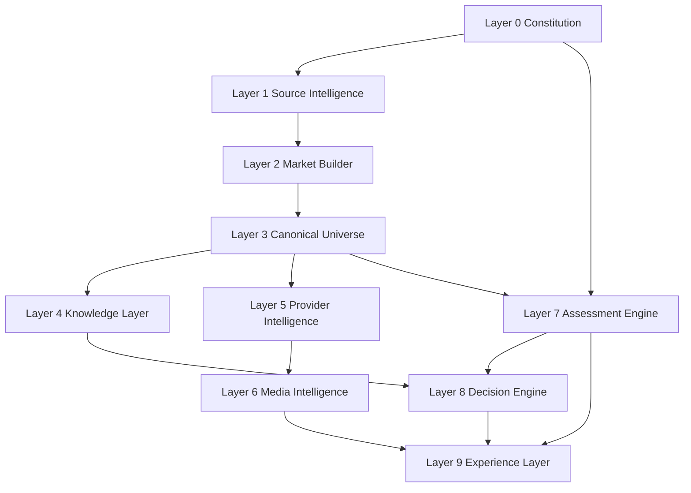

# OPTIME Platform Readiness Matrix

Generated: 2026-08-05

This audit is based on repository evidence only. Where direct evidence is missing, the matrix marks the field as `UNKNOWN`.

## Executive Summary

1. Weakest layer: **Layer 6 - Media Intelligence**
Reason: the current Las Vegas media pilot produced **0** valid displayable images and failed primarily on official-site discovery and identity sufficiency.

2. Layer that blocks all later work: **Layer 2 - Market Builder**
Reason: the repository still lacks a generic market builder, and later layers depend on reliable source packaging, state configuration, and reusable validation before scaled rollout.

3. Completed work performed before prerequisites existed: **Media Intelligence and parts of Experience Layer**
Reason: media pilots and UX validation exist while Market Builder, Canonical Universe completeness, and Provider Intelligence are still partial.

4. Work that should now be frozen: **Layer 6 Media Intelligence, Layer 9 UX/provider-portal expansion, and non-essential provider expansion**
Reason: these layers sit downstream of incomplete builder/canonical/provider prerequisites.

5. Work that should resume immediately: **Layer 2 Market Builder and Layer 3 Canonical Universe**
Reason: these are prerequisite layers for cross-market readiness and for stable downstream execution.

6. Next single engineering objective: **complete the governed Market Builder path to a PASS-grade canonical universe package for active markets**
Reason: this is the lowest prerequisite layer that still blocks scaled progress in later layers.

## Dependency Graph

## Layer Summary

| Layer | Status | Completeness | Primary Blocker |
| --- | --- | ---: | --- |
| Layer 0 Constitution | READY FOR REVIEW | 85% | Runtime enforcement remains partial on some surfaces |
| Layer 1 Source Intelligence | PARTIALLY COMPLETE | 70% | Registry/policy exist, but integration coverage is incomplete |
| Layer 2 Market Builder | BLOCKED | 35% | No generic builder; state logic remains embedded in separate scripts |
| Layer 3 Canonical Universe | PARTIALLY COMPLETE | 65% | Nevada remains incomplete and market-gate thresholds still fail |
| Layer 4 Knowledge Layer | PARTIALLY COMPLETE | 60% | Governance/reporting package exists, runtime depth varies by center |
| Layer 5 Provider Intelligence | PARTIALLY COMPLETE | 55% | Enrichment exists, but verified structured provider coverage is incomplete |
| Layer 6 Media Intelligence | FAILED | 20% | Las Vegas pilot failed with 0 valid displayable images |
| Layer 7 Assessment Engine | READY FOR REVIEW | 80% | Validation passes, but broader architecture dependency gates remain incomplete |
| Layer 8 Decision Engine | READY FOR REVIEW | 82% | Core engine is active, but deeper decision traceability remains partial |
| Layer 9 Experience Layer | PARTIALLY COMPLETE | 50% | Frontend/provider-portal breadth exceeds upstream readiness |

## Layer 0 - Constitution

- Status: `READY FOR REVIEW`
- Purpose: constitutional governance, principles, objectivity, and owner-gate control over all semantic changes.
- Inputs:
  - `AGENTS.md`
  - `docs/OPTIME_PRINCIPLES.md`
  - `docs/OPTIME_PRINCIPLES_REGISTRY.md`
  - `docs/COMMAND_*.md`
- Outputs:
  - Principle impact checks
  - Owner-gate decisions
  - Governance constraints for implementation and reporting
- Dependencies: none
- Current implementation:
  - Governance is codified in doctrine and registry documents.
  - Owner approval gates are explicitly defined in `AGENTS.md`.
  - Constitution is documented in `docs/master-book/04_CONSTITUTION.md`.
- Missing implementation:
  - Full runtime compliance matrix across all endpoints and reports.
  - Automated constitution compliance checks per release.
- Current reports:
  - `docs/master-book/04_CONSTITUTION.md`
  - `reports/verified_information_standard.md`
  - `reports/EVIDENCE_PARITY_REGRESSION_TESTS.json`
- Current tests:
  - Governance/process rule only; no dedicated automated constitution test suite found.
- Current owner gates:
  - Principle Impact Check
  - Classification Gate A-E
  - Owner Approval Protocol for C/D/E
- Blocking issues:
  - Some runtime/report surfaces still rely on convention rather than automated gate enforcement.
- PASS criteria:
  - Doctrine exists
  - Registry exists
  - Owner gates are active
  - Automated compliance checks cover release surfaces
- FAIL criteria:
  - Silent principle drift
  - Missing owner approval for principle/architecture changes
  - Missing doctrine source of truth
- Evidence required:
  - Principle docs
  - Registry
  - Governance rules in root instructions
- Reports required:
  - Principle registry
  - Verified information/governance audit artifacts
- Tests required: `UNKNOWN`
- Approval required: yes for C/D/E changes

## Layer 1 - Source Intelligence

- Status: `PARTIALLY COMPLETE`
- Purpose: discovery, lifecycle governance, policy evaluation, and source coverage management.
- Inputs:
  - Source connectivity audits
  - Source lifecycle registry
  - Agent source discovery specs
- Outputs:
  - `database/source_lifecycle_registry.json`
  - `reports/SOURCE_LIFECYCLE_STATUS.md`
  - `reports/SOURCE_POLICY_MIGRATION_REPORT.*`
- Dependencies:
  - Layer 0
- Current implementation:
  - Source lifecycle registry exists and is authoritative.
  - Deterministic source policy engine and lifecycle service exist.
  - Status report is generated from registry.
- Missing implementation:
  - Agent write path is present in service code but not yet evidenced as active production orchestration.
  - Integration coverage remains incomplete for multiple approved sources.
  - Active remediation/orchestration layer is not yet evidenced as complete.
- Current reports:
  - `reports/SOURCE_LIFECYCLE_STATUS.md`
  - `reports/SOURCE_POLICY_MIGRATION_REPORT.md`
  - `reports/FLORIDA_SOURCE_CONNECTIVITY_AUDIT.md`
  - `reports/NEVADA_SOURCE_INTEGRATION_REPORT.md`
- Current tests:
  - `backend/tests/test_source_policy_engine.py`
- Current owner gates:
  - Source lifecycle policy states
  - Launch blocker listing from registry
  - Owner review path for exceptional sources
- Blocking issues:
  - High proportion of non-integrated sources
  - Florida state sources remain blocked
  - Some approved sources are not yet integrated into downstream builders
- PASS criteria:
  - Every discovered source in registry
  - Deterministic policy state
  - Registry-generated status reports
  - No lingering free-text-only source state
- FAIL criteria:
  - Sources only in reports
  - Duplicate source lifecycle state
  - Report-derived status overwriting registry
- Evidence required:
  - Registry records
  - Policy output
  - Source audits
- Reports required:
  - Source lifecycle status
  - Source policy migration report
- Tests required:
  - policy evaluation
  - lifecycle transitions
  - report generation from registry only
- Approval required: owner only for exceptional legal/commercial conflicts

## Layer 2 - Market Builder

- Status: `BLOCKED`
- Purpose: transform governed source packages into market/state build flows with reusable configuration and validation.
- Inputs:
  - Layer 1 source registry and approved sources
  - State/market configuration
  - builder scripts and connectors
- Outputs:
  - state/market canonical build runs
  - validation and readiness artifacts
- Dependencies:
  - Layer 1
  - Layer 0
- Current implementation:
  - Runtime market selection exists in `backend/app/services/canonical_universe.py`.
  - Nevada and Florida builders exist as separate scripts.
- Missing implementation:
  - No generic market builder entry point.
  - No configuration-only onboarding path for new states.
  - Validation remains state-specific.
- Current reports:
  - `reports/CANONICAL_FACILITY_UNIVERSE_REPORT.md`
  - `reports/NEVADA_SOURCE_INTEGRATION_REPORT.md`
  - `reports/NEVADA_CANONICAL_FACILITY_UNIVERSE_REPORT.md`
- Current tests:
  - `backend/tests/test_nevada_canonical_universe.py`
- Current owner gates:
  - Market readiness depends on source lifecycle and canonical gates.
- Blocking issues:
  - No generic reusable builder layer
  - Source packages are still wired inside state-specific builders
  - New market onboarding still requires code changes
- PASS criteria:
  - Generic builder entry point exists
  - State source packages are configuration-driven
  - Validation is reusable by market
  - New state onboarding does not require new architecture
- FAIL criteria:
  - Separate bespoke build path per state
  - Runtime routes to markets that build layer cannot onboard generically
- Evidence required:
  - builder scripts
  - runtime market resolver
  - state integration reports
- Reports required:
  - market/state integration reports
  - canonical build reports
- Tests required:
  - builder tests across market configurations
- Approval required: yes for architectural deviation

## Layer 3 - Canonical Universe

- Status: `PARTIALLY COMPLETE`
- Purpose: normalization, identity resolution, deduplication, canonical IDs, coverage, and canonical validation.
- Inputs:
  - Market Builder outputs
  - approved authoritative sources
- Outputs:
  - canonical universe JSON files
  - crosswalks
  - validation reports
- Dependencies:
  - Layer 2
- Current implementation:
  - Florida canonical universe exists and has validation reports.
  - Nevada canonical universe now exists with NPPES integration.
  - Canonical IDs, merge evidence, and duplicate detection exist.
- Missing implementation:
  - Nevada is still missing HCQC licensing integration.
  - Las Vegas gate remains below threshold.
  - Some records remain incomplete and unresolved duplicate candidates remain high.
- Current reports:
  - `reports/CANONICAL_FACILITY_UNIVERSE_REPORT.md`
  - `reports/FLORIDA_CANONICAL_UNIVERSE_AUDIT.md`
  - `reports/NEVADA_CANONICAL_FACILITY_UNIVERSE_REPORT.md`
  - `reports/NEVADA_SOURCE_INTEGRATION_REPORT.md`
- Current tests:
  - `scripts/validate_canonical_facility_universe.py`
  - `backend/tests/test_nevada_canonical_universe.py`
- Current owner gates:
  - canonical validation
  - media pilot gate depends on complete authoritative identities
- Blocking issues:
  - Nevada HCQC remains blocked
  - Las Vegas complete identities = 68, below required 100
  - Nevada license IDs still absent
- PASS criteria:
  - canonical schema validated
  - authoritative identity completeness for active market passes threshold
  - duplicate and conflict thresholds acceptable
  - validation reports PASS
- FAIL criteria:
  - invalid canonical IDs
  - unresolved critical identity gaps
  - market gate below threshold
- Evidence required:
  - canonical JSON
  - report JSON/MD
  - validation outputs
- Reports required:
  - canonical report
  - validation/audit report
- Tests required:
  - merge, dedup, normalization, completeness, gate behavior
- Approval required: owner only for schema or identity-rule changes

## Layer 4 - Knowledge Layer

- Status: `PARTIALLY COMPLETE`
- Purpose: structured articles, FAQs, regulations, research, and provider knowledge for reusable decision intelligence.
- Inputs:
  - canonical universe
  - agent knowledge snapshots
  - research and validation artifacts
- Outputs:
  - knowledge objects
  - evidence objects
  - knowledge gap and validation reports
- Dependencies:
  - Layer 3
- Current implementation:
  - knowledge centers are documented and implemented as governance/reporting surfaces.
  - backend knowledge fabric schema exists.
- Missing implementation:
  - runtime depth varies by center.
  - some centers rely more on reporting package than active runtime telemetry.
- Current reports:
  - `reports/scientific_method.md`
  - `reports/evidence_grading_framework.md`
  - `reports/knowledge_validation_framework.md`
  - `reports/knowledge_gap_report.md`
- Current tests: `UNKNOWN`
- Current owner gates:
  - evidence quality and verified information doctrine
- Blocking issues:
  - incomplete runtime depth across knowledge centers
  - knowledge/report surfaces still partially transitional
- PASS criteria:
  - knowledge centers have active prepared knowledge and telemetry
  - evidence and validation frameworks are consumable at runtime
  - gap reporting is connected to operational queueing
- FAIL criteria:
  - knowledge only exists as static reporting package
  - missing evidence governance
- Evidence required:
  - knowledge center docs
  - knowledge validation reports
  - backend knowledge fabric models
- Reports required:
  - scientific method
  - evidence grading
  - knowledge validation
  - knowledge gaps
- Tests required: `UNKNOWN`
- Approval required: owner for doctrine changes only

## Layer 5 - Provider Intelligence

- Status: `PARTIALLY COMPLETE`
- Purpose: operator, organization, ownership, official domain, and provider profile intelligence.
- Inputs:
  - canonical facilities
  - source audits
  - provider agent workflows
- Outputs:
  - provider profiles
  - organization registry/state
  - provider intelligence reports
- Dependencies:
  - Layer 3
  - Layer 4
- Current implementation:
  - provider intelligence agent spec exists.
  - provider organization registry service exists with tests.
  - provider review and portal schema artifacts exist.
- Missing implementation:
  - organization/provider coverage is not complete statewide.
  - provider portal is backend-strong but UI-incomplete.
  - verified structured operator/domain coverage is still incomplete.
- Current reports:
  - `reports/provider_portal_review.md`
  - `reports/provider_portal_schema.md`
  - `reports/provider_portal_design.md`
- Current tests:
  - `backend/tests/test_provider_organization_registry.py`
- Current owner gates:
  - provider identity verification and domain allowlist flows
- Blocking issues:
  - pending verification backlog
  - incomplete per-field provider completeness
  - missing robust provider UI workflows
- PASS criteria:
  - provider identity and organization relationships verified
  - per-field completeness/verification visible
  - provider portal workflows operational end-to-end
- FAIL criteria:
  - ownership/domain ambiguity unresolved
  - portal flow incomplete despite backend primitives
- Evidence required:
  - provider spec
  - organization registry service/tests
  - provider portal review
- Reports required:
  - provider portal review/schema
  - intelligence dashboards
- Tests required:
  - organization linking
  - owner/operator distinction
  - portal verification
- Approval required: owner for semantic identity rule changes

## Layer 6 - Media Intelligence

- Status: `FAILED`
- Purpose: official websites, exact facility pages, image discovery, rights, and verification.
- Inputs:
  - canonical universe
  - provider intelligence
  - official domains/pages
- Outputs:
  - media registry state
  - verified image candidates
  - media pilot reports
- Dependencies:
  - Layer 3
  - Layer 5
- Current implementation:
  - media resolution and government identity services exist.
  - media pilots and failure analysis exist.
- Missing implementation:
  - official site discovery remains weak.
  - displayable image verification coverage is currently zero in the pilot baseline.
  - organization-first media flow is not yet evidenced as complete.
- Current reports:
  - `reports/MEDIA_LIVE_PILOT_100.md`
  - `reports/MEDIA_LIVE_PILOT_FAILURE_ANALYSIS.md`
  - `reports/GOVERNMENT_IDENTITY_MEDIA_COVERAGE.md`
- Current tests:
  - `backend/tests/test_government_identity_media.py`
  - `backend/tests/test_facility_media_resolution.py`
- Current owner gates:
  - media owner gate in pilot report
  - rights gating and facility-specific verification rules
- Blocking issues:
  - official-site discovery is dominant failure
  - display rights uncertainty
  - facility identity uncertainty on candidate images
- PASS criteria:
  - official site discovery rate sufficient
  - facility-specific image verification > gate threshold
  - rights-clear displayable images meet governed minimums
- FAIL criteria:
  - 0 verified displayable images
  - official-site failures dominate pilot
  - owner gate fails
- Evidence required:
  - pilot reports
  - failure analysis
  - media tests
- Reports required:
  - live pilot report
  - failure analysis
  - media coverage report
- Tests required:
  - identity verification
  - facility-specific vs shared image classification
  - rights handling
- Approval required: owner for evidence/rights threshold changes

## Layer 7 - Assessment Engine

- Status: `READY FOR REVIEW`
- Purpose: questionnaire, dynamic logic, clarification flow, progress tracking, and patient profile construction.
- Inputs:
  - governance rules
  - questionnaire schema
  - profile logic
- Outputs:
  - assessment state
  - understanding/profile signals
  - patient profile for decision engine
- Dependencies:
  - Layer 0
  - Layer 3
- Current implementation:
  - assessment conversation/profile/schema tests exist.
  - journey/profile validation reports both PASS.
- Missing implementation:
  - broader platform dependency gates remain incomplete.
  - some project-specific documentation is still thin.
- Current reports:
  - `reports/understanding_journey_v3_validation_report.md`
  - `reports/understanding_profile_validation_report.md`
- Current tests:
  - `frontend/tests/assessment-schema.test.ts`
  - `frontend/tests/assessment-profile.test.ts`
  - `frontend/tests/assessment-home-progress.test.ts`
  - `frontend/tests/assessment-conversation.test.ts`
- Current owner gates:
  - no ranking regression checks in validation reports
- Blocking issues:
  - assessment quality can outpace upstream data/provider/media readiness
- PASS criteria:
  - build PASS
  - state persistence PASS
  - profile/understanding logic PASS
  - no ranking regression
- FAIL criteria:
  - questionnaire state loss
  - understanding/profile regressions
  - ranking side-effects from assessment layer
- Evidence required:
  - validation reports
  - frontend tests
- Reports required:
  - understanding journey/profile validation
- Tests required:
  - assessment schema/profile/conversation/progress
- Approval required: owner for semantic intake behavior changes

## Layer 8 - Decision Engine

- Status: `READY FOR REVIEW`
- Purpose: matching, recommendation, explainability, confidence, and tradeoff output.
- Inputs:
  - canonical/provider/knowledge data
  - assessment profile
  - governed runtime context
- Outputs:
  - ranked candidates
  - explanations
  - confidence and tradeoff surfaces
- Dependencies:
  - Layer 4
  - Layer 7
- Current implementation:
  - recommendation engine and decision framework are implemented.
  - governed runtime integration validation exists.
  - decision engine route and patient decision engine tests exist.
- Missing implementation:
  - deeper decision-psychology lineage is partial.
  - some calibration and traceability work remains open.
- Current reports:
  - `reports/recommendation_engine_validation.md`
  - `reports/GOVERNED_RUNTIME_INTEGRATION_REPORT.md`
  - `reports/GOVERNED_RUNTIME_INTEGRATION_VALIDATION.json`
  - `reports/decision_framework.md`
- Current tests:
  - `backend/tests/test_patient_decision_engine.py`
  - `backend/tests/test_decision_engine_routes.py`
- Current owner gates:
  - principle impact check for ranking/scoring
  - governed runtime validation
- Blocking issues:
  - decision layer still depends on incomplete upstream builder/canonical/provider/media layers for full platform readiness
- PASS criteria:
  - governed runtime validation PASS
  - recommendation engine validation PASS
  - no recommendation policy regressions
  - explainability and confidence outputs preserved
- FAIL criteria:
  - MUST gates bypassed
  - unknown/confidence semantics drift
  - ungoverned ranking change
- Evidence required:
  - engine code
  - validation reports
  - backend tests
- Reports required:
  - runtime integration report
  - recommendation validation
  - decision framework
- Tests required:
  - route tests
  - patient decision engine tests
- Approval required: owner for ranking/recommendation semantic changes

## Layer 9 - Experience Layer

- Status: `PARTIALLY COMPLETE`
- Purpose: frontend, UX, provider portal, admin, and accessibility/user-facing system surfaces.
- Inputs:
  - decision outputs
  - media outputs
  - assessment state
  - provider/admin workflows
- Outputs:
  - user experience
  - provider portal UX
  - admin visibility
- Dependencies:
  - Layer 6
  - Layer 7
  - Layer 8
- Current implementation:
  - Next.js frontend exists with active recommendation/result experience.
  - provider portal backend foundations exist.
  - provider portal maturity is documented as medium with strong backend foundations and UI gaps.
- Missing implementation:
  - robust provider dashboard UI
  - verification inbox UI, assignment, escalation
  - lead lifecycle domain/UI
  - accessibility evidence is `UNKNOWN`
- Current reports:
  - `reports/provider_portal_review.md`
  - `reports/phase9_architecture_validation.md`
  - `reports/ui_language_review.md`
- Current tests:
  - frontend assessment tests
  - runtime/experience adjacent validations in reports
- Current owner gates:
  - no explicit dedicated experience owner gate found; governance still applies through Layer 0 and runtime validations
- Blocking issues:
  - UX/productization exceeds upstream data/media/provider readiness
  - provider portal workflow completeness remains low
  - accessibility evidence not found
- PASS criteria:
  - production-grade frontend flows
  - provider portal end-to-end workflow completeness
  - accessibility validation present
  - upstream dependencies passed
- FAIL criteria:
  - UX depends on incomplete upstream layers
  - provider portal lacks first-class operational workflows
  - no accessibility evidence
- Evidence required:
  - frontend architecture doc
  - provider portal review
  - architecture validation summary
- Reports required:
  - provider portal review
  - phase 9 architecture validation
- Tests required: `UNKNOWN` for accessibility/provider-portal specific suite
- Approval required: owner for product-semantics changes, not for standard UX completion
