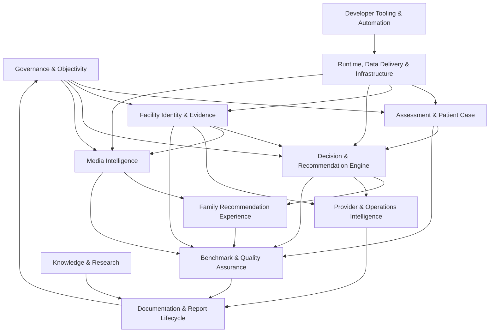

# OPTIME Project Streams

**Document role:** Canonical operational map of repository ownership, dependencies, status, overlap, and health.  
**Evidence snapshot:** Local worktree on 2026-08-03.  
**Branch:** `review/homepage-questionnaire-inline`  
**HEAD:** `fb8d341` (`docs(simulation): add end-to-end decision audit artifacts`)  
**Scope:** Repository governance only. This document changes no product behavior or architecture.

## Evidence Discipline

- **Observed** means directly supported by repository paths, Git state, tests, manifests, or generated artifacts.
- **Inference** means a conclusion drawn from those observations; it is not a product principle or approved architecture change.
- **Recommendation** means proposed governance or cleanup. It is non-executing and remains subject to `AGENTS.md` and PR-008 owner approval where architecture or semantics could change.
- **Ownership rule:** every path has one primary stream. A consumer relationship is recorded as a dependency, never as duplicate ownership. When rules overlap, the most-specific path in Table 2 wins.
- **Status vocabulary for worktree files:** `ACTIVE`, `FROZEN`, `READY`, `EXPERIMENTAL`, `DEPRECATED`, `BLOCKED`, `OWNER DECISION`.
- **Roadmap vocabulary:** `Not Started`, `Planning`, `Prototype`, `Active Development`, `Code Complete`, `Testing`, `Production Ready`, `Maintenance`, `Frozen`.

## Constitutional Constraints

**Observed:** [`AGENTS.md`](../AGENTS.md) makes [`docs/OPTIME_PRINCIPLES.md`](../docs/OPTIME_PRINCIPLES.md) and [`docs/OPTIME_PRINCIPLES_REGISTRY.md`](../docs/OPTIME_PRINCIPLES_REGISTRY.md) constitutional. PR-001 through PR-009 are `ACTIVE`. PR-008 requires explicit owner approval for principle ambiguity/change and architectural deviation.

**Observed:** The permanent constraints include: missing information is not negative evidence; generic completeness must not improve ranking; only verified case-relevant evidence may strengthen proven match under governed rules; commercial relationships cannot alter organic ranking; matching is parameter-first.

**Inference:** Stream consolidation may document ownership and dependencies, but it may not silently choose between competing engines, registries, or product semantics.

**Recommendation:** Treat all `Should Merge`, `Should Replace`, and `Should Delete` entries below as owner-gated proposals, not implementation authorization.

# Table 1: Platform Streams

| Stream | Purpose | Status | Owner | Priority |
|---|---|---|---|---|
| Governance & Objectivity | Preserve principles, neutrality, evidence semantics, and approval gates. | Maintenance | Product Governance / Decision Science | P0 |
| Assessment & Patient Case | Acquire family needs adaptively and normalize them into the canonical patient case. | Active Development | Assessment Platform Engineering | P0 |
| Facility Identity & Evidence | Maintain canonical facility identity, parameter evidence, provenance, freshness, and source integrity. | Active Development | Facility Intelligence / Data Engineering | P0 |
| Decision & Recommendation Engine | Resolve eligibility, proven match, ordering, comparison context, and verification needs. | Production Ready | Decision Platform Engineering | P0 |
| Media Intelligence | Verify official facility pages and display-eligible facility-specific media. | Testing | Media Intelligence Engineering | P1 |
| Family Recommendation Experience | Present recommendations, facility profiles, comparison, explanations, favorites, and search sessions. | Active Development | Family Experience Engineering | P1 |
| Provider & Operations Intelligence | Support provider identity, acquisition, admin control surfaces, agents, and executive operations. | Prototype | Platform Operations Engineering | P2 |
| Knowledge & Research | Preserve institutional knowledge, market research, decision-science proposals, and outcome learning inputs. | Planning | Research & Institutional Intelligence | P2 |
| Benchmark & Quality Assurance | Validate deterministic behavior, sparse evidence, benchmarks, simulations, and browser contracts. | Maintenance | Evaluation Science / Quality Engineering | P1 |
| Runtime, Data Delivery & Infrastructure | Deploy, synchronize, cache, persist, and operate backend/frontend runtimes safely. | Production Ready | Platform / Release Engineering | P0 |
| Developer Tooling & Automation | Build canonical artifacts, run controlled automation, and provide reproducible local workflows. | Active Development | Developer Productivity Engineering | P2 |
| Documentation & Report Lifecycle | Maintain canonical docs, report catalog, generated audit artifacts, retention, and historical labels. | Maintenance | Technical Governance / Research Operations | P2 |

# Stream Records

## 1. Governance & Objectivity

**Purpose:** Preserve the product constitution and separate quality, match, proven match, potential match, confidence, unknown, contradiction, source failure, no-data-found, and commercial concerns.

**Business Goal:** Keep recommendations resident-first, evidence-backed, explainable, and commercially neutral.

**Technical Goal:** Provide versioned principles, canonical parameter doctrine, approval gates, source authority rules, and regression evidence for semantic invariants.

**Current Status:** Maintenance.

**Architecture Owner:** Product Governance / Decision Science.

**Observed**

- Primary components: [`AGENTS.md`](../AGENTS.md), [`docs/OPTIME_PRINCIPLES.md`](../docs/OPTIME_PRINCIPLES.md), [`docs/OPTIME_PRINCIPLES_REGISTRY.md`](../docs/OPTIME_PRINCIPLES_REGISTRY.md), [`docs/OPTIME_MASTER_PARAMETER_REGISTRY.md`](../docs/OPTIME_MASTER_PARAMETER_REGISTRY.md), [`database/professional_rule_registry.json`](../database/professional_rule_registry.json), [`database/candidate_governance_policy.json`](../database/candidate_governance_policy.json).
- Dependent components: decision engine, evidence service, assessment advisor, benchmark judges, recommendation explanations, admin intelligence.
- Related tests: [`backend/tests/test_patient_decision_engine.py`](../backend/tests/test_patient_decision_engine.py), [`backend/tests/test_matching_v3_phase0_phase1.py`](../backend/tests/test_matching_v3_phase0_phase1.py), governed runtime and parity scripts under [`scripts/`](../scripts/).
- Related reports: `reports/EVIDENCE_PARITY_REGRESSION_TESTS.json`, `reports/GOLDEN_CASE_RANKING_CAUSALITY_AUDIT.json`, [`reports/OPTIME_DECISION_ONTOLOGY_REVIEW.md`](OPTIME_DECISION_ONTOLOGY_REVIEW.md), [`reports/OPTIME_DECISION_INTELLIGENCE_ARCHITECTURE.md`](OPTIME_DECISION_INTELLIGENCE_ARCHITECTURE.md).
- Related documentation: mission, method, score, parameter, law, and command documents under [`docs/`](../docs/).
- Current branches: `review/homepage-questionnaire-inline`; remote `codex/targeted-unknown-resolution-engine` contains isolated unknown-resolution work at `fc44c94`.
- Current commits: `2010c7a` strategy consolidation; `a158339` competitive research; older parameter-first governance history is reflected in the active principle registry.
- Repository paths: `AGENTS.md`; `docs/OPTIME_PRINCIPLES*`; `docs/OPTIME_MASTER_PARAMETER_REGISTRY.md`; governance/policy registries; governance-specific reports.

**Inference:** This is the healthiest semantic boundary because it has an explicit constitution, lifecycle statuses, and an approval protocol.

**Recommendation:** Do not merge semantic concepts merely because UI labels overlap. Update stale score documents only through a versioned, owner-approved process.

## 2. Assessment & Patient Case

**Purpose:** Ask only decision-relevant questions, preserve uncertainty, save family answers, and produce one normalized patient case.

**Business Goal:** Move a family from uncertainty to sufficient structured context without unnecessary burden or guessed answers.

**Technical Goal:** Own question schema, visibility/dependencies, adaptive ordering, answer persistence, profile conversion, patient-case upsert, and readiness to request recommendations.

**Current Status:** Active Development.

**Architecture Owner:** Assessment Platform Engineering.

**Observed**

- Primary components: [`frontend/src/lib/assessment-schema.ts`](../frontend/src/lib/assessment-schema.ts), `assessment-advisor.ts`, `assessment-conversation.ts`, `assessment-profile.ts`, `assessment-home-progress.ts`, [`frontend/src/components/assessment/`](../frontend/src/components/assessment/), [`backend/app/services/unified_patient_case_service.py`](../backend/app/services/unified_patient_case_service.py), `ai_case_understanding_service.py`.
- Dependent components: questionnaire context, search-session persistence, API client, patient-case routes in `backend/app/main.py`.
- Related tests: assessment schema/profile/conversation/home-progress/living-document/search-session unit tests; [`backend/tests/test_unified_patient_case_service.py`](../backend/tests/test_unified_patient_case_service.py); Playwright living-document flows.
- Related reports: [`reports/ADAPTIVE_INTERVIEW_CURRENT_CODE_EXTRACT.md`](ADAPTIVE_INTERVIEW_CURRENT_CODE_EXTRACT.md), assessment UX screenshots and proposal artifacts.
- Related documentation: [`docs/DATA_MODEL.md`](../docs/DATA_MODEL.md), principles, parameter registry, and assessment-oriented strategy proposals.
- Current branches: active local work is on `review/homepage-questionnaire-inline`; upstream branch is at `f08832b`.
- Current commits: `f08832b` inline questionnaire integration; `ad354ee` canonical family assessment restoration; `c322232` earlier AI onboarding/profile experience.
- Repository paths: `frontend/src/components/assessment/**`; `frontend/src/lib/assessment-*`; assessment routes; assessment tests/E2E; patient-case and AI-understanding backend services.

**Inference:** Two assessment generations coexist: the active advisor/living-document path and the 2,749-line legacy [`frontend/src/app/intake/page.tsx`](../frontend/src/app/intake/page.tsx). This is the repository’s clearest duplicated product surface.

**Recommendation:** Freeze new behavior in `/intake`; characterize externally used routes; then seek owner approval for one canonical assessment entry point. Do not change adaptive selection or readiness semantics during consolidation.

## 3. Facility Identity & Evidence

**Purpose:** Maintain the canonical facility universe and evidence-bearing parameter truth.

**Business Goal:** Give every facility fair, source-governed treatment while preventing missing data from becoming negative evidence.

**Technical Goal:** Ingest government/regulatory sources, reconcile identities, normalize parameter evidence, preserve provenance/conflicts/freshness, and expose a memory-safe read model.

**Current Status:** Active Development.

**Architecture Owner:** Facility Intelligence / Data Engineering.

**Observed**

- Primary components: canonical identity and parameter JSON under [`database/`](../database/); source data under [`data/`](../data/); [`backend/app/services/facility_parameter_service.py`](../backend/app/services/facility_parameter_service.py), `evidence_engine_service.py`, `evidence_source_integrity.py`, `external_discovery.py`, `provider_identity.py`; CMS ingestion/import modules.
- Dependent components: decision engine, facility profiles, comparison, assessment parameter intelligence, media identity.
- Related tests: `test_facility_parameter_service.py`, `test_evidence_engine_service.py`, identity/source tests, realistic synthetic facility tests.
- Related reports: canonical facility universe, parameter coverage matrix, source connectivity, evidence parity, realistic sparse-evidence reports.
- Related documentation: [`docs/DATA_SOURCES.md`](../docs/DATA_SOURCES.md), [`docs/CMS_DATA_SOURCES.md`](../docs/CMS_DATA_SOURCES.md), [`docs/FLORIDA_FACILITY_UNIVERSE_EXECUTION_PLAN.md`](../docs/FLORIDA_FACILITY_UNIVERSE_EXECUTION_PLAN.md).
- Current branches: current review branch contains governed runtime refresh; no durable stream branch exists.
- Current commits: `5cb2ae3` Florida parameter evidence matrix/API; `1bcad8c` governed evidence runtime refresh; `c4c2aa5` startup-memory/runtime hardening.
- Repository paths: `database/**` except media-only registry; `data/florida_universe/**`, `data/nppes/**`; evidence/identity/ingestion services; evidence builders and validators.

**Inference:** The canonical data boundary is strong, but names such as `florida_senior_living_inventory.json` and `florida_facility_universe_canonical.json` can imply competing authority unless stage roles are explicit.

**Recommendation:** Preserve source inventory and canonical enriched universe as separate stages; add authority metadata rather than merging them. Migrate remaining consumers of the explicitly legacy South Florida inventory before archival.

## 4. Decision & Recommendation Engine

**Purpose:** Turn canonical patient context and facility evidence into eligibility, ordering, explanation, comparison context, and verification work.

**Business Goal:** Produce deterministic, objective, case-relevant recommendations that remain useful under incomplete evidence.

**Technical Goal:** Own one authoritative runtime decision path, compact candidate ranking, tie handling, confidence/readiness separation, and response contracts.

**Current Status:** Production Ready, with authority debt.

**Architecture Owner:** Decision Platform Engineering.

**Observed**

- Primary components: [`backend/app/services/patient_decision_engine.py`](../backend/app/services/patient_decision_engine.py), decision routes in [`backend/app/main.py`](../backend/app/main.py), matching shadow/simulation services, verification and comparison contracts.
- Dependent components: unified patient case, facility parameter service, evidence state, frontend API client.
- Related tests: [`backend/tests/test_patient_decision_engine.py`](../backend/tests/test_patient_decision_engine.py), route tests, matching-v3 shadow tests, golden-case and recommendation-invariance scripts.
- Related reports: canonical Dad/Stroke/Miami golden case, end-to-end decision simulation, sensitivity analysis, matching-v3 phase reports.
- Related documentation: principles, parameter registry, results comparison flow, data model.
- Current branches: current branch includes `1bcad8c`; remote targeted-unknown branch is separate.
- Current commits: `15e950c` patient decision engine integration; `963909e` request-memory reduction; `1bcad8c` governed evidence refresh.
- Repository paths: backend decision/matching services and tests; decision-specific simulation scripts/reports.

**Inference:** [`frontend/src/lib/optime-v2-engine.ts`](../frontend/src/lib/optime-v2-engine.ts) remains a second executable ranking implementation and a fallback in the frontend API layer. That creates authority drift even if the backend is intended to be canonical.

**Recommendation:** Preserve the TypeScript engine as a named legacy simulation oracle until all scripts/benchmark consumers migrate. Removing production fallback or changing engine authority is an architectural deviation and requires owner approval plus characterization tests.

## 5. Media Intelligence

**Purpose:** Discover, verify, govern, and monitor exact-facility media without affecting ranking.

**Business Goal:** Improve presentation with trustworthy facility-specific imagery while keeping rights and identity uncertainty visible.

**Technical Goal:** Resolve government identity to official location pages, classify/reject generic assets, assess rights, maintain one media registry, and gate frontend display to verified media.

**Current Status:** Testing; production writes are blocked pending authorization.

**Architecture Owner:** Media Intelligence Engineering.

**Observed**

- Primary components: `backend/app/services/facility_media_resolution.py`, `government_identity_media.py`, `facility_media_registry.py`, [`database/facility_media_registry.json`](../database/facility_media_registry.json), media discovery/coverage scripts.
- Dependent components: facility identity/evidence, backend facility responses, results and facility profile presentation.
- Related tests: `backend/tests/test_facility_media_resolution.py`, `test_government_identity_media.py`, frontend facility-experience image tests.
- Related reports: `GOVERNMENT_IDENTITY_MEDIA_COVERAGE.{md,json}`, `facility_media_statewide_progress.json`, facility fallback screenshots.
- Related documentation: media sprint requirements are represented by tests/reports rather than a committed canonical design document.
- Current branches: local-only work on the current review branch.
- Current commits: `4c08aa8` tracked registry service; `819dcdd` identity-first resolver corrections; current changes are uncommitted.
- Repository paths: media services, registry, media scripts/tests/reports.

**Inference:** Runtime registry reading is distinct from discovery policy and should remain separate. The pilot and statewide scripts currently overlap as registry-writing orchestrators.

**Recommendation:** Keep `facility_media_registry.py` as the sole runtime read boundary. Consolidate pilot/statewide orchestration only after the current governed behavior is committed and characterized. Do not auto-upgrade legacy records.

## 6. Family Recommendation Experience

**Purpose:** Present recommendations, evidence, profiles, comparisons, favorites, search state, and actionable explanations to families.

**Business Goal:** Help families understand why options differ and what remains to verify.

**Technical Goal:** Own results/profile/compare UI, API presentation DTOs, session state, responsive behavior, attribution, and route continuity.

**Current Status:** Active Development.

**Architecture Owner:** Family Experience Engineering.

**Observed**

- Primary components: `frontend/src/app/results/**`, `frontend/src/components/compare/**`, `frontend/src/components/facility/**`, `frontend/src/lib/api.ts`, `comparison-flow.ts`, `results-compare-flow.ts`, `search-session.ts`.
- Dependent components: backend decision/profile/evidence/media APIs and assessment output.
- Related tests: facility-experience, comparison, API base URL, results/compare helper tests, Playwright recommendation flows.
- Related reports: UX refresh before/after images, comparison-flow docs, facility fallback screenshots.
- Related documentation: [`docs/OPTIME_RESULTS_COMPARISON_FLOW.md`](../docs/OPTIME_RESULTS_COMPARISON_FLOW.md).
- Current branches: current review branch; many recent fixes were committed directly in this branch lineage.
- Current commits: `8a08e68` canonical comparison; `6c30e36` favorites compare/evidence drilldown; `cacb81c` results/profile flow; `9a6096d` evidence-backed live profile.
- Repository paths: results, compare, facility/profile routes/components, brand/header presentation, frontend session/API boundary.

**Inference:** Profile functionality is split between `/facility/[id]` and `/facilities/[id]`, with `facility-profile-client.tsx` and `live-facility-profile-client.tsx` using different identifiers/contracts. Results and compare clients are also high-churn integration hubs.

**Recommendation:** Preserve routes for compatibility, but designate one canonical profile composition after owner review. Extract stable presentation modules only after behavior-level browser tests cover both identifiers and return paths.

## 7. Provider & Operations Intelligence

**Purpose:** Support provider identity, data acquisition operations, executive visibility, agents, and controlled administrative workflows.

**Business Goal:** Scale facility intelligence and operational oversight without creating commercial ranking influence.

**Technical Goal:** Own admin access, provider identity, parameter acquisition views, executive reports, agents, outreach queues, and operational telemetry.

**Current Status:** Prototype.

**Architecture Owner:** Platform Operations Engineering.

**Observed**

- Primary components: `backend/app/services/admin_access.py`, `provider_identity.py`, `executive_report_service.py`, `chief_ai_supervisor.py`, `intelligence_agent.py`, `agent_knowledge_reports.py`; `frontend/src/app/admin/**`; provider/outreach schemas.
- Dependent components: facility evidence, governance, report lifecycle, runtime APIs.
- Related tests: admin access, intelligence agent, provider/executive service tests where present.
- Related reports: executive dashboards, agent reports, parameter acquisition audit.
- Related documentation: `docs/agent_specs/**`, institute/command documents.
- Current branches: current branch includes uncommitted admin and parameter-acquisition UI.
- Current commits: agent/report history is distributed across July platform commits; no dedicated stream branch exists.
- Repository paths: admin UI; operational/agent backend services; parameter-acquisition audit data and builder.

**Inference:** This stream mixes runtime admin tools with generated executive/report content. Its product boundary is less mature than assessment or decision runtime.

**Recommendation:** Keep admin/provider actions strictly outside organic ranking. Define explicit read/write authority per admin endpoint before promoting prototype views.

## 8. Knowledge & Research

**Purpose:** Preserve institutional knowledge, market research, outcome signals, and proposal-stage decision intelligence.

**Business Goal:** Improve long-term decision quality without allowing unapproved research to alter production semantics.

**Technical Goal:** Maintain research catalogs, knowledge state, outcome events, market analyses, and proposal lineage.

**Current Status:** Planning.

**Architecture Owner:** Research & Institutional Intelligence.

**Observed**

- Primary components: [`knowledge/`](../knowledge/), research-oriented [`data/`](../data/), root competitive reports, market/strategy docs and reports.
- Dependent components: governance review, simulations, future acquisition and decision work.
- Related tests: research claims are mostly validated through simulations and benchmark scripts rather than a dedicated unit suite.
- Related reports: competitive intelligence, data intelligence blueprint, decision ontology review, decision intelligence architecture.
- Related documentation: market analyses, intelligence strategy/layer/signal documents.
- Current branches: current review branch contains `a158339` and `2010c7a`.
- Current commits: `a158339` senior-living competitive intelligence; `2010c7a` data/objectivity planning.
- Repository paths: `knowledge/**`; root research reports; research catalogs and strategy documents/reports.

**Inference:** Proposal documents overlap in vocabulary but represent different scopes: data acquisition, ontology, and full decision architecture. Treating any as deployed authority would violate PR-008.

**Recommendation:** Preserve them with explicit `PROPOSAL`, `CURRENT`, or `HISTORICAL` metadata and links to the principle registry.

## 9. Benchmark & Quality Assurance

**Purpose:** Prove deterministic behavior, source integrity, sparse-evidence safety, cross-provider benchmark quality, and frontend workflows.

**Business Goal:** Make platform claims reproducible and expose regressions before families see them.

**Technical Goal:** Own benchmark cases/adapters/judges, domain tests, simulations, browser tests, golden cases, profiling, and invariance checks.

**Current Status:** Maintenance.

**Architecture Owner:** Evaluation Science / Quality Engineering.

**Observed**

- Primary components: [`benchmark/`](../benchmark/); `backend/tests/**`; `frontend/tests/**`; `frontend/e2e/**`; test-specific fixtures and validation scripts.
- Dependent components: all product streams under test.
- Related tests: the stream is the test estate itself; ownership of each test remains here only for assurance governance, while subject paths are cross-referenced in their product stream records.
- Related reports: benchmark system report, golden cases, sparse-evidence simulations, runtime validation, memory profiles.
- Related documentation: benchmark README and validation study.
- Current branches: current branch contains `c6b0d78` and `fb8d341`; benchmark framework is otherwise stable.
- Current commits: `c6b0d78` realistic sparse evidence; `fb8d341` end-to-end decision audit artifacts.
- Repository paths: `benchmark/**`; test/e2e directories; assurance-only scripts and reports.

**Inference:** The benchmark framework is a clean bounded subsystem. The broader assurance estate is harder to navigate because scripts and reports mix canonical, historical, and generated outputs.

**Recommendation:** Maintain benchmark independence. Add a repository-level test matrix and artifact policy rather than moving tests away from their existing frameworks.

## 10. Runtime, Data Delivery & Infrastructure

**Purpose:** Operate and deploy the platform with deterministic runtimes, bounded memory, safe refresh, and durable state.

**Business Goal:** Keep recommendation services available and reproducible under hosting constraints.

**Technical Goal:** Own deployment manifests, FastAPI composition, runtime synchronization/cache swap, schema migrations, persistence, environment contracts, and deployment documentation.

**Current Status:** Production Ready.

**Architecture Owner:** Platform / Release Engineering.

**Observed**

- Primary components: [`render.yaml`](../render.yaml), backend app composition in `backend/app/main.py`, `runtime_sync_service.py`, `schema_migrations.py`, database/session persistence, frontend runtime config.
- Dependent components: all backend services and frontend API consumers.
- Related tests: runtime sync, memory profiling, route smoke tests, API base URL tests.
- Related reports: active snapshot simulation, memory/endurance logs, runtime integration validation.
- Related documentation: [`backend/README.md`](../backend/README.md), root README, runtime rules in `AGENTS.md`.
- Current branches: main at `5b39e0b`; current review branch includes runtime hardening commits.
- Current commits: `c4c2aa5` startup memory/runtime; `963909e` request memory; `e53d8f5` discovery/decision memory pressure.
- Repository paths: deployment/config manifests; runtime/cache/migration services; persistence files excluded from source control by policy.

**Inference:** Backend deployment is explicit; equivalent frontend deployment is documented for Vercel but not represented by a root deployment manifest. `backend/app/main.py` is a 2,563-line composition hotspot.

**Recommendation:** Split route registration from business services only after route characterization tests. Add explicit frontend deployment ownership/configuration without changing runtime behavior.

## 11. Developer Tooling & Automation

**Purpose:** Reproduce builds, generate canonical artifacts, validate data, and run bounded operational workflows.

**Business Goal:** Scale engineering and data operations without proportional manual effort.

**Technical Goal:** Own runtime resolvers, builders, import CLIs, controlled runners, package scripts, and local development conventions.

**Current Status:** Active Development.

**Architecture Owner:** Developer Productivity Engineering.

**Observed**

- Primary components: [`scripts/`](../scripts/) except domain-specific policy code; `scripts/lib/python_runtime.cjs`; package manifests; Playwright/Vitest/ESLint configuration; `.vscode`.
- Dependent components: all generated artifacts and test workflows.
- Related tests: builder/import tests and the tests invoked by package/script commands.
- Related reports: generator outputs are owned by their subject stream; tooling owns reproducibility, not report semantics.
- Related documentation: runtime instructions in `AGENTS.md`, package scripts, backend deployment README.
- Current branches: current branch contains uncommitted builders/runners and Playwright configuration.
- Current commits: `25abdfb` generated/local cleanup; `c4c2aa5` canonical runtime locking.
- Repository paths: package/config files; generic script/runtime helpers; generated-output tooling.

**Inference:** `scripts/` contains both reusable tooling and domain policy. File location alone does not define architecture ownership.

**Recommendation:** Keep each script owned by the stream whose state it mutates; reserve Developer Tooling ownership for generic execution/build infrastructure.

## 12. Documentation & Report Lifecycle

**Purpose:** Keep current operational truth discoverable and historical evidence distinguishable from active authority.

**Business Goal:** Enable trustworthy audits without letting stale reports masquerade as current product behavior.

**Technical Goal:** Own canonical documentation structure, report catalog, status metadata, retention, deduplication, and artifact provenance.

**Current Status:** Maintenance.

**Architecture Owner:** Technical Governance / Research Operations.

**Observed**

- Primary components: general [`docs/`](../docs/) and [`reports/`](../reports/) lifecycle, `reports/report_registry.json`, `reports/versions/**`, `reports/daily/archive/**`, `scripts/run_report_registry.cjs`.
- Dependent components: every stream publishes subject-specific reports and documentation through this lifecycle.
- Related tests: report validators and generators; no single retention-policy test suite was found.
- Related reports: 452 tracked report files; 143 tracked `reports/versions/**` files; 69 daily archive files; 61 exact duplicate report hash groups.
- Related documentation: README and report indexes.
- Current branches: current branch adds strategy, simulation, media, UX, and architecture reports.
- Current commits: `fb8d341`, `a158339`, `2010c7a`.
- Repository paths: report registry/index/archive infrastructure; general cross-stream docs; generated visual evidence.

**Inference:** The repository is serving as both source repository and artifact store. Report snapshots and current reports are not consistently distinguished.

**Recommendation:** Keep canonical manifests and reproducible generators in Git; define retention and external artifact storage before deleting audit history.

# Table 2: Repository Ownership

The most-specific matching row owns a path. This table is authoritative for ownership; dependency usage does not transfer ownership.

| Path | Stream | Status |
|---|---|---|
| `AGENTS.md`, `docs/OPTIME_PRINCIPLES*`, `docs/OPTIME_MASTER_PARAMETER_REGISTRY.md` | Governance & Objectivity | Canonical |
| `database/*governance*`, `database/professional_rule_registry.json`, `database/candidate_governance_policy.json` | Governance & Objectivity | Canonical |
| `frontend/src/components/assessment/**`, `frontend/src/lib/assessment-*`, `frontend/src/app/assessment/**`, `frontend/src/app/questionnaire/**` | Assessment & Patient Case | Active |
| `frontend/src/app/intake/**` | Assessment & Patient Case | Legacy candidate |
| `backend/app/services/unified_patient_case_service.py`, `ai_case_understanding_service.py` | Assessment & Patient Case | Active |
| `database/**` except media/governance-specific rows above | Facility Identity & Evidence | Canonical data |
| `data/florida_universe/**`, `data/nppes/**` | Facility Identity & Evidence | Source data |
| backend evidence/identity/import services | Facility Identity & Evidence | Active |
| `backend/app/services/patient_decision_engine.py`, matching/snapshot simulation services | Decision & Recommendation Engine | Production |
| decision-specific tests/scripts/reports | Decision & Recommendation Engine | Active assurance |
| media services, `database/facility_media_registry.json`, media scripts/tests/reports | Media Intelligence | Testing |
| results/compare/facility/profile frontend routes/components | Family Recommendation Experience | Active |
| `frontend/src/lib/api.ts`, `search-session.ts`, comparison/session helpers | Family Recommendation Experience | Shared frontend boundary |
| `frontend/src/components/brand/**`, `frontend/src/app/globals.css` | Family Recommendation Experience | Presentation |
| `frontend/src/app/admin/**`, admin/provider/agent/executive backend services | Provider & Operations Intelligence | Prototype/Active |
| `knowledge/**`, research catalogs, root competitive/market reports | Knowledge & Research | Planning/Reference |
| `benchmark/**` | Benchmark & Quality Assurance | Maintenance |
| `backend/tests/**`, `frontend/tests/**`, `frontend/e2e/**` | Benchmark & Quality Assurance | Active assurance |
| `render.yaml`, runtime sync/migrations, deployment docs | Runtime, Data Delivery & Infrastructure | Production |
| package manifests, Playwright config, `.vscode/**`, generic script helpers | Developer Tooling & Automation | Active |
| domain-specific `scripts/*` | Stream whose domain state the script reads/writes | Per stream |
| general `docs/**`, report registry/version/archive infrastructure | Documentation & Report Lifecycle | Maintenance |
| subject-specific `reports/*` | Stream named by report subject | Per stream |
| `.venv/**`, `node_modules/**`, `.next/**`, caches, local DBs | Runtime, Data Delivery & Infrastructure | Generated/ignored, not repository capability |

**Observed:** Tracked path counts are: reports 452, scripts 103, docs 90, frontend 87, backend 61, benchmark 45, database 43, data 12, knowledge 5, and eight root/config files.

**Inference:** The ownership rules cover committed and planned capabilities without assigning the same path to multiple streams. Tests are governed by Quality Assurance but remain related evidence in product stream records.

# Worktree File Classification

Every modified, added, or untracked file reported by `git status --short -uall` is classified below. `frontend/tests/search-session.test.ts` was already staged before this exercise; this document did not stage it.

## Backend, Database, Scripts, and Core Reports

| Path | Stream | Classification | Why | Disposition |
|---|---|---|---|---|
| `backend/app/main.py` | Runtime, Data Delivery & Infrastructure | OWNER DECISION | Media response gating is mixed into a 2,563-line route/composition hub. | Keep uncommitted until a focused reviewed slice exists. |
| `backend/app/services/facility_media_registry.py` | Media Intelligence | READY | Focused runtime media read/display-rights boundary with tests. | Commit only in a focused media change after owner review. |
| `backend/app/services/facility_media_resolution.py` | Media Intelligence | READY | Focused official-source classification and resolver behavior. | Commit only in focused media change. |
| `backend/app/services/government_identity_media.py` | Media Intelligence | READY | New governed identity-first policy core; deterministic tests exist. | Commit only in focused media change. |
| `backend/tests/test_facility_media_resolution.py` | Benchmark & Quality Assurance | READY | Focused media resolver/display tests. | Commit with media implementation. |
| `backend/tests/test_government_identity_media.py` | Benchmark & Quality Assurance | READY | Deterministic identity/media test matrix. | Commit with media implementation. |
| `database/facility_media_registry.json` | Media Intelligence | OWNER DECISION | Live registry data predates the governed sprint and production writes require authorization. | Stay uncommitted pending explicit data decision. |
| `scripts/pilot_facility_media_discovery.py` | Media Intelligence | READY | Dry-run-first pilot orchestration is validated but overlaps statewide runner. | Commit with media implementation; consolidate later only with approval. |
| `scripts/run_statewide_facility_media_discovery.py` | Media Intelligence | READY | Resumable bounded statewide mode. | Commit with media implementation. |
| `scripts/generate_government_identity_media_coverage.py` | Media Intelligence | READY | Reproducible required coverage generator. | Commit with media implementation. |
| `reports/GOVERNMENT_IDENTITY_MEDIA_COVERAGE.json` | Media Intelligence | BLOCKED | Report states production writes were not authorized; verified coverage remains zero. | Keep as baseline only if owner accepts it. |
| `reports/GOVERNMENT_IDENTITY_MEDIA_COVERAGE.md` | Media Intelligence | BLOCKED | Human-readable form of blocked baseline. | Keep as baseline only if owner accepts it. |
| `reports/facility_media_statewide_progress.json` | Media Intelligence | ACTIVE | Resume/checkpoint state for incomplete statewide work. | Keep uncommitted and ignore as runtime state. |
| `scripts/build_assessment_advisor_parameter_index.py` | Assessment & Patient Case | ACTIVE | Generates advisor parameter intelligence for active assessment work. | Stay uncommitted with assessment stream. |
| `scripts/build_parameter_acquisition_audit.py` | Provider & Operations Intelligence | EXPERIMENTAL | Generates prototype admin acquisition data. | Stay uncommitted pending product/owner review. |
| `clear-data-index.patch` | Developer Tooling & Automation | DEPRECATED | Failed partial-staging artifact duplicates current worktree intent. | Delete after owner confirms no recovery need. |

## Frontend Source, Tests, Configuration, and Assets

| Path | Stream | Classification | Why | Disposition |
|---|---|---|---|---|
| `frontend/package.json` | Developer Tooling & Automation | ACTIVE | Adds/defines unit and E2E tooling for active assessment work. | Stay uncommitted with coherent tooling change. |
| `frontend/package-lock.json` | Developer Tooling & Automation | ACTIVE | Lockfile follows active test/tool dependencies. | Stay uncommitted with package manifest. |
| `frontend/playwright.config.ts` | Benchmark & Quality Assurance | ACTIVE | New browser-test infrastructure for active flows. | Stay uncommitted with E2E suite. |
| `frontend/e2e/living-document.spec.ts` | Benchmark & Quality Assurance | ACTIVE | Covers active assessment/recommendation document behavior. | Stay uncommitted until feature boundary is coherent. |
| `frontend/e2e/owner-living-document-recording.spec.ts` | Benchmark & Quality Assurance | EXPERIMENTAL | Owner recording flow also generates visual evidence. | Keep outside product commit or delete after review. |
| `frontend/src/app/assessment/page.tsx` | Assessment & Patient Case | ACTIVE | Routes to the new advisor experience. | Stay uncommitted with assessment stream. |
| `frontend/src/app/page.tsx` | Assessment & Patient Case | ACTIVE | Homepage now hosts the advisor experience. | Stay uncommitted with assessment stream. |
| `frontend/src/app/globals.css` | Family Recommendation Experience | ACTIVE | Shared styling for broad uncommitted redesign. | Stay uncommitted until split is reviewed. |
| `frontend/src/app/results/results-page-client.tsx` | Family Recommendation Experience | OWNER DECISION | Large, high-churn file mixes clear-data, media, and results redesign. | Keep uncommitted; isolate behavior before commit. |
| `frontend/src/app/results/verification-offer.tsx` | Family Recommendation Experience | ACTIVE | Part of unfinished recommendation explanation work. | Stay uncommitted. |
| `frontend/src/app/admin/executive-intelligence/page.tsx` | Provider & Operations Intelligence | EXPERIMENTAL | Prototype executive UI. | Stay uncommitted pending owner decision. |
| `frontend/src/app/admin/parameter-acquisition/page.tsx` | Provider & Operations Intelligence | EXPERIMENTAL | New parameter acquisition admin surface. | Stay uncommitted pending owner decision. |
| `frontend/src/components/assessment/advisor-response.tsx` | Assessment & Patient Case | ACTIVE | Existing advisor presentation changed within active redesign. | Stay uncommitted. |
| `frontend/src/components/assessment/conversation-question.tsx` | Assessment & Patient Case | OWNER DECISION | Validated multi-answer behavior is mixed with broader work. | Keep uncommitted until focused diff is isolated. |
| `frontend/src/components/assessment/conversational-assessment.tsx` | Assessment & Patient Case | ACTIVE | Owns active adaptive interview composition/readiness. | Stay uncommitted. |
| `frontend/src/components/assessment/multi-select.tsx` | Assessment & Patient Case | ACTIVE | Control changes belong to active assessment. | Stay uncommitted. |
| `frontend/src/components/assessment/option-card.tsx` | Assessment & Patient Case | ACTIVE | Control/presentation changes belong to active assessment. | Stay uncommitted. |
| `frontend/src/components/assessment/priority-ranking.tsx` | Assessment & Patient Case | ACTIVE | Priority control changes belong to active assessment. | Stay uncommitted. |
| `frontend/src/components/assessment/question-step.tsx` | Assessment & Patient Case | OWNER DECISION | Explicit multi-answer confirmation is mixed with broader redesign. | Keep uncommitted until isolated. |
| `frontend/src/components/assessment/questionnaire-shell.tsx` | Assessment & Patient Case | ACTIVE | Active shell redesign. | Stay uncommitted. |
| `frontend/src/components/assessment/validation-message.tsx` | Assessment & Patient Case | ACTIVE | Active assessment presentation. | Stay uncommitted. |
| `frontend/src/components/assessment/advisor-writing-block.tsx` | Assessment & Patient Case | ACTIVE | New advisor rendering primitive. | Stay uncommitted. |
| `frontend/src/components/assessment/assessment-advisor-experience.tsx` | Assessment & Patient Case | ACTIVE | New assessment orchestrator and submission path. | Stay uncommitted. |
| `frontend/src/components/assessment/assessment-photo-environment.tsx` | Assessment & Patient Case | EXPERIMENTAL | Visual reveal tied to progress and provisional assets. | Stay uncommitted pending design/media review. |
| `frontend/src/components/assessment/comparison-narrative.tsx` | Family Recommendation Experience | ACTIVE | New transition narrative. | Stay uncommitted. |
| `frontend/src/components/assessment/home-progress-illustration.tsx` | Assessment & Patient Case | ACTIVE | New decision-area progress view. | Stay uncommitted. |
| `frontend/src/components/assessment/living-assessment-document.tsx` | Assessment & Patient Case | ACTIVE | New primary assessment document. | Stay uncommitted. |
| `frontend/src/components/assessment/living-recommendation-document.tsx` | Family Recommendation Experience | ACTIVE | New inline recommendation presentation. | Stay uncommitted. |
| `frontend/src/components/assessment/match-readiness-action.tsx` | Assessment & Patient Case | ACTIVE | Readiness action for active flow. | Stay uncommitted. |
| `frontend/src/components/assessment/paged-option-list.tsx` | Assessment & Patient Case | ACTIVE | New assessment control. | Stay uncommitted. |
| `frontend/src/components/brand/optime-dynamic-logo.tsx` | Family Recommendation Experience | EXPERIMENTAL | Branding/progress treatment awaits design decision. | Stay uncommitted. |
| `frontend/src/components/brand/optime-static-logo.tsx` | Family Recommendation Experience | EXPERIMENTAL | Branding refresh awaits provenance/approval. | Stay uncommitted. |
| `frontend/src/components/brand/site-header.tsx` | Family Recommendation Experience | ACTIVE | Shared header changed with redesign. | Stay uncommitted. |
| `frontend/src/components/compare/compare-page-client.tsx` | Family Recommendation Experience | ACTIVE | Comparison experience remains under development. | Stay uncommitted. |
| `frontend/src/components/facility/facility-profile-client.tsx` | Family Recommendation Experience | OWNER DECISION | Large profile redesign overlaps alternate live profile. | Stay uncommitted pending canonical-profile decision. |
| `frontend/src/components/facility/live-facility-profile-client.tsx` | Family Recommendation Experience | OWNER DECISION | Alternate profile path and governed fallback changes. | Stay uncommitted pending canonical-profile decision. |
| `frontend/src/components/facility/facility-evidence-explorer.tsx` | Family Recommendation Experience | EXPERIMENTAL | New evidence explorer not isolated from profile redesign. | Stay uncommitted. |
| `frontend/src/lib/api.ts` | Family Recommendation Experience | OWNER DECISION | 2,454-line high-coupling API/fallback module spans multiple domains. | Keep uncommitted; isolate contracts before commit. |
| `frontend/src/lib/assessment-conversation.ts` | Assessment & Patient Case | ACTIVE | Active conversation ordering/summary logic. | Stay uncommitted. |
| `frontend/src/lib/assessment-profile.ts` | Assessment & Patient Case | ACTIVE | Active conversion to canonical questionnaire state. | Stay uncommitted. |
| `frontend/src/lib/assessment-schema.ts` | Assessment & Patient Case | ACTIVE | Active schema/dependency definitions. | Stay uncommitted. |
| `frontend/src/lib/assessment-advisor.ts` | Assessment & Patient Case | ACTIVE | New adaptive question-selection implementation. | Stay uncommitted. |
| `frontend/src/lib/assessment-home-progress.ts` | Assessment & Patient Case | ACTIVE | New decision-area progress calculation. | Stay uncommitted. |
| `frontend/src/lib/assessment-photo-library.ts` | Assessment & Patient Case | EXPERIMENTAL | Visual asset selection for assessment environment. | Stay uncommitted pending rights/design review. |
| `frontend/src/lib/assessment-region.ts` | Assessment & Patient Case | ACTIVE | Configures assessment market without hardcoded UI branching. | Stay uncommitted. |
| `frontend/src/lib/search-session.ts` | Family Recommendation Experience | OWNER DECISION | Scoped clear-data helper is mixed with broader session changes. | Keep uncommitted until focused source/test slice is complete. |
| `frontend/src/data/assessment-advisor-parameter-intelligence.json` | Assessment & Patient Case | ACTIVE | Generated input for adaptive advisor. | Stay uncommitted with generator and validation. |
| `frontend/src/data/parameter-acquisition-audit.json` | Provider & Operations Intelligence | EXPERIMENTAL | Generated prototype admin dataset. | Stay uncommitted. |
| `frontend/tests/assessment-conversation.test.ts` | Benchmark & Quality Assurance | ACTIVE | Covers active adaptive/conversation changes. | Stay uncommitted with assessment stream. |
| `frontend/tests/assessment-profile.test.ts` | Benchmark & Quality Assurance | ACTIVE | Covers active conversion changes. | Stay uncommitted. |
| `frontend/tests/assessment-schema.test.ts` | Benchmark & Quality Assurance | ACTIVE | Covers active schema/dependencies. | Stay uncommitted. |
| `frontend/tests/assessment-home-progress.test.ts` | Benchmark & Quality Assurance | ACTIVE | Covers new progress stages. | Stay uncommitted. |
| `frontend/tests/living-document-presentation.test.ts` | Benchmark & Quality Assurance | ACTIVE | Covers new living-document presentation. | Stay uncommitted. |
| `frontend/tests/facility-experience.test.ts` | Benchmark & Quality Assurance | OWNER DECISION | Media assertions depend on mixed profile/API changes. | Keep uncommitted until source boundary is resolved. |
| `frontend/tests/search-session.test.ts` | Benchmark & Quality Assurance | OWNER DECISION | Staged before this exercise while corresponding source/UI changes are not staged. | Do not alter index; reconcile in focused clear-data work. |
| `frontend/public/branding/optime-ai-logo.svg` | Family Recommendation Experience | OWNER DECISION | Brand asset provenance/approval not recorded. | Stay uncommitted. |
| `frontend/public/branding/optime-logo-header.png` | Family Recommendation Experience | OWNER DECISION | Brand asset provenance/approval not recorded. | Stay uncommitted. |
| `frontend/public/images/assessment/modern-community-31656168.jpg` | Assessment & Patient Case | OWNER DECISION | Downloaded imagery needs license/provenance approval. | Stay uncommitted; do not ship without rights evidence. |

## Reports and Visual Artifacts

| Path | Stream | Classification | Why | Disposition |
|---|---|---|---|---|
| `reports/ADAPTIVE_INTERVIEW_CURRENT_CODE_EXTRACT.md` | Documentation & Report Lifecycle | FROZEN | Point-in-time code extract; line references will drift. | Preserve as snapshot or date/version it. |
| `reports/GIT_UNTRACKED_FILES_BEFORE_COMMIT.txt` | Documentation & Report Lifecycle | DEPRECATED | Older point-in-time inventory is no longer exhaustive. | Delete after confirming no audit retention need. |
| `reports/GIT_WORKTREE_AUDIT_BEFORE_COMMIT.md` | Documentation & Report Lifecycle | DEPRECATED | References older HEAD/path set. | Delete or archive as explicitly historical. |
| `reports/OPTIME_COMMUNITY_REVEAL_VISUAL_STRATEGY.md` | Knowledge & Research | OWNER DECISION | Proposal-level product direction. | Stay uncommitted until accepted/rejected. |
| `reports/OPTIME_IMMERSIVE_EDITORIAL_EXPERIENCE_STRATEGY.md` | Knowledge & Research | OWNER DECISION | Proposal-level product direction. | Stay uncommitted until accepted/rejected. |
| `reports/optime-community-reveal-design-proposal.html` | Knowledge & Research | EXPERIMENTAL | Generated design proposal. | Keep outside product commit; archive/delete after review. |
| `reports/optime-immersive-editorial-experience-proposal.html` | Knowledge & Research | EXPERIMENTAL | Generated design proposal. | Keep outside product commit; archive/delete after review. |
| `reports/assessment-image-background-1440.png` | Documentation & Report Lifecycle | EXPERIMENTAL | Generated visual review artifact. | Ignore or delete after review. |
| `reports/assessment-image-background-390.png` | Documentation & Report Lifecycle | EXPERIMENTAL | Generated visual review artifact. | Ignore or delete after review. |
| `reports/assessment-image-background-final-1440.png` | Documentation & Report Lifecycle | EXPERIMENTAL | Generated visual review artifact. | Ignore or delete after review. |
| `reports/assessment-image-background-final-390.png` | Documentation & Report Lifecycle | EXPERIMENTAL | Generated visual review artifact. | Ignore or delete after review. |
| `reports/assessment-ux-review/desktop-summary.png` | Documentation & Report Lifecycle | EXPERIMENTAL | Browser review screenshot. | Ignore or delete after review. |
| `reports/assessment-ux-review/mobile-progressive-flow.png` | Documentation & Report Lifecycle | EXPERIMENTAL | Browser review screenshot. | Ignore or delete after review. |
| `reports/facility-105719-editorial-fallback-desktop.png` | Documentation & Report Lifecycle | EXPERIMENTAL | Browser validation screenshot. | Ignore or delete after review. |
| `reports/facility-105719-editorial-fallback-mobile.png` | Documentation & Report Lifecycle | EXPERIMENTAL | Browser validation screenshot. | Ignore or delete after review. |
| `reports/immersive-assessment-completed-reveal.png` | Documentation & Report Lifecycle | EXPERIMENTAL | Browser validation screenshot. | Ignore or delete after review. |
| `reports/immersive-assessment-desktop-five-answers.png` | Documentation & Report Lifecycle | EXPERIMENTAL | Browser validation screenshot. | Ignore or delete after review. |
| `reports/immersive-assessment-mobile-five-answers.png` | Documentation & Report Lifecycle | EXPERIMENTAL | Browser validation screenshot. | Ignore or delete after review. |
| `reports/immersive-assessment-owner-final.png` | Documentation & Report Lifecycle | EXPERIMENTAL | Owner-review screenshot. | Ignore or delete after review. |
| `reports/immersive-assessment-owner-recording.webm` | Documentation & Report Lifecycle | EXPERIMENTAL | Playwright/browser recording. | Ignore or delete after review. |
| `reports/immersive-assessment-recommendations-continuation.png` | Documentation & Report Lifecycle | EXPERIMENTAL | Browser validation screenshot. | Ignore or delete after review. |
| `reports/ux-premium-refresh/comparison-after.png` | Documentation & Report Lifecycle | EXPERIMENTAL | Before/after design evidence. | Ignore or archive externally. |
| `reports/ux-premium-refresh/comparison-before.png` | Documentation & Report Lifecycle | EXPERIMENTAL | Before/after design evidence. | Ignore or archive externally. |
| `reports/ux-premium-refresh/facility-after.png` | Documentation & Report Lifecycle | EXPERIMENTAL | Before/after design evidence. | Ignore or archive externally. |
| `reports/ux-premium-refresh/facility-before.png` | Documentation & Report Lifecycle | EXPERIMENTAL | Before/after design evidence. | Ignore or archive externally. |
| `reports/ux-premium-refresh/results-after.png` | Documentation & Report Lifecycle | EXPERIMENTAL | Before/after design evidence. | Ignore or archive externally. |
| `reports/ux-premium-refresh/results-before.png` | Documentation & Report Lifecycle | EXPERIMENTAL | Before/after design evidence. | Ignore or archive externally. |
| `reports/PROJECT_STREAMS.md` | Documentation & Report Lifecycle | READY | Canonical governance artifact requested by this exercise. | Keep uncommitted; no commit authorized. |

# Architectural Overlap

| Duplicate/Overlap | Evidence | Classification | Observed | Inference | Recommendation |
|---|---|---|---|---|---|
| Backend and frontend decision engines | `patient_decision_engine.py`; `optime-v2-engine.ts`; fallback in `frontend/src/lib/api.ts` | Should Replace | Both execute ranking-shaped logic; backend is the deployed recommendation API while frontend fallback remains executable. | Two authorities can drift silently. | Backend should be sole production authority; preserve TS engine temporarily as named legacy oracle. Owner approval required. |
| Legacy and advisor assessments | `frontend/src/app/intake/page.tsx`; `AssessmentAdvisorExperience`; home and assessment routes | Should Replace | `/intake` is 2,749 lines; `/` and `/assessment` use the advisor experience. | Parallel questionnaires duplicate state, readiness, and transition logic. | Freeze `/intake`, verify external reachability, then redirect/archive with approval. |
| Facility profile routes/components | `/facility/[id]`; `/facilities/[id]`; `facility-profile-client.tsx`; `live-facility-profile-client.tsx` | Should Merge | Two identifier/DTO paths render evidence-rich profiles. | Canonical identity and return-path behavior can diverge. | Select one composition and preserve compatibility redirects after tests. |
| CMS import pipelines | `backend/app/ingestion/cms_*`; `backend/app/services/cms_*_import.py`; `scripts/import_*` | Should Merge | Download/filter/map/persist patterns repeat; provenance and telemetry differ. | Operational fixes can land in only one importer. | One importer per dataset plus thin CLI, preserving provenance and telemetry. |
| Media orchestration | media resolver/government identity module; pilot and statewide scripts | Should Merge | Both runners discover and write the same registry through overlapping policy layers. | Retry/checkpoint/write rules can diverge. | One CLI/orchestrator with pilot/incremental modes after current behavior is frozen. |
| Media registry vs resolver | `facility_media_registry.py` vs media discovery modules | Should Preserve | Registry module is a runtime read/cache/display gate; resolver is acquisition policy. | Similar vocabulary does not mean duplicate responsibility. | Preserve separation; require validated writer boundary. |
| Parameter read model vs evidence registry | `facility_parameter_service.py`; `evidence_engine_service.py` | Should Preserve | One serves canonical parameter cache; one normalizes evidence into a registry. | They are adjacent bounded contexts. | Share evidence-state policy, not storage/service identity. |
| Source confidence/freshness constants | evidence engine, unified patient case, facility memory, decision engine | Should Merge | Source weights, TTLs, multipliers, and confidence rules are separately hardcoded. | Same policy may diverge across contexts. | Introduce one versioned governance registry while retaining distinct case/evidence/match concepts. Owner approval required. |
| Frontend and backend facility memory | memory logic in `optime-v2-engine.ts`; `facility_memory_persistence.py` | Should Replace | Both model recency/conflict/confidence; only backend persists. | Frontend memory can become stale shadow authority. | Backend canonical; frontend receives presentation DTOs. Owner approval required. |
| Offline and runtime evidence snapshots | `facility_evidence_matrix_snapshot.json`; `florida_facility_parameter_evidence.json` | Should Replace | Governance context and recommendation runtime read different artifacts. | “Current evidence” can mean two datasets. | Keep matrix as historical fixture, remove runtime authority after parity proof. |
| Canonical/source inventories | `florida_senior_living_inventory.json`; `florida_facility_universe_canonical.json` | Should Preserve | One is source inventory; one is enriched canonical identity. | Names obscure stage roles but data roles differ. | Preserve and document stage/authority metadata. |
| Legacy South Florida inventory | `south_florida_senior_living_inventory.json` and older builders | Should Replace | Canonical report labels it legacy, but some builders consume it. | Outputs can reintroduce stale scope. | Migrate consumers, archive after validation. |
| Frontend progress components | `progress-indicator.tsx`, `progressive-section.tsx`, `editable-answer-summary.tsx`, `review-section.tsx`, `unknown-clarification-list.tsx` | Should Delete | Static searches found definitions but no current imports. | Likely superseded by living-document components. | Confirm dynamic/external reachability, then delete in separate cleanup. |
| Environment examples | `frontend/.env.example`; `frontend/.env.local.example` | Should Merge | Difference is localhost spelling. | Two examples invite drift. | Keep one documented example. |
| Scoring documents | `OPTIME_SCORE.md`; `OPTIME_SCORE_ENGINE.md`; `SCORE_FORMULAS.md` | Should Replace | They contain differing weights/imputation statements, including fallback values inconsistent with active unknown neutrality. | Documentation can misstate current product truth. | Version and label historical material; publish one current governed scoring reference. |
| Strategy proposals | data blueprint, ontology review, decision architecture | Should Preserve | Scope differs: acquisition, ontology, full architecture. | Vocabulary overlap is intentional research lineage. | Preserve with proposal/current/historical metadata. |
| Report snapshots/archives | `reports/versions/**`; `reports/daily/archive/**`; report registry | Should Delete | 143 version files, 69 daily archive files, 61 duplicate hash groups. | Git and in-repo snapshots duplicate history. | Define retention/export policy first, then remove exact duplicates or externalize immutable history. |
| Python runtime resolution | `scripts/lib/python_runtime.cjs`; backend Python runtime resolution | Should Preserve | Cross-language callers need equivalent behavior. | Duplication is justified by runtime boundary. | Keep behavior contract aligned with `AGENTS.md`. |
| Quality/match/confidence/readiness concepts | principles, engines, UI labels | Should Preserve | Governance explicitly distinguishes them. | Merging would change product philosophy. | Never collapse these concepts without owner-approved principle change. |

# Table 3: Architecture Dependencies

| Stream | Depends On | Used By |
|---|---|---|
| Governance & Objectivity | Approved owner decisions; assurance evidence | Every stream |
| Assessment & Patient Case | Governance; Developer Tooling; Runtime Infrastructure | Decision Engine; Family Recommendation Experience; Quality Assurance |
| Facility Identity & Evidence | Governance; government/regulatory sources; Runtime Infrastructure | Decision Engine; Media Intelligence; Provider Operations; Family Experience |
| Decision & Recommendation Engine | Governance; Assessment/Patient Case; Facility Identity/Evidence; Runtime Infrastructure | Family Recommendation Experience; Provider Operations; Benchmark/QA |
| Media Intelligence | Governance; Facility Identity/Evidence; Runtime Infrastructure | Family Recommendation Experience; Provider Operations; Benchmark/QA |
| Family Recommendation Experience | Assessment; Decision Engine; Media Intelligence; Runtime Infrastructure | Families; Benchmark/QA |
| Provider & Operations Intelligence | Governance; Facility Evidence; Decision Engine; Runtime Infrastructure | Operations users; Documentation/Reports |
| Knowledge & Research | Outcome/research inputs; Documentation lifecycle | Governance review; future approved platform work |
| Benchmark & Quality Assurance | All tested streams; Developer Tooling | Governance approval; Release decisions; Documentation/Reports |
| Runtime, Data Delivery & Infrastructure | Governance constraints; Developer Tooling | All runtime streams |
| Developer Tooling & Automation | Runtime conventions | All engineering streams |
| Documentation & Report Lifecycle | Subject-stream outputs; Developer Tooling | Governance; engineers; operations; research |

**Observed:** Runtime information flow is acyclic until evidence from QA/research returns to governance.

**Inference:** The `QA/Research -> Governance -> approved versioned policy` loop is justified because owner approval prevents automatic self-modification. Runtime synchronization’s dirty-detect/build/validate/rollback/cache-swap loop is also justified and contained.

**Recommendation:** Prohibit automatic `outcome -> ranking policy` feedback. Exclude generated dashboards from report-registry input to avoid a report-registry/dashboard rewrite cycle.

# Roadmap Status

| Stream | Roadmap Status | Evidence |
|---|---|---|
| Governance & Objectivity | Maintenance | Active principles registry and mandatory change gate. |
| Assessment & Patient Case | Active Development | Large modified/untracked advisor/living-document implementation and tests. |
| Facility Identity & Evidence | Active Development | Runtime refresh and acquisition/admin work continue. |
| Decision & Recommendation Engine | Production Ready | Deployed backend API, route/tests, memory hardening; authority debt remains. |
| Media Intelligence | Testing | Focused tests pass; production writes/rights coverage remain blocked. |
| Family Recommendation Experience | Active Development | Results/profile/compare files are high-churn and modified. |
| Provider & Operations Intelligence | Prototype | New admin pages/data are untracked and proposal-adjacent. |
| Knowledge & Research | Planning | Major architecture/ontology documents remain proposals. |
| Benchmark & Quality Assurance | Maintenance | Benchmark framework is implemented; simulations/tests continue. |
| Runtime, Data Delivery & Infrastructure | Production Ready | Render/backend runtime exists with sync/memory safeguards. |
| Developer Tooling & Automation | Active Development | New Playwright and builders/runners are uncommitted. |
| Documentation & Report Lifecycle | Maintenance | Registry exists but retention/duplication debt is active. |

# Table 4: Technical Debt

| Stream | Issue | Severity | Recommendation |
|---|---|---:|---|
| Governance & Objectivity | Current principle registry cites the legacy frontend engine for several implementation references while backend is authoritative. | High | Update references only after semantic parity proof and owner review. |
| Governance & Objectivity | Multiple score documents conflict with active unknown-neutral doctrine. | High | Version/label historical docs and establish one current reference. |
| Assessment & Patient Case | Parallel `/intake` and advisor assessment implementations. | Critical | Freeze legacy path; characterize; consolidate only with owner approval. |
| Assessment & Patient Case | Readiness, visual progress, decision-area progress, and submission are distributed across several modules. | Medium | Document contracts and add characterization tests before refactoring. |
| Assessment & Patient Case | New generated advisor intelligence lacks committed lifecycle documentation. | Medium | Document generator, source inputs, version, and rebuild command. |
| Facility Identity & Evidence | Multiple inventory names imply canonical authority. | High | Add stage/authority metadata and migrate legacy consumers. |
| Facility Identity & Evidence | CMS import implementations and CLIs overlap. | High | Consolidate per dataset while preserving provenance and telemetry. |
| Facility Identity & Evidence | Large committed JSON artifacts dominate repository size. | High | Define artifact storage/version policy; retain reproducible manifests/generators. |
| Decision & Recommendation Engine | Backend and frontend engines remain executable. | Critical | Remove production fallback only after parity, migration, and approval. |
| Decision & Recommendation Engine | `patient_decision_engine.py` is 1,338 lines. | Medium | Extract stable subdomains after characterization tests. |
| Decision & Recommendation Engine | Tie/comparator history has documented contradictory-order risk. | High | Add invariant tests before any comparator change. |
| Media Intelligence | Production registry writes and display rights are not authorized for current pilot output. | High | Keep dry-run/block; obtain explicit owner authorization. |
| Media Intelligence | Pilot/statewide orchestration overlaps. | Medium | Consolidate after behavior is frozen and tests cover resume/idempotency. |
| Family Recommendation Experience | `results-page-client.tsx` is 1,260 lines and highest-churn path (72 historical touches). | High | Extract stable view/data modules behind browser contracts. |
| Family Recommendation Experience | Two facility profile clients/routes. | High | Choose canonical composition after identity/route tests. |
| Family Recommendation Experience | `api.ts` is 2,454 lines and referenced broadly. | High | Split by backend bounded context without changing fallback/contract semantics unintentionally. |
| Provider & Operations Intelligence | Admin, agents, executive reports, and acquisition prototypes share an unclear boundary. | Medium | Define read/write authority and product status per surface. |
| Knowledge & Research | Proposal documents can be mistaken for deployed architecture. | High | Add explicit lifecycle metadata and links to approvals. |
| Benchmark & Quality Assurance | No repository-level test matrix unifies backend, frontend unit, E2E, benchmark, and data validation. | High | Add one non-semantic CI/test orchestration map. |
| Benchmark & Quality Assurance | Browser recording test creates non-source artifacts. | Low | Separate evidence capture from regression suite. |
| Runtime, Data Delivery & Infrastructure | `backend/app/main.py` is 2,563 lines with 183 definitions and 48 imports. | High | Separate route composition after route-contract coverage. |
| Runtime, Data Delivery & Infrastructure | Frontend deployment is documented but lacks equivalent root manifest ownership. | Medium | Add explicit deployment configuration/ownership. |
| Developer Tooling & Automation | Scripts mix orchestration and domain policy. | Medium | Assign scripts by mutated domain and keep generic helpers policy-free. |
| Developer Tooling & Automation | Current worktree contains a failed staging patch. | Low | Remove after confirming no recovery need. |
| Documentation & Report Lifecycle | 452 tracked reports, 61 duplicate hash groups, and nested versions/archive. | High | Define retention and deduplicate exact copies after audit approval. |
| Documentation & Report Lifecycle | Screenshots/recordings/proposals mix with canonical audits. | Medium | Separate ephemeral visual evidence from canonical reports. |

# Repository Health

## Scale

**Observed**

- 906 tracked files.
- Tracked top-level composition: 452 reports, 103 scripts, 90 docs, 87 frontend, 61 backend, 45 benchmark, 43 database, 12 data, 5 knowledge, and 8 root/config files.
- Committed blobs total approximately 117.93 MiB; database files account for approximately 105.97 MiB (89.9%).
- The current worktree has 38 modified files, 1 added file, and 62 untracked files before this report; this report adds one further untracked governance document.
- Current tracked diff measured 8,693 insertions and 1,579 deletions before this report.
- Branch is 9 commits ahead of `main` and 8 ahead of `origin/review/homepage-questionnaire-inline`.

## Largest Tracked Data Files

| Lines/Type | Bytes | Path |
|---:|---:|---|
| 761,531 | 25,954,348 | `database/florida_facility_universe_canonical.json` |
| 453,053 current | 16,406,157 | `database/florida_facility_parameter_evidence.json` |
| 495,158 | 16,181,188 | `database/florida_nppes_taxonomy_evidence.json` |
| 410,801 | 13,534,012 | `database/florida_nppes_facility_identities.json` |
| 219,357 | 7,986,536 | `database/community_intelligence_profile.json` |
| 218,616 | 7,907,951 | `database/florida_parameter_evidence.json` |
| 199,013 | 7,242,916 | `database/community_intelligence_wave1.json` |
| 124,870 | 4,447,301 | `database/community_signal_graph.json` |
| 101,738 | 3,148,093 | `database/community_deep_intelligence_v3.json` |
| binary | 2,235,110 | `frontend/public/hero-reference.png` |

## Largest Source Modules

| Lines | Path | Stream |
|---:|---|---|
| 3,177 | `frontend/src/lib/optime-v2-engine.ts` | Decision & Recommendation Engine (legacy frontend implementation) |
| 2,749 | `frontend/src/app/intake/page.tsx` | Assessment & Patient Case |
| 2,563 | `backend/app/main.py` | Runtime, Data Delivery & Infrastructure |
| 2,454 | `frontend/src/lib/api.ts` | Family Recommendation Experience |
| 1,396 | `backend/app/services/executive_report_service.py` | Provider & Operations Intelligence |
| 1,387 | `backend/app/services/external_discovery.py` | Facility Identity & Evidence |
| 1,338 | `backend/app/services/patient_decision_engine.py` | Decision & Recommendation Engine |
| 1,316 | `scripts/run_florida_statewide_universe_pipeline.cjs` | Facility Identity & Evidence |
| 1,260 | `frontend/src/app/results/results-page-client.tsx` | Family Recommendation Experience |
| 1,251 | `backend/app/services/unified_patient_case_service.py` | Assessment & Patient Case |
| 1,240 | `scripts/generate_phase18_agent_specs.cjs` | Provider & Operations Intelligence |
| 1,151 | `backend/app/services/agent_knowledge_reports.py` | Provider & Operations Intelligence |
| 963 | `backend/app/services/evidence_engine_service.py` | Facility Identity & Evidence |
| 870 | `frontend/src/components/facility/facility-profile-client.tsx` | Family Recommendation Experience |
| 772 | `frontend/src/components/compare/compare-page-client.tsx` | Family Recommendation Experience |

## Coupling and Churn

**Observed:** Static source-reference proxy counts: `api` 58 files, `optime-v2-engine` 35, `assessment-schema` 23, `questionnaire-context` 13, `search-session` 8, and `facility_parameter_service` 7. Generic module names can overcount.

**Observed:** Most historically touched paths across all refs: `results-page-client.tsx` 72, homepage `page.tsx` 53, `optime-v2-engine.ts` 46, `api.ts` 42, `backend/app/main.py` 39, `backend/app/models/facility.py` 15, questionnaire context 14, and patient decision engine 10.

**Inference:** Size, coupling, and churn converge on five integration hotspots: backend `main.py`, frontend `api.ts`, frontend legacy engine, results client, and facility profile clients.

**Recommendation:** Characterize behavior before extraction. File size alone is not authority to refactor.

## Unused, Dead, and Obsolete Candidates

**Observed**

- ESLint previously reported 0 errors and 27 warnings.
- The legacy frontend engine contains lint-confirmed unused functions including `weightedTotal`, `buildMatchQualityResult`, `collectHardRejectionReasons`, `buildPersonalWhy`, `buildTradeoff`, and `buildIntelligenceReport`.
- `frontend/src/app/intake/page.tsx` has no internal route/link references found by static search, but remains directly addressable.
- `frontend/public/hero-reference.png` is referenced only by that legacy intake path.
- `progress-indicator.tsx`, `progressive-section.tsx`, `editable-answer-summary.tsx`, `review-section.tsx`, and `unknown-clarification-list.tsx` had definitions but no current imports in static search.
- Reports contain 61 exact duplicate hash groups; daily archive and version directories duplicate Git history in many cases.

**Inference:** These are dead/obsolete candidates, not deletion proof; dynamic routes, external links, reflection, and operational consumers are not fully observable through static search.

**Recommendation:** Require reachability checks and owner disposition before deletion. Mark stale/historical reports first so cleanup does not erase audit evidence.

# Table 5: Current Focus

Exactly one stream is designated `ACTIVE` for coordination. Lowercase `Active` means work exists but must not displace the primary integration focus.

| Stream | Focus State | Immediate Governance Intent |
|---|---|---|
| Assessment & Patient Case | **ACTIVE** | Stabilize one adaptive assessment contract, tests, and a coherent review boundary without changing semantics. |
| Facility Identity & Evidence | Maintenance | Preserve canonical evidence/runtime behavior; accept only focused fixes. |
| Decision & Recommendation Engine | Frozen | No ranking, scoring, comparator, or authority changes during assessment stabilization. |
| Media Intelligence | Active | Keep dry-run/testing work isolated; no production registry writes. |
| Family Recommendation Experience | Active | Finish only assessment-coupled presentation and avoid new profile/results scope. |
| Governance & Objectivity | Maintenance | Enforce PR-001 through PR-009 and owner gates. |
| Provider & Operations Intelligence | Planning | Do not promote prototype admin surfaces during primary stabilization. |
| Knowledge & Research | Planning | Preserve proposals; do not implement them implicitly. |
| Benchmark & Quality Assurance | Active | Expand characterization around the active assessment boundary. |
| Runtime, Data Delivery & Infrastructure | Maintenance | Preserve deployment/runtime behavior. |
| Developer Tooling & Automation | Active | Support focused tests and reproducibility only. |
| Documentation & Report Lifecycle | Maintenance | Maintain this map and separate canonical from ephemeral artifacts. |

**Inference:** Assessment is the only defensible `ACTIVE` focus because the current branch name, the largest coherent worktree cluster, and the newest untracked product surface all center on the advisor/living-document flow. Media is substantial but blocked from production publication and must remain isolated.

**Recommendation:** Revisit the single active focus only after assessment source/tests/assets can be reviewed as one coherent unit and the legacy path has an owner disposition.

# Executive Summary

## 1. What is the healthiest part of the architecture?

**Observed:** Governance and the backend evidence/decision boundary have explicit principles, deterministic tests, canonical data services, memory-hardening work, and production routes. Benchmarking is also a well-bounded subsystem.

**Inference:** The healthiest part is the combination of **Governance & Objectivity + Facility Identity & Evidence + backend Decision Engine**, because authority and uncertainty semantics are documented and testable.

**Recommendation:** Protect that boundary from presentation-driven shortcuts and unapproved fallback behavior.

## 2. What is the weakest part?

**Observed:** The frontend contains parallel assessment generations, two executable decision paths, two facility profile paths, and several very large/high-churn integration modules. The worktree mixes more than one initiative.

**Inference:** The weakest part is **frontend authority and composition**, especially assessment transition, API fallback, results/profile integration, and route duplication.

**Recommendation:** Stabilize contracts and choose canonical paths before adding product scope; do not redesign semantics during consolidation.

## 3. What should absolutely not be changed?

**Observed:** PR-001 through PR-009 are active constitutional constraints.

**Inference:** Ranking neutrality, unknown-not-negative semantics, parameter-first matching, evidence distinctions, source governance, and owner approval gates are the platform’s non-negotiable core.

**Recommendation:** Freeze ranking/scoring/evidence semantics and commercial boundaries throughout consolidation.

## 4. Where is duplication beginning to appear?

**Observed:** Duplication exists in backend/frontend decision engines, legacy/advisor assessments, facility profile routes/components, CMS importers, media orchestrators, source-confidence rules, evidence snapshots, environment examples, and report archives.

**Inference:** Duplication is beginning at integration boundaries where a new platform capability was added without retiring its predecessor.

**Recommendation:** Consolidate one boundary at a time, with characterization tests and explicit owner approval where authority changes.

## 5. Which stream should receive the next month of engineering effort?

**Observed:** Assessment-related changes dominate the active frontend worktree and directly feed the canonical patient case. The path has focused unit/E2E tests but remains mixed with visual and recommendation changes.

**Inference:** **Assessment & Patient Case** should receive the next month of engineering effort.

**Recommendation:** Spend the month on stabilization rather than features: one canonical entry point decision, patient-case contract characterization, dependency/readiness tests, worktree isolation, and removal/archival decisions for legacy assessment code only after approval.

## 6. Which streams should remain frozen until that work is complete?

**Observed:** Decision semantics and media publication have the greatest risk of introducing hidden product-policy change; provider/admin and architecture proposals are not production-complete.

**Inference:** Freeze **Decision & Recommendation Engine semantic changes**, **Governance principle changes**, **Media production writes**, **Provider/Admin promotion**, and **Knowledge/Architecture proposal implementation**.

**Recommendation:** Allow only maintenance fixes, tests, and documentation in those streams until assessment stabilization is complete. Family Recommendation Experience should accept only work necessary to complete and verify the active assessment transition.

# Maintenance Protocol

**Observed:** Branches are feature/review-oriented rather than durable stream branches. The current branch is ahead of both main and its upstream and contains a mixed worktree.

**Recommendation:** Update this document when any of the following occurs:

1. A stream changes roadmap status.
2. Authority moves between engines, registries, routes, or datasets.
3. A new canonical path or registry is introduced.
4. Owner approval changes a principle or architecture decision.
5. A branch/commit changes the current focus.
6. A report becomes canonical, historical, or deprecated.

Every update must preserve Observed/Inference/Recommendation separation and the single-primary-owner rule.
